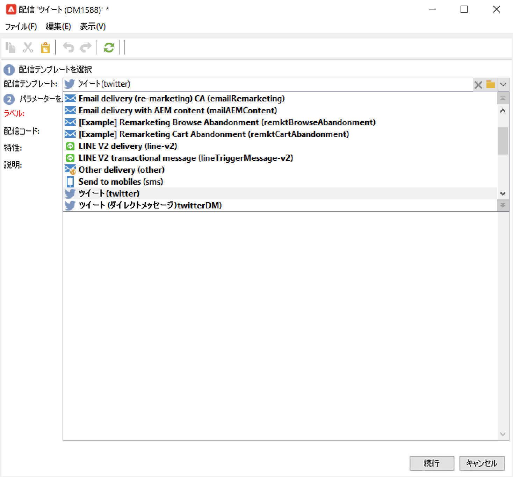
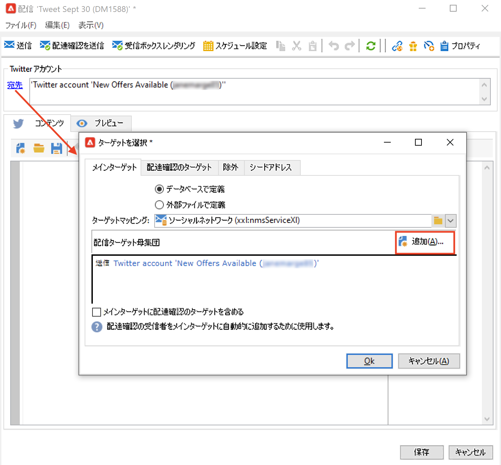
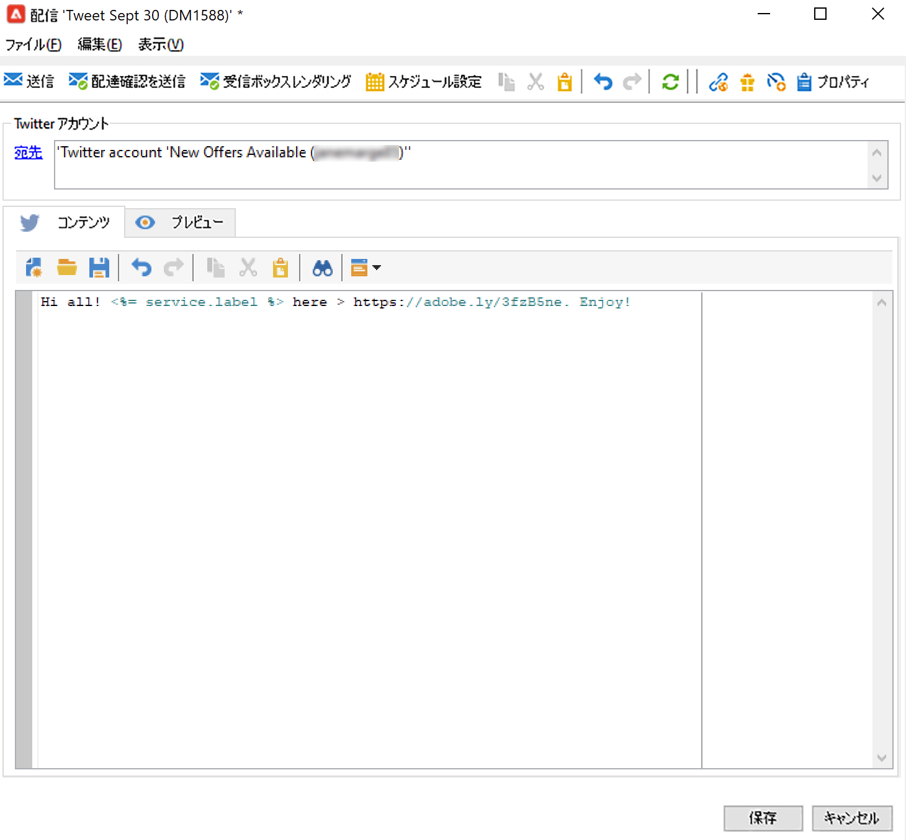
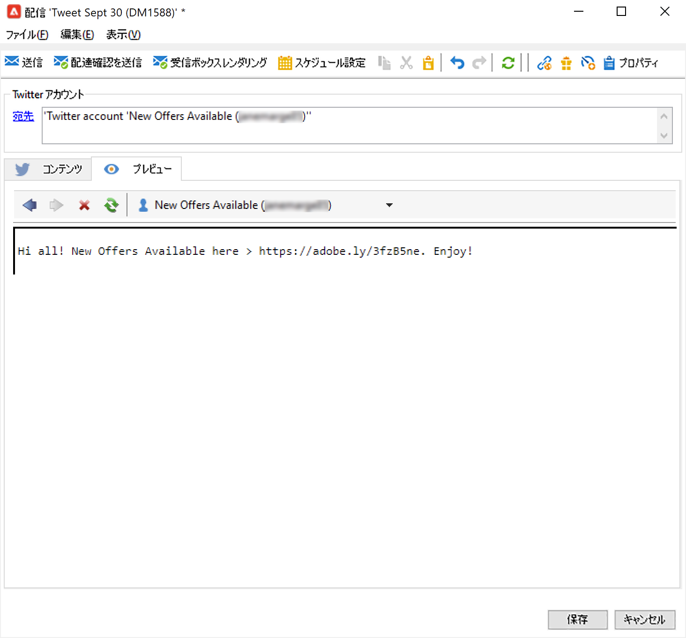
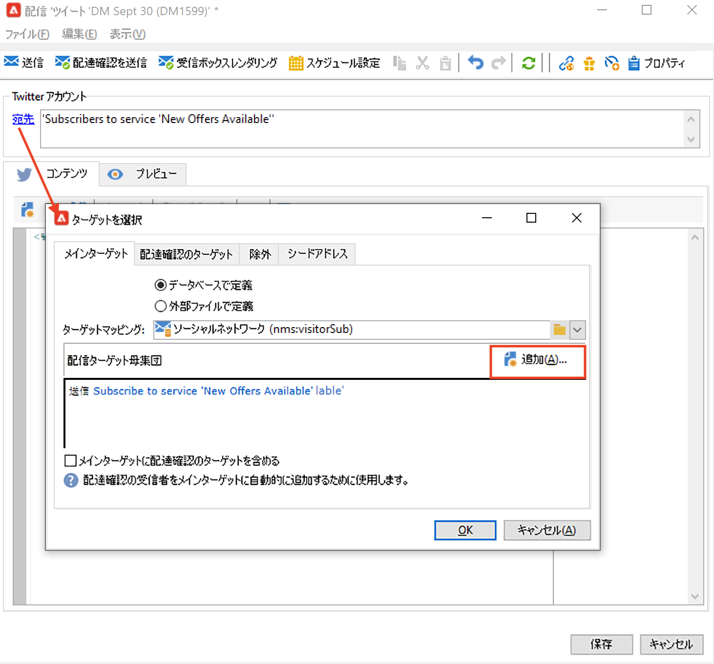
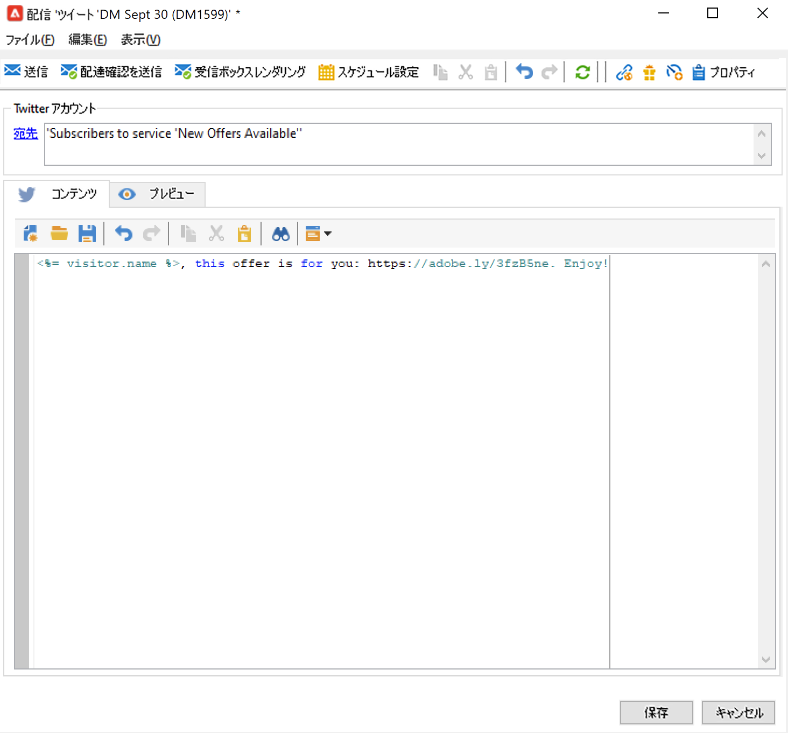
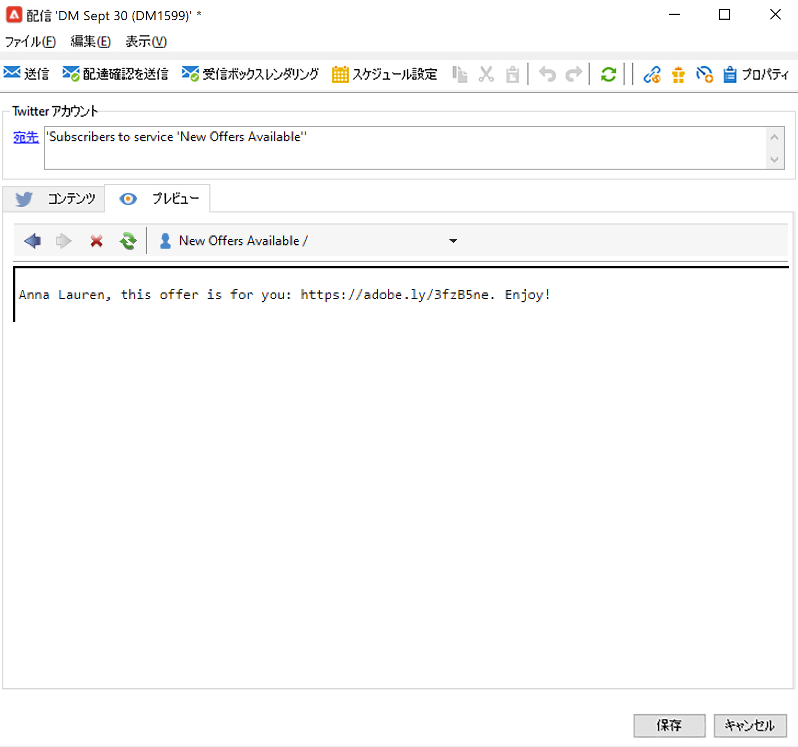

# Adobe Campaign を使用して X（Twitter）でメッセージを投稿 {#post-tw-messages}

Adobe Campaign には、X（旧 Twitter）を介して顧客や見込み客とやり取りできる&#x200B;**ソーシャルマーケティング**&#x200B;モジュールが付属しています。

統合を設定すると、次の操作を実行できます。

* フォロワーへのダイレクトメッセージの送信
* X アカウントへの投稿
* プロファイルデータを回収して新しい連絡先を収集します。これにより、キャンペーンのターゲティングを実行し、可能であればクロスチャネル戦略を導入できます。この操作には、ユーザーの同意が必要です。

X アカウントを Adobe Campaign と統合するための設定手順については、[このページ](../connect/ac-tw.md)を参照してください。

## X 投稿の作成と公開 {#publish-on-tw}

X アカウントでメッセージを投稿するには、次の手順に従います。

1. X 配信の作成

   「**[!UICONTROL ツイート（Twitter）]**」配信テンプレートに基づいて新しい配信を作成します。

   

1. メインターゲットの選択

   投稿の送信先アカウントを選択します。

   

   1. 「**[!UICONTROL 宛先]**」リンクをクリックします。
   1. 「**[!UICONTROL 追加]**」ボタンをクリックします。
   1. 「**[!UICONTROL Twitter アカウント]**」を選択します。
   1. 「**[!UICONTROL フォルダー]**」フィールドで、X アカウントを含むサービスフォルダーを選択します。次に、ツイートを送信する X アカウントを選択します。

1. 配達確認のターゲットの選択

   「**[!UICONTROL 配達確認のターゲット]**」タブでは、最終的な配信の前に、テスト配信目的で使用する X アカウントを定義できます。

   [設定手順](../connect/ac-tw.md#tw-test-account)で詳しく説明しているように、配達確認の送信専用の非公開テスト X アカウントを作成する必要があります。

   >[!NOTE]
   >
   >すべての配信に同じ X テストアカウントを使用する場合、「**[!UICONTROL ツイート]**」配信テンプレートに配達確認のターゲットを保存できます。このテンプレートには、**[!UICONTROL リソース／テンプレート／配信テンプレート]**&#x200B;ノードからアクセスできます。これにより、新規の各配信で、配達確認のターゲットがデフォルトで入力されるようになります。

1. 投稿のコンテンツを定義

   「**[!UICONTROL コンテンツ]**」タブに投稿の内容を入力します。

   

   >[!CAUTION]
   >
   >X に投稿する際には、次の制限が適用されます。
   >
   >* メッセージの長さは 140 文字以下にする必要があります。
   >* HTML はサポートされていません。
   >

1. 投稿をプレビュー

   「**[!UICONTROL プレビュー]**」タブを参照して、投稿のレンダリングを確認します。

   

   1. 「**[!UICONTROL プレビュー]**」タブをクリックします。
   1. 「**[!UICONTROL パーソナライゼーションをテスト]**」ドロップダウンメニューをクリックし、「**[!UICONTROL サービス]**」を選択します。
   1. 「**[!UICONTROL フォルダー]**」フィールドで、X アカウントを含むサービスフォルダーを選択します。

1. 配達確認の送信

   ツイートを投稿する前に、パブリケーションの配達確認を送信して検証する必要があります。その後、非公開の X テストページでパブリケーションの正確なレンダリングを取得できます。

1. メッセージを投稿

   1. コンテンツが承認されたら、「**[!UICONTROL 送信]**」ボタンをクリックします。
   1. 「**[!UICONTROL 可能な限り早く配信]**」を選択し、「**[!UICONTROL 分析]**」ボタンをクリックします。
   1. 分析が完了したら、結果を確認します。
   1. 「**[!UICONTROL 配信を確定]**」をクリックし、「**[!UICONTROL はい]**」をクリックします。

## フォロワーへのダイレクトメッセージの送信 {#direct-tw-messages}

この **[!UICONTROL Twitter アカウントの同期]**&#x200B;テクニカルワークフローは、X のフォロワーのリストを復元して、ダイレクトメッセージを送信できるようにします。[詳細情報](../connect/ac-tw.md#synchro-tw-accounts)

フォロワーにダイレクトメッセージを送信するには、次の手順に従います。

1. 「**[!UICONTROL ツイート（ダイレクトメッセージ）]**」ビルトインの配信テンプレートに基づいて X 配信を作成します。

1. メインターゲットの選択

   

   1. **[!UICONTROL 宛先]**&#x200B;リンクと「**[!UICONTROL 追加]** 」ボタンを選択します。

   1. ターゲティングのタイプを選択します

      * 「**[!UICONTROL Twitter 購読者]**」を選択し、フォロワー全員にダイレクトメッセージを送信します。

      * 「**[!UICONTROL フィルター条件]**」を選択し、クエリを定義して結果を表示します。フィルターを作成する方法については、[こちらの節](../audiences/create-filters.md#advanced-filters)を参照してください。

1. 「**[!UICONTROL 配達確認のターゲット]**」タブから配達確認のターゲットを選択する：このアカウントは、ダイレクトメッセージの配達確認を受信します。

   [設定手順](../connect/ac-tw.md#tw-test-account)で詳しく説明しているように、配達確認の送信専用の非公開テスト X アカウントを作成する必要があります。

   >[!NOTE]
   >
   >すべてのダイレクトメッセージの配達確認を同じ X アカウントに送信する場合、「**[!UICONTROL ツイート（ダイレクトメッセージ）]**」配信テンプレートに配達確認のターゲットを保存できます。このテンプレートには、**[!UICONTROL リソース／テンプレート／配信テンプレート]**&#x200B;ノードからアクセスできます。

1. 「**[!UICONTROL コンテンツ]**」タブにメッセージの内容を入力します。

   

   パーソナライゼーションフィールドは、メール配信と同じ手順で使用可能です。例えば、メッセージの本文にフォロワーの名前を追加できます。詳しくは、[この節](../send/personalize.md)を参照してください。

1. メッセージのプレビュー

   「**[!UICONTROL プレビュー]**」タブを参照して、投稿のレンダリングを確認します。

   

   1. 「**[!UICONTROL プレビュー]**」タブをクリックします。
   1. 「**[!UICONTROL パーソナライゼーションをテスト]**」ドロップダウンメニューをクリックし、「**[!UICONTROL 訪問者の購読]**」を選択します。
   1. プレビューをテストする X アカウントを選択します。

1. 配達確認の送信

   メッセージを送信する前に、[テストアカウントに配達確認を送信](../send/preview-and-proof.md)して検証する必要があります。その後、非公開の X アカウントでメッセージの正確なレンダリングを取得し、コンテンツとパーソナライゼーションを確認できます。

1. ダイレクトメッセージの送信

   1. コンテンツが承認されたら、「**[!UICONTROL 送信]**」ボタンをクリックします。
   1. 「**[!UICONTROL 可能な限り早く配信]**」を選択し、「**[!UICONTROL 分析]**」ボタンをクリックします。
   1. 分析が完了したら、結果を確認します。
   1. 「**[!UICONTROL 配信を確定]**」をクリックし、「**[!UICONTROL はい]**」をクリックします。

>[!CAUTION]
>
>1 日に 250 件を超えるダイレクトメッセージを送信することはできません。このしきい値を超えないようにするには、ウェーブで配信します。詳しくは、[この節](configure-and-send.md#sending-using-multiple-waves)を参照してください。

## トラッキングデータへのアクセス {#tw-tracking}

ビルトインの「**[!UICONTROL ツイート]**」配信テンプレートでは、トラッキングがデフォルトで有効になっています。

トラッキングデータは、配信レポート、さらに配信とサービスの&#x200B;**[!UICONTROL 編集／トラッキング]**&#x200B;タブで表示できます。

トラッキング設定は、メール配信の場合と同じです。詳細情報：[&#x200B; トラッキング &#x200B;](tracking.md)。

