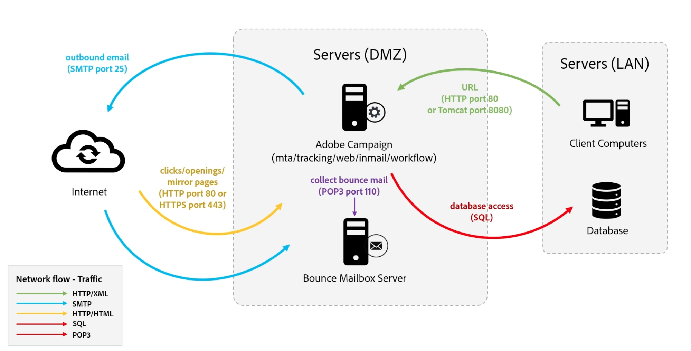

# Campaign のプロセスとコンポーネントについて {#components-and-processes}

Adobe Campaign は、E メール、モバイル、ソーシャル、オフラインのキャンペーンを自動化するクロスチャネルマーケティングソリューションです。Adobe Campaign では、顧客データとプロファイルに一箇所でアクセスできます。Adobe Campaign を使用して、顧客に対して一貫したエクスペリエンスを調整し、複数のチャネルをまたいでマーケティングを設計、実行およびパーソナライズし、各デバイスおよびタッチポイントでの顧客体験を向上させます。 Adobe Campaign では、ドラッグ＆ドロップのビジュアルワークフローインターフェイスを使用して、複数のデータソースの管理、オーディエンスセグメントの定義、複数手順のクロスチャネルキャンペーンの計画と実行が可能です。

Campaign の主な機能について詳しくは、[このページ](../start/get-started.md)を参照してください。

## Campaign コンポーネント {#ac-components}

Adobe Campaign のコンポーネントとグローバルアーキテクチャは次のとおりです。

### プレゼンテーションレイヤー{#presentation-layer}

Adobe Campaign には、リッチクライアント、シンクライアント、API 統合を通じてアクセスできます。

* リッチクライアント

   Campaign リッチクライアントは、SOAP や HTTP などの標準のインターネットプロトコルを通じて Adobe Campaign アプリケーションサーバーと通信するネイティブアプリケーションです。

   Campaign クライアントコンソールは、すべての機能と設定を一元化しています。また、ローカルキャッシュに依存することで、必要な帯域幅は最小限に抑えられます。簡単にデプロイできるように設計された Campaign クライアントコンソールは、インターネットブラウザーからデプロイし、自動的に更新できます。発生するトラフィックは HTTP(S) のみであり、特別なネットワーク設定は不要です。

    [Campaign クライアントコンソールの詳細情報](../start/connect.md)。

* シンクライアント

   Adobe Campaign の web アクセス機能を使用すると、web ブラウザーを使用して、Campaign の機能のサブセットにアクセスできます。HTML ユーザーインターフェイスが使用されます。この web インターフェイスを使用して、レポートへのアクセス、メッセージの制御と検証、監視ダッシュボードへのアクセスなどを行います。

    [Campaign への Web でのアクセスの詳細情報](../start/connect.md)。

* API を使用した外部アプリケーション

   SOAP プロトコルで公開されている web サービス API を使用して、外部のアプリケーションからシステムを呼び出すこともできます。

    [Campaign API の詳細情報](../dev/api.md)。

### 永続性レイヤー{#persistance-layer}

Campaign データベースは永続性レイヤーとして使用され、Adobe Campaign が管理するほとんどすべての情報とデータが含まれています。これには、プロファイル、購読、コンテンツなどの機能データ、配信ジョブやログ、トラッキングログなどの技術データおよび作業データ（購入、リード）が含まれます。

タスクを実行するには（リダイレクトモジュールを除く）Adobe Campaign のコンポーネントの大部分がデータベースへのアクセスを必要とするので、データベースの信頼性が最も重要です。

### 論理アプリケーションレイヤー{#logical-app-layer}

Campaign の論理アプリケーションレイヤーは、複雑なビジネスニーズに合わせて簡単に設定できます。Campaign を、様々なアプリケーションと組み合わせて、オープンで拡張性の高いアーキテクチャを作成する単一のプラットフォームとして使用できます。各 Campaign インスタンスは、アプリケーションレイヤー内のプロセスの集まりです。これらのプロセスには共有されているものも、専用のものもあります。

## Campaign Managed Services{#ac-managed-services}

Adobe Campaign v8 はマネージドサービスとしてデプロイされます。Adobe Campaign のすべてのコンポーネント（ユーザーインターフェイス、実行管理エンジン、Campaign データベースなど）は、アドビで完全にホストされます。これには、メールの実行、ミラーページ、トラッキングサーバー、外部に配置される web コンポーネント（登録解除ページ／環境設定センターやランディングページなど）が含まれます。

## Campaign のプロセス

Campaign web サーバーは、Campaign web プロセスへのアクセスを制御します。JavaScript は、コア製品の機能やカスタマイズに使用されるサーバーサイドの言語です。Tomcat はバックエンドエンジンで、web プロセスの一部として Campaign 製品に埋め込まれます。JavaScript は、JSP ページや JSSP ページなどで、動的コンテンツをレンダリングするために使用されます。

Campaign クライアントコンソールは、SOAP XML over HTTP を使用して web サーバーに接続します。web サーバーはセキュリティレイヤーを提供し、JavaScript を使用してアプリケーションレイヤーにリクエストを渡し、Campaign の内部プロセスは SQL を使用してデータベースにアクセスします。

以下のスタンドアロンデプロイメントの図は、Campaign プロセス間の全体的な通信を示したものです。すべての Campaign コンポーネントが同じマシンにインストールされています。

ユーザーは、HTTP を使用して Campaign アプリケーションサーバーに接続します。すべてのデータと情報は、Campaign データベースで管理されます。Campaign 開発者が設定の変更を行うと、その変更はデータベースに取り込まれます。マーケターが新しいキャンペーンを作成すると、この新しいキャンペーンに関連するすべての情報とデータもデータベースで管理されます。マーケターがキャンペーンを実行すると、メール配信が SMTP サーバーを通じて Campaign サーバーからプロファイルに送信されます。プロファイルがメール配信でインタラクションを行う（メールの開封など）すると、そのトラッキングデータがトラッキングサーバーに送り返されます。

 [Campaign プロセスの詳細情報](../architecture/general-architecture.md#dev-env)。
