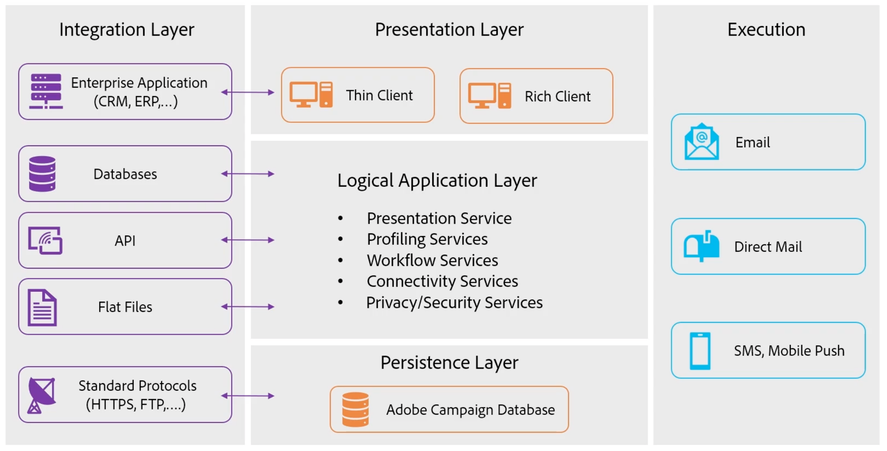
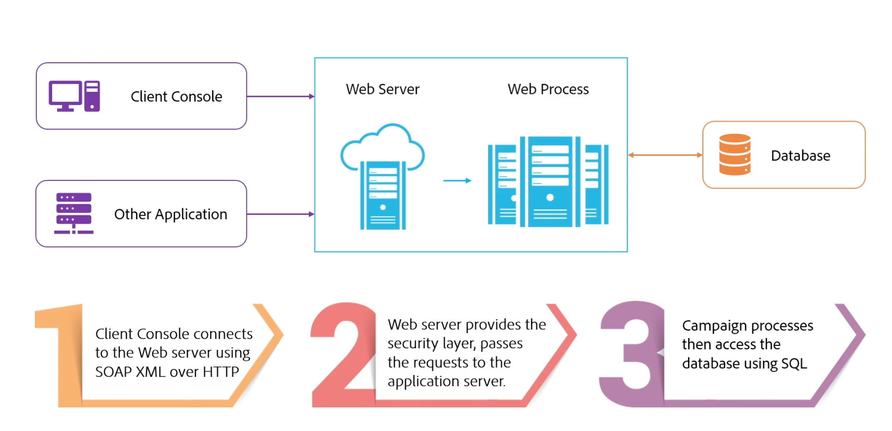

# Campaign のコンポーネントとプロセスについて {#components-and-processes}

Adobe Campaign は、メール、モバイル、ソーシャル、オフラインのキャンペーンを自動化するクロスチャネルマーケティングソリューションです。Adobe Campaign では、顧客データとプロファイルに一箇所でアクセスできます。Adobe Campaign を使用して、顧客に対して一貫したエクスペリエンスを調整し、複数のチャネルをまたいでマーケティングを設計、実行およびパーソナライズし、各デバイスおよびタッチポイントでの顧客体験を向上させます。 Adobe Campaign では、ドラッグ＆ドロップのビジュアルワークフローインターフェイスを使用して、複数のデータソースの管理、オーディエンスセグメントの定義、複数手順のクロスチャネルキャンペーンの計画と実行が可能です。

Campaign の主な機能について詳しくは、[このページ](../start/get-started.md)を参照してください。

## Campaign コンポーネント {#ac-components}

Adobe Campaign のコンポーネントとグローバルアーキテクチャは次のとおりです。

### 永続性レイヤー{#persistance-layer}

Campaign データベースは永続性レイヤーとして使用され、Adobe Campaign が管理するほとんどすべての情報とデータが含まれています。これには、プロファイル、購読、コンテンツなどの機能データ、配信ジョブやログ、トラッキングログなどの技術データおよび作業データ（購入、リード）が含まれます。

タスクを実行するには（リダイレクトモジュールを除く）Adobe Campaign のコンポーネントの大部分がデータベースへのアクセスを必要とするので、データベースの信頼性が最も重要です。

### 論理アプリケーションレイヤー{#logical-app-layer}

Campaign の論理アプリケーションレイヤーは、複雑なビジネスニーズに合わせて簡単に設定できます。Campaign を、様々なアプリケーションと組み合わせて、オープンで拡張性の高いアーキテクチャを作成する単一のプラットフォームとして使用できます。各 Campaign インスタンスは、アプリケーションレイヤー内のプロセスの集まりです。これらのプロセスには共有されているものも、専用のものもあります。

## Campaign Managed Cloud Services{#ac-managed-services}

Adobe Campaign v8 はマネージドサービスとしてデプロイされます。Adobe Campaign のすべてのコンポーネント（ユーザーインターフェイス、実行管理エンジン、Campaign データベースなど）は、アドビで完全にホストされます。これには、メールの実行、ミラーページ、トラッキングサーバー、外部に配置される web コンポーネント（登録解除ページ／環境設定センターやランディングページなど）が含まれます。

## Campaign のプロセス

Campaign web サーバーは、Campaign web プロセスへのアクセスを制御します。JavaScript は、コア製品の機能やカスタマイズに使用されるサーバーサイドの言語です。Tomcat はバックエンドエンジンで、web プロセスの一部として Campaign 製品に埋め込まれます。JavaScript は、JSP ページや JSSP ページなどで、動的コンテンツをレンダリングするために使用されます。

Campaign クライアントコンソールは、SOAP XML over HTTP を使用して web サーバーに接続します。web サーバーはセキュリティレイヤーを提供し、JavaScript を使用してアプリケーションレイヤーにリクエストを渡し、Campaign の内部プロセスは SQL を使用してデータベースにアクセスします。

<!--The overall communication between Campaign processes are described in the following standalone deployment diagram: all Campaign components are installed in the same machine.

 -->

ユーザーは、HTTP を使用して Campaign アプリケーションサーバーに接続します。すべてのデータと情報は、Campaign データベースで管理されます。Campaign 開発者が設定の変更を行うと、その変更はデータベースに取り込まれます。マーケターが新しいキャンペーンを作成すると、この新しいキャンペーンに関連するすべての情報とデータもデータベースで管理されます。マーケターがキャンペーンを実行すると、メール配信が SMTP サーバーを通じて Campaign サーバーからプロファイルに送信されます。プロファイルがメール配信でインタラクションを行う（メールの開封など）すると、そのトラッキングデータがトラッキングサーバーに送り返されます。

[詳しくは、Campaign のプロセスを参照してください](../architecture/general-architecture.md#dev-env)。
