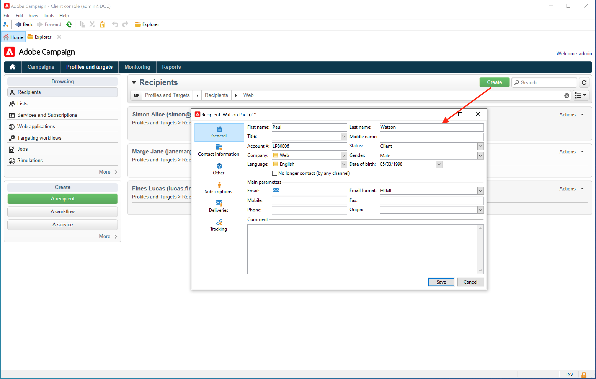

# オーディエンスの概要{#gs-ac-audiences}

## プロファイルの操作{#gs-ac-profiles}

プロファイルは、Campaign データベースに保存される連絡先で、顧客、購読者、見込み客が含まれます。 web フォームを介したオンラインでの収集、テキストファイルの手動や自動での読み込み、会社のデータベースやその他の情報システムからのレプリケーションなど、プロファイルの取得やデータベースの構築に利用できるメカニズムは多数あります。Adobe Campaign を利用すると、マーケティング履歴、購入情報、好み、CRM データ、関連する個人情報などを統合されたビューに組み込んで分析し、アクションを起こすことができまプロファイルには、個人のターゲティング、選定、トラッキングなどに必要な情報がすべて含まれています。

プロファイルは、**nmsRecipient** テーブルまたは外部テーブル内のレコードで、すべてのプロファイル属性（名、姓、メールアドレス、Cookie ID、顧客 ID、モバイル識別情報、特定のチャネルに関連するその他の情報など）が保存されます。受信者テーブルにリンクされるその他のテーブルには、プロファイルに関連付けられたデータが含まれます。例えば、受信者に送信されたすべての配信記録を含む、配信ログテーブルなどです。組み込みのプロファイルと受信者テーブルについての詳細は、[この節](../dev/datamodel.md#ootb-profiles)を参照してください。

Adobe Campaign では、**受信者**&#x200B;とは、配信（メール、SMS など）の送信対象となるデフォルトのプロファイルのことです。データベースに保存された受信者データを使用すると、特定の配信を受け取るターゲットをフィルタリングしたり、配信コンテンツにパーソナライズデータを追加したりできます。 データベースには、他のタイプのプロファイルも含まれています。それらのプロファイルは用途が異なります。例えば、シードプロファイルは、配信を最終的なターゲットに送信する前のテスト用に作成されます。

プロファイルは、リストにグループ化することも、データベースに対してクエリを実行して収集することもできます。

Campaign にプロファイルデータを入力するには、次の方法を使用できます。

* CRM システムなどの外部データソースから[データファイルを読み込む](import.md)
* 顧客が自分で情報を入力し、自分自身のプロファイルを作成できる [web フォームの作成](../dev/webapps.md)
* プロファイルが格納されている[外部データベースへのマッピング](../connect/fda.md)
* 次のように、クライアントコンソールを使用してプロファイルを手動で入力します。

[!DNL :arrow_upper_right:] プロファイルの管理方法については、[Adobe Campaign Classic v7 ドキュメント](https://experienceleague.adobe.com/docs/campaign-classic/using/getting-started/profile-management/about-profiles.html?lang=ja){target=&quot;_blank&quot;}を参照してください。

## プライバシーと同意

Adobe Campaign は大量のデータを収集して処理できる強力なツールですが、データの中には個人情報や機密情報も含まれます。 Adobe Campaign を使用すると、個人情報や機密情報などのデータを収集できます。したがって、受信者の同意を得てこれを監視することが重要になります。

[!DNL :arrow_upper_right:] プライバシーと同意の管理方法については、[Adobe Campaign Classic v7 ドキュメント](https://experienceleague.adobe.com/docs/campaign-classic/using/getting-started/privacy/privacy-and-recommendations.html?lang=ja){target=&quot;_blank&quot;}を参照してください。

## リストの作成

リストは、配信アクションのターゲットにしたり、インポート操作時やワークフロー実行時に更新したりできるプロファイルの静的なセットです。例えば、クエリによってデータベースから抽出した母集団からリストを作成できます。

[!DNL :arrow_upper_right:] リストの作成および管理方法については、[Adobe Campaign Classic v7 ドキュメント](https://experienceleague.adobe.com/docs/campaign-classic/using/getting-started/profile-management/creating-and-managing-lists.html?lang=ja){target=&quot;_blank&quot;}を参照してください。

## データベースのクエリ

ワークフローで&#x200B;**クエリ**&#x200B;アクティビティを使用して、データベースにクエリを実行し、データをセグメント化し、複雑なオーディエンスを構築します。

[!DNL :arrow_upper_right:]Campaign クエリについて詳しくは、[Adobe Campaign Classic v7 ドキュメント](https://experienceleague.adobe.com/docs/campaign-classic/using/automating-with-workflows/advanced-management/about-technical-workflows.html?lang=ja){target=&quot;_blank&quot;}を参照してください。

[!DNL :arrow_upper_right:] すべてのターゲティングアクティビティのリストは、[Adobe Campaign Classic v7 ドキュメント](https://experienceleague.adobe.com/docs/campaign-classic/using/automating-with-workflows/targeting-activities/about-targeting-activities.html?lang=ja){target=&quot;_blank&quot;}を参照してください。

## ワークフローでのオーディエンスの作成

ターゲティングは、ワークフロー内のグラフィカルシーケンスでクエリを組み合わせて作成できます。 要件に応じてターゲットとなるオーディエンスを作成できます。 ワークフローエディターを表示するには、Campaign ダッシュボードで「**[!UICONTROL ターゲティングとワークフロー]**」タブをクリックします。

[!DNL :arrow_upper_right:] Campaign ワークフローでのオーディエンスの作成方法については、[Adobe Campaign Classic v7 ドキュメント](https://experienceleague.adobe.com/docs/campaign-classic/using/orchestrating-campaigns/orchestrate-campaigns/marketing-campaign-target.html?lang=ja#building-the-main-target-in-a-workflow)を参照してください。{target=&quot;_blank&quot;}。

## アクティブなプロファイル{#active-profiles}

各キャンペーンインスタンスには、契約に従って特定数のアクティブなプロファイルがプロビジョニングされ、課金のためその数がカウントされます。購入したアクティブなプロファイルの数については、最新の契約書を参照してください。

**プロファイル**&#x200B;とは、エンドカスタマー、見込み客、リードなどを表す情報のレコードです。例えば、Cookie ID、カスタマー ID、モバイル ID、特定のチャネルに関連するその他の情報などを含む[受信者テーブル](../dev/datamodel.md)や外部テーブルなどのレコードです。アクティブであると見なすプロファイルは、過去 12 か月以内に、いずれかのチャネルを介してターゲットに設定された、またはやり取りしたプロファイルです。

<!--
You can monitor the number of active profiles used on your instances directly from Campaign Control Panel. 

[!DNL :arrow_upper_right:] For more on this, refer to the [Control Panel documentation](https://docs.adobe.com/content/help/en/control-panel/using/performance-monitoring/active-profiles-monitoring.html).
-->

**関連トピック** Campaign Classic v7 ドキュメント：

[!DNL :arrow_upper_right:] [キャンペーン固有のワークフローのデザインと実行](https://experienceleague.adobe.com/docs/campaign-classic/using/automating-with-workflows/advanced-management/about-technical-workflows.html?lang=ja){target=&quot;_blank&quot;}

[!DNL :arrow_upper_right:] [キャンペーンのオーディエンスを選択する方法を学ぶ](https://experienceleague.adobe.com/docs/campaign-classic/using/orchestrating-campaigns/orchestrate-campaigns/marketing-campaign-target.html?lang=ja){target=&quot;_blank&quot;}

[!DNL :arrow_upper_right:] [ワークフローの概要](https://experienceleague.adobe.com/docs/campaign-classic/using/automating-with-workflows/advanced-management/about-technical-workflows.html?lang=ja){target=&quot;_blank&quot;}
