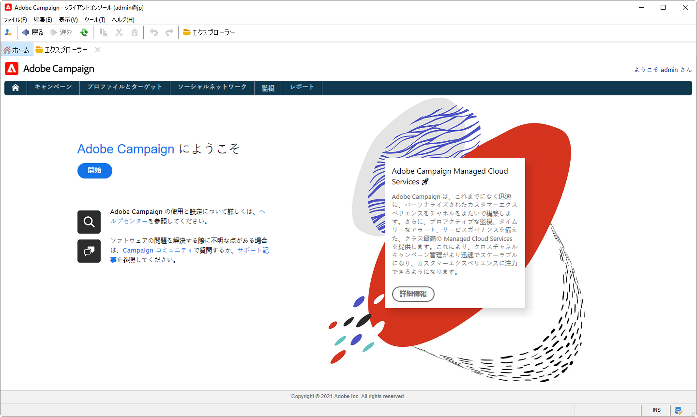
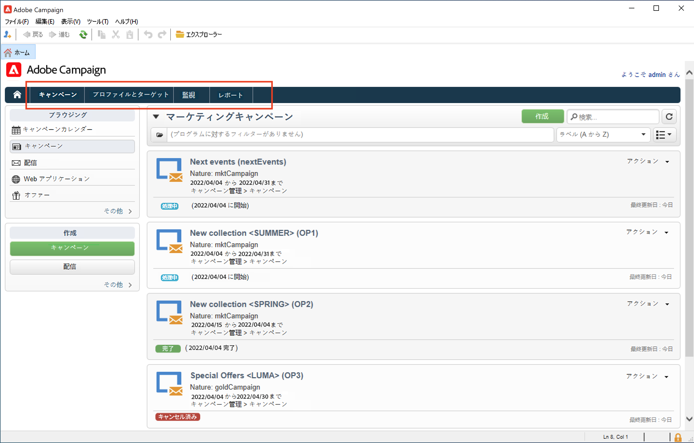
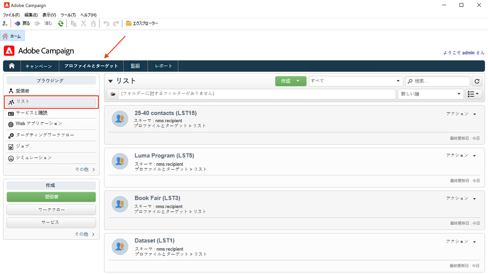
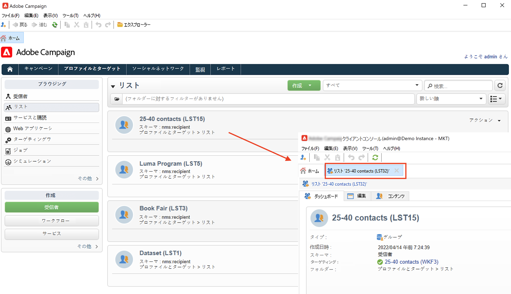
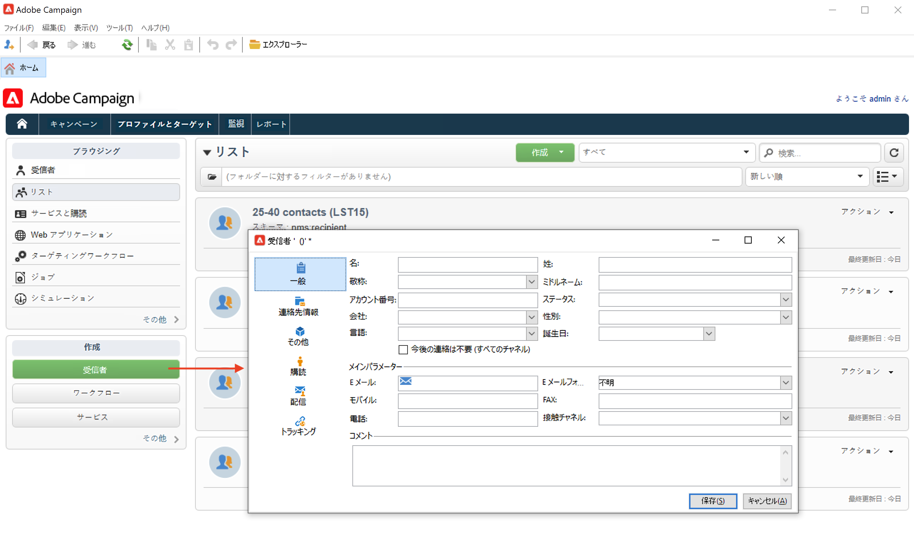
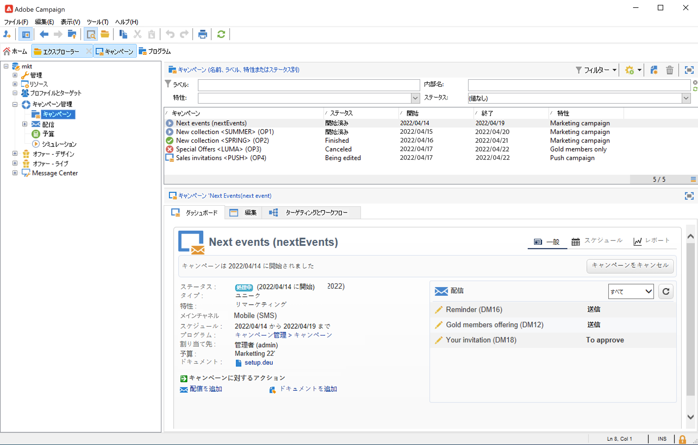

# Campaign のユーザーインターフェイスの確認

## Campaign UI へのアクセス

[クライアントコンソール](../architecture/general-architecture.md)から Campaign Workspace を利用できます。

Campaign クライアントコンソールをインストールして設定する方法については、[この節](../start/connect.md)を参照してください。

また、web ブラウザーを使用して Campaign にアクセスすることもできます。このコンテキストでは、Campaign 機能のサブセットのみ使用できます。 [詳細情報](#web-browser)

## UI の参照

Campaign に接続したら、ホームページにアクセスします。 機能にアクセスするには、リンクを参照します。UI で使用できる一連の機能は、オプションと権限に応じて異なります。

ホームページの中央セクションにあるリンクを使用して、Campaign のヘルプ資料、コミュニティ、サポート web サイトにアクセスします。

上部セクションのタブを使用して、Campaign の主な機能を参照します。

>[!NOTE]
>
>アクセスできるコア機能のリストは、権限と実装によって異なります。

各機能について、「**[!UICONTROL ブラウジング]**」セクションの一連の主な機能にアクセスできます。**[!UICONTROL その他]**&#x200B;リンクを使用すると、他のすべてのコンポーネントにアクセスできます。

例えば、「**[!UICONTROL プロファイルとターゲット]**」タブを参照すると、受信者リスト、購読サービス、既存のターゲティングワークフローおよびこれらすべてのコンポーネントを作成するためのショートカットにアクセスできます。

画面で要素を選択すると、その要素は新しいタブに読み込まれるので、コンテンツを簡単に参照できます。

## 要素の作成 {#create-an-element}

画面の左側にある「**[!UICONTROL 作成]**」セクションのショートカットを使用して、新しい要素を追加します。リストの上にある「**[!UICONTROL 作成]**」ボタンを使用すると、現在のリストに新しい要素を追加できます。

例えば、配信ページでは、「**[!UICONTROL 作成]**」ボタンを使用して新しい配信を作成します。

## web ブラウザーの使用 {#web-browser}

また、web ブラウザーを使用して、Campaign 機能のサブセットにアクセスすることもできます。

Web アクセスインターフェイスは、コンソールインターフェイスに類似しています。ブラウザーからは、コンソールと同じナビゲーションおよび表示機能を使用できますが、キャンペーンに対して実行できるアクションは限られています。 例えば、キャンペーンの表示とキャンセルはできますが、キャンペーンを変更することはできません。

 [Campaign web アクセスの詳細情報](../start/connect.md#web-access)。

## Campaign エクスプローラーへのアクセス {#ac-explorer-ui}

Campaign エクスプローラーを参照して、すべての Adobe Campaign の機能と設定にアクセスします。

このワークスペースでは、エクスプローラーツリーにアクセスして、すべての機能とオプションを参照できます。

左側のセクションには Campaign エクスプローラーツリーが表示され、権限に応じて、インスタンスのすべてのコンポーネントと設定を参照できます。

上部のセクションには、現在のフォルダー内のレコードのリストが表示されます。これらのリストは完全にカスタマイズ可能です。 [詳細情報](customize-ui.md)

下部のセクションには、選択したレコードの詳細が表示されます。

## 言語

Campaign v8 ユーザーインターフェイスは、次の言語で使用できます。

* 英語（英国）
* 英語（米国）
* フランス語
* ドイツ語
* 日本語

言語は、インストールプロセス中に選択します。

>[!CAUTION]
>
>インスタンス作成後に言語を変更することはできません。

言語は、日付および時刻の形式に影響します。

米国英語と英国英語の主な違いは次のとおりです。

<table> 
 <thead> 
  <tr> 
   <th> フォーマット  </th> 
   <th> 英語（米国）  </th> 
   <th> 英語（英国）  </th> 
  </tr> 
 </thead> 
 <tbody> 
  <tr> 
   <td> 日付  </td> 
   <td> 日曜日が週始め  </td> 
   <td> 月曜日が週始め  </td> 
  </tr> 
  <tr> 
   <td> 日付の短縮表記  </td> 
   <td> 
%2M/%2D/%4Y

<strong>例：09/25/2018</strong>
 </td> 
   <td> 
%2D/%2M/%4Y

<strong>例：25/09/2018</strong>
 </td> 
  </tr> 
  <tr> 
   <td> 日付と時刻の短縮表記  </td> 
   <td> 
%2M/%2D/%4Y %I:%2N:%2S %P

<strong>例：09/25/2018 10:47:25 PM</strong>
 </td> 
   <td> 
%2D/%2M/%4Y %2H:%2N:%2S

<strong>例：25/09/2018 22:47:25</strong>
 </td> 
  </tr> 
 </tbody> 
</table>
