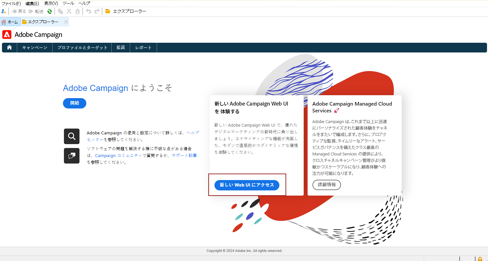
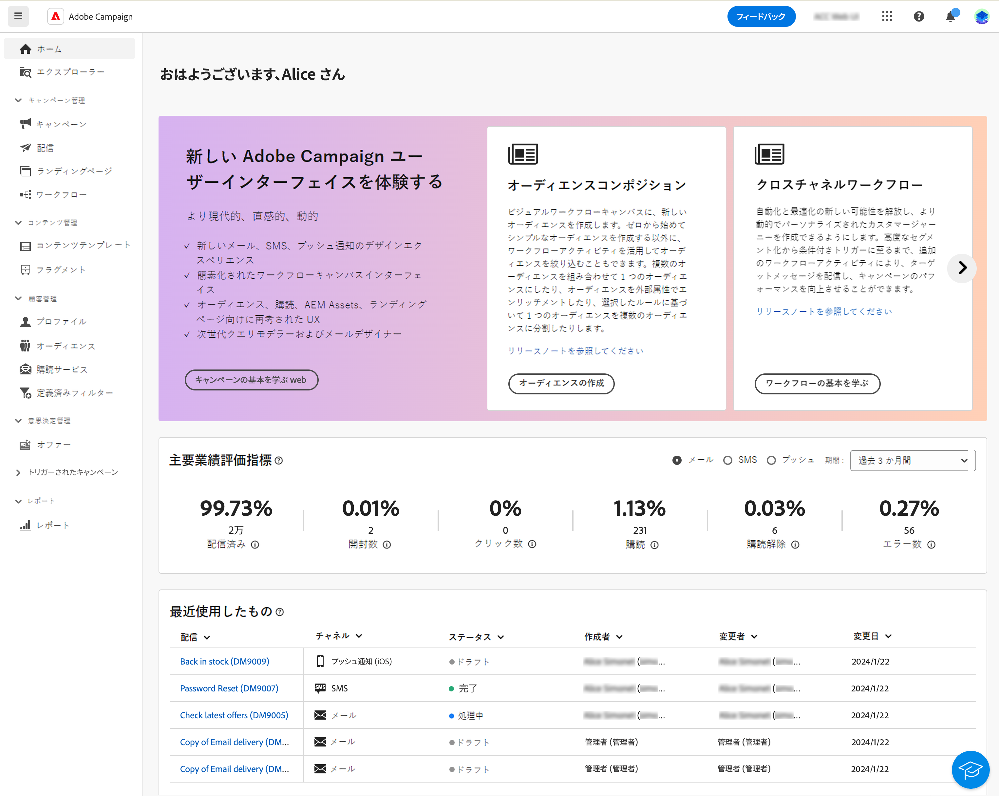

# ユーザーインターフェイスの確認 {#ui-client-console}

Adobe Campaignには、クライアントコンソールまたは Web ユーザーインターフェイスからアクセスできます。 また、API を使用して、Campaign プラットフォームでデータの管理やタスクの実行をおこなうこともできます。

>[!CAUTION]
>
>このドキュメントでは、Campaign クライアントコンソールの使用に焦点を当てています。 Campaign Web ユーザーインターフェイスを使用している場合は、 [このドキュメント](https://experienceleague.adobe.com/docs/campaign-web/v8/campaign-web-home.html){target="_blank"}.

* **クライアントコンソール** - Campaign クライアントコンソールは、SOAP や HTTP などの標準のインターネットプロトコルを通じてAdobe Campaignアプリケーションサーバーと通信するネイティブアプリケーションです。 Campaign クライアントコンソールは、すべての機能と設定を一元化し、ローカルキャッシュに依存するので、必要最小限の帯域幅です。 Campaign クライアントコンソールは、簡単にデプロイできるように設計され、インターネットブラウザーからデプロイし、自動的に更新されるので、HTTP(S) トラフィックを生成するだけなので、特定のネットワーク設定は不要です。 [詳細情報](#ui-access)

  Campaign クライアントコンソールをインストールして設定する方法については、 [この節](../start/connect.md).

<!--     -->

* **Web ユーザーインターフェイス** - v8.6.1 リリース以降、Campaign v8 ユーザーは、中央のAdobe Experience Cloudユーザーインターフェイスを通じて使用できる Web 環境にアクセスできるようになりました。 その後、Web ブラウザーからAdobe Campaignに接続できます。 この新しいインターフェイスでは、主要なマーケティングアクションを作成、管理、実行できます。 ただし、Campaign のすべての機能を使用できるわけではありません。 [詳細情報](#ac-web-ui)。

  Campaign Campaign Web ユーザーインターフェイスは、クライアントコンソールのホームページから使用できます。

  

  >[!NOTE]
  >
  >新しいアクセスカードが表示されない場合は、Adobe Experience Cloud外部アカウント内で次のフィールドを空にしないでください。 **サーバー**, **テナント**, **コールバックサーバー**、および **関連付けマーク**.

* **Web アクセス** - Adobe Campaignの Web アクセス機能を使用すると、Web ブラウザーを使用して、Campaign の機能のサブセットにアクセスでき、HTMLのユーザーインターフェイスを使用できます。 この web インターフェイスを使用して、レポートへのアクセス、メッセージの制御と検証、監視ダッシュボードへのアクセスなどを行います。Campaign Web アクセスの詳細 [この節](../start/connect.md#web-access).

* **API**  — より多くの使用例に対処するために、SOAP プロトコルで公開された Web Services API を使用して、システムを外部アプリケーションから呼び出すことができます。 Campaign API の詳細を説明します [このページの](../dev/api.md).

## クライアントコンソールの操作 {#ui-access}

Campaign クライアントコンソールは、SOAP や HTTP などの標準のインターネットプロトコルを通じてAdobe Campaignアプリケーションサーバーと通信するネイティブアプリケーションです。 Campaign クライアントコンソールは、すべての機能と設定を一元化し、ローカルキャッシュに依存するので、必要最小限の帯域幅です。 Campaign クライアントコンソールは、簡単にデプロイできるように設計され、インターネットブラウザーからデプロイし、自動的に更新されるので、HTTP(S) トラフィックを生成するだけなので、特定のネットワーク設定は不要です。  [Campaign クライアントコンソールの詳細を説明します](../start/connect.md).

また、web ブラウザーを使用して Campaign にアクセスすることもできます。このコンテキストでは、Campaign 機能のサブセットのみ使用できます。 [詳細情報](#web-browser)

### インターフェイスの参照 {#ui-browse}

Campaign クライアントコンソールに接続したら、ホームページにアクセスします。 機能にアクセスするには、リンクを参照します。インターフェイスで使用できる一連の機能は、オプションと権限によって異なります。

ホームページの中央のセクションにあるリンクを使用して、Campaign のヘルプ資料、コミュニティ、サポート Web サイトにアクセスします。 中央のカードを使用して、新しい Campaign Web ユーザーインターフェイスと Campaign コントロールパネルを参照します。

上部セクションのタブを参照して、Campaign の主な機能にアクセスします。

>[!NOTE]
>
>アクセスできるコア機能のリストは、権限と実装によって異なります。

各機能について、「**[!UICONTROL ブラウジング]**」セクションの一連の主な機能にアクセスできます。**[!UICONTROL その他]**&#x200B;リンクを使用すると、他のすべてのコンポーネントにアクセスできます。

例えば、「**[!UICONTROL プロファイルとターゲット]**」タブを参照すると、受信者リスト、購読サービス、既存のターゲティングワークフローおよびこれらすべてのコンポーネントを作成するためのショートカットにアクセスできます。

画面で要素を選択すると、その要素は新しいタブに読み込まれるので、コンテンツを簡単に参照できます。

### 要素の作成 {#create-an-element}

画面の左側にある「**[!UICONTROL 作成]**」セクションのショートカットを使用して、新しい要素を追加します。リストの上にある「**[!UICONTROL 作成]**」ボタンを使用すると、現在のリストに新しい要素を追加できます。

例えば、配信ページでは、「**[!UICONTROL 作成]**」ボタンを使用して新しい配信を作成します。

<!--
## Use a web browser {#web-browser}

You can also access a subset of Campaign capabilities through the a web browser.

The web access interface is similar to the console interface. From a browser, you can use the same navigation and display features as in the console, but you can perform only a reduced set of actions on campaigns. For example, you can view and cancel campaigns, but you cannot modify campaigns. 

 [Learn more about Campaign web access](../start/connect.md#web-access).-->

### Campaign エクスプローラーへのアクセス {#ac-explorer-ui}

Campaign エクスプローラーを参照して、すべての Adobe Campaign の機能と設定にアクセスします。

このワークスペースでは、エクスプローラーツリーにアクセスして、すべての機能とオプションを参照できます。

* 左側のセクションには Campaign エクスプローラーツリーが表示され、権限に応じて、インスタンスのすべてのコンポーネントと設定を参照できます。フォルダーの追加やカスタマイズについては、[このページ](../audiences/folders-and-views.md)を参照してください。

* 上部のセクションには、現在のフォルダー内のレコードのリストが表示されます。これらのリストは完全にカスタマイズ可能です。 [詳細情報](../config/ui-settings.md)

* 下部のセクションには、選択したレコードの詳細が表示されます。

## Campaign Web ユーザーインターフェイス {#ac-web-ui}

v8.6.1 リリース以降、Campaign v8 クライアントコンソールユーザーは、中央のAdobe Experience Cloudユーザーインターフェイスを通じて使用できる Web 環境にアクセスできるようになりました。 Experience Cloud は、アドビのデジタルマーケティングアプリケーション、製品、サービスの統合ファミリーです。直感的なインターフェイスから、クラウドアプリケーション、製品機能、サービスにすばやくアクセスできます。

新しい Campaign Web ユーザーインターフェイスの詳細については、 [このドキュメント](https://experienceleague.adobe.com/docs/campaign-web/v8/campaign-web-home.html){target="_blank"}.

追加機能および高度な機能、設定および設定は、クライアントコンソールでのみ使用できます。 両方のユーザーインターフェイスで使用できる機能の詳細を説明します [Campaign Web ユーザーインターフェイスドキュメントのを参照してください。](https://experienceleague.adobe.com/docs/campaign-web/v8/start/capability-matrix.html){target="_blank"}.

## サポートされている言語 {#languages}

サポートされる言語は、ユーザーインターフェイスによって異なります。

* Campaign v8 クライアントコンソールインターフェイスでサポートされる言語は次のとおりです。

   * 英語（英国）
   * 英語（米国）
   * フランス語
   * ドイツ語
   * 日本語

  >[!CAUTION]
  >
  >言語は、インストールプロセス中に選択され、後で変更することはできません。

* Campaign の Web ユーザーインターフェイスでサポートされている言語の場合、 [このページを参照してください。](https://experienceleague.adobe.com/docs/campaign-web/v8/start/connect-to-campaign.html#language-pref){target="_blank"}.

言語は、日付および時刻の形式に影響します。

米国英語と英国英語の主な違いは次のとおりです。

<table> 
 <thead> 
  <tr> 
   <th> フォーマット  </th> 
   <th> 英語（米国）  </th> 
   <th> 英語（英国）  </th> 
  </tr> 
 </thead> 
 <tbody> 
  <tr> 
   <td> 日付  </td> 
   <td> 日曜日が週始め  </td> 
   <td> 月曜日が週始め  </td> 
  </tr> 
  <tr> 
   <td> 日付の短縮表記  </td> 
   <td> 
%2M/%2D/%4Y

<strong>例：09/25/2018</strong>
 </td> 
   <td> 
%2D/%2M/%4Y

<strong>例：25/09/2018</strong>
 </td> 
  </tr> 
  <tr> 
   <td> 日付と時刻の短縮表記  </td> 
   <td> 
%2M/%2D/%4Y %I:%2N:%2S %P

<strong>例：09/25/2018 10:47:25 PM</strong>
 </td> 
   <td> 
%2D/%2M/%4Y %2H:%2N:%2S

<strong>例：25/09/2018 22:47:25</strong>
 </td> 
  </tr> 
 </tbody> 
</table>
