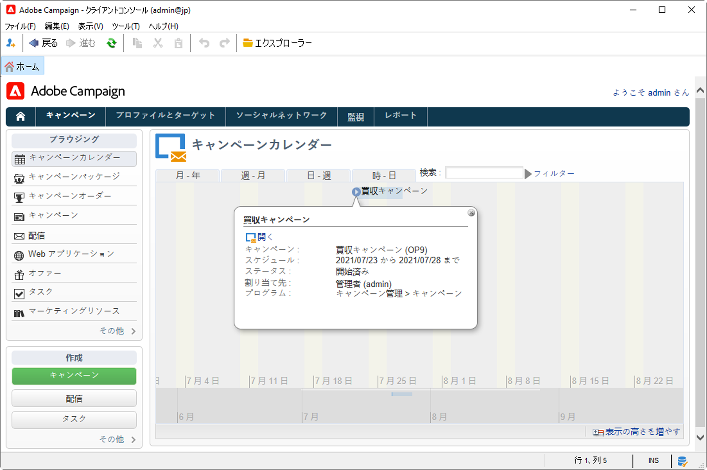
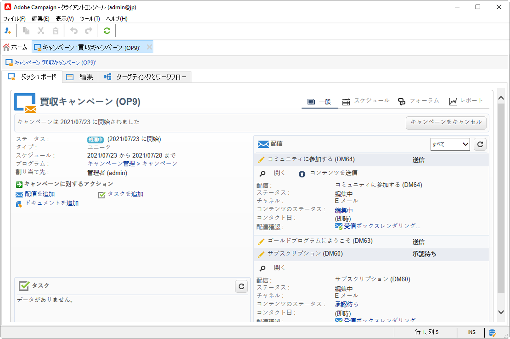

# マーケティングキャンペーンの基本を学ぶ{#gs-ac-campaigns}

Adobe Campaign が提供する一連のソリューションを使用すると、オンラインとオフラインのすべてのチャネルで、キャンペーンをパーソナライズして配信することができます。マーケティングキャンペーンの作成、設定、実施、分析などを行うことができます。 すべてのマーケティングキャンペーンは、統合コントロールセンターで管理できます。この節では、マーケティングキャンペーンの参照および作成方法について説明します。

キャンペーンには、アクション（配信）とプロセス（ファイルのインポートまたは抽出）だけでなく、マーケティングドキュメントや配信の概要といったリソースも含まれます。これらはマーケティングキャンペーンで使用されます。キャンペーンはプログラムの一部で、プログラムは 1 つのキャンペーンプランに含まれます。

## クロスチャネルキャンペーンのオーケストレーション

Adobe Campaign を使用すると、メール、ダイレクトメール、SMS、プッシュ通知などの複数のチャネルで、ターゲットを絞りパーソナライズしたキャンペーンの設計とオーケストレーションを行えます。1 つのインターフェイスを通して、すべてのキャンペーンとコミュニケーションのスケジュール作成、オーケストレーション、設定、パーソナライズ、自動化、実施、測定などに必要なすべての機能を利用することができます。

### 主要コンセプト

マーケティングキャンペーンの実装を始める前に、次の概念を理解しておく必要があります。

* **マーケティングキャンペーン**：キャンペーンは、配信、ターゲティングルール、費用、出力ファイル、関連ドキュメントなど、マーケティングキャンペーンに関連するすべての要素を 1 つにまとめたものです。各キャンペーンは 1 つのプログラムに添付されます。

* **プログラム**：プログラムを使用して、立ち上げ、訪問活動、特典施策などのマーケティングアクションをカレンダー期間で定義します。各プログラムには、1 つのカレンダーにリンクされた複数のキャンペーンが含まれており、カレンダーが全体像を提供します。

* **プラン**：マーケティングプランには複数のプログラムを含めることができます。マーケティングプランは 1 つのカレンダー期間にリンクし、予算が割り当てられています。また、ドキュメントや目標にリンクすることもできます。

* **キャンペーンワークフロー**：キャンペーンワークフローには、キャンペーンロジックを組み立てるためのアクティビティが含まれています。キャンペーンワークフローを使用すると、オーディエンスを定義し、使用可能なすべてのチャネルの配信を作成できます。

* **繰り返しキャンペーン**：繰り返しキャンペーンは、実行するワークフローテンプレートと実行スケジュールを定義する特定のテンプレートから作成します。

* **定期的なキャンペーン**：定期的なキャンペーンは、キャンペーンテンプレートの実行スケジュールに従って自動的に作成されるキャンペーンです。

## マーケティングキャンペーンのワークスペース

Adobe Campaign を使用すると、すべてのマーケティングキャンペーンの作成、設定、実施、分析を統合コントロールセンターで行うことができます。

↗️ [Campaign Classicv7ドキュメント](https://experienceleague.adobe.com/docs/campaign-classic/using/orchestrating-campaigns/about-marketing-campaigns/accessing-marketing-campaigns.html?lang=ja#orchestrating-campaigns){target=&quot;_blank&quot;}でマーケティングキャンペーンにアクセスして実装する方法を理解する

## 開始する主な手順

クロスチャネルのマーケティングキャンペーンを作成する主な手順は次のとおりです。

1. **マーケティングプログラムおよびキャンペーンの計画と設計**

   階層とスケジュールを定義し、予算を設定し、リソースを追加して、オペレーターを選択します。

   ↗️ [Campaign Classicv7ドキュメント](https://experienceleague.adobe.com/docs/campaign-classic/using/orchestrating-campaigns/orchestrate-campaigns/setting-up-marketing-campaigns.html?lang=ja#creating-plan-and-program-hierarchy){target=&quot;_blank&quot;}でマーケティングプランを作成し、キャンペーンを設定する方法を説明します

   すべてのマーケティングキャンペーンは、主な設定と機能を定義したテンプレートに基づいています。特定の設定が定義されていないキャンペーンを作成するために、組み込みのテンプレートが用意されています。 キャンペーンテンプレートを作成および設定して、そのテンプレートからキャンペーンを作成することができます。

   ↗️ [Campaign Classicv7ドキュメント](https://experienceleague.adobe.com/docs/campaign-classic/using/orchestrating-campaigns/orchestrate-campaigns/marketing-campaign-templates.html?lang=ja#orchestrating-campaigns){target=&quot;_blank&quot;}でキャンペーンテンプレートを使用する方法を説明します

   ↗️繰り返しキャンペーンの検出と[Campaign Classicv7ドキュメント](https://experienceleague.adobe.com/docs/campaign-classic/using/orchestrating-campaigns/orchestrate-campaigns/setting-up-marketing-campaigns.html?lang=ja#recurring-and-periodic-campaigns){target=&quot;_blank&quot;}での設定方法

1. **オーディエンスの定義**

   ワークフロー内にオーディエンスを作成したり、既存のグループを選択したりできます。例えば、受信者の一覧、ニュースレターの購読者、以前の配信の受信者、任意のフィルタリング条件などのオーディエンスグループです。

   

   ↗️ [Campaign Classicv7ドキュメント](https://experienceleague.adobe.com/docs/campaign-classic/using/orchestrating-campaigns/orchestrate-campaigns/marketing-campaign-target.html?lang=ja#orchestrating-campaigns){target=&quot;_blank&quot;}でメッセージのオーディエンスを定義する方法を説明します

1. **配信の作成**

   チャネルを選択し、メッセージの内容を定義して、配信を開始します。

   

   ↗️ [Campaign Classicv7ドキュメント](https://experienceleague.adobe.com/docs/campaign-classic/using/orchestrating-campaigns/orchestrate-campaigns/marketing-campaign-deliveries.html?lang=ja#creating-deliveries){target=&quot;_blank&quot;}でマーケティングキャンペーン配信を作成して開始する方法を説明します

   キャンペーンには、レポート、写真、web ページ、図などの様々なドキュメントを関連付けることができます。

   ↗️ [Campaign Classicv7ドキュメント](https://experienceleague.adobe.com/docs/campaign-classic/using/orchestrating-campaigns/orchestrate-campaigns/marketing-campaign-assets.html?lang=ja#adding-documents){target=&quot;_blank&quot;}の関連ドキュメントの詳細

1. **承認プロセスの設定**

   Adobe Campaign を使用すると、マーケティングキャンペーンの主要な段階で協調して行う承認プロセスを設定できます。キャンペーンごとに、配信ターゲット、コンテンツ、費用などを承認できます。Adobe Campaign を操作する承認者は、メールで通知を受け、コンソールまたはweb 接続で承認を許可または却下できます。 

   ↗️[Campaign Classicv7ドキュメント](https://experienceleague.adobe.com/docs/campaign-classic/using/orchestrating-campaigns/orchestrate-campaigns/marketing-campaign-approval.html?lang=ja#orchestrating-campaigns){target=&quot;_blank&quot;}で承認を設定および管理する方法について説明します

