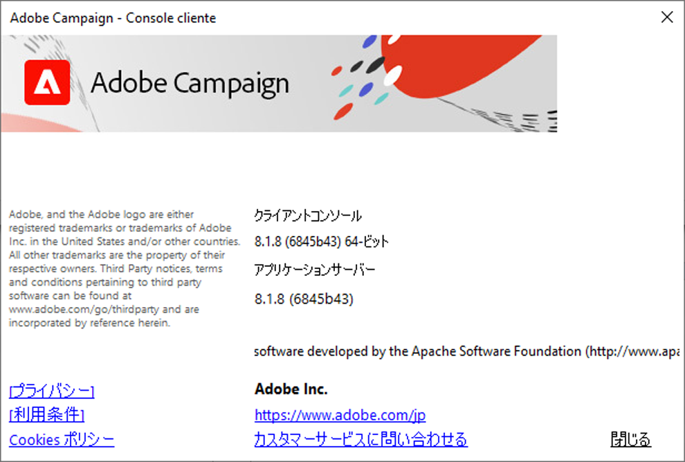

# Campaign v8 互換性マトリックス

このドキュメントでは、**Adobe Campaign v8** の最新のビルドでサポートしているすべてのシステムとコンポーネントの一覧を示します。このリストに含まれていない製品とバージョンは、Adobe Campaign とは互換性がありません。

>[!CAUTION]
>
>* 特に明記されていない限り、マイナーリリースはすべてサポートしています。
>* サードパーティ製のシステムやツールの特定のバージョンは、サービス終了（EOL）になると Adobe Campaign との互換性がなくなり、この互換性マトリックスから削除されます。問題を回避するため、互換性マトリックスに記載されているサポート対象バージョンのシステムをご使用ください。

## 互換性のあるシステム

### クライアントコンソール{#ClientConsoleoperatingsystems}

:warning: Campaign クライアントコンソールを使用するには、次のオペレーティングシステムとブラウザーが必要です。

**オペレーティングシステム**

* **Microsoft Windows Server** 2016、2012
* **Microsoft Windows** 8、10 (日本語インスタンスの場合に推奨))

**ブラウザー**

**Microsoft Internet Explorer** 11

### CRM コネクタ{#CRMconnectors}

* **Salesforce** コネクタ API バージョン 49
* **Microsoft Dynamics** コネクタ、Web API：Dynamics 365 オンプレミスおよびオンライン

### Federated Data Access（FDA）{#FederatedDataAccessFDA}

* **Amazon Redshift**
* **[!DNL Google Big Query]**
* **[!DNL Snowflake]**
* **[!DNL Vertica]**

### モバイル SDK{#MobileSDK}

* **Android** 7.x、8.x、9.0、Mobile SDK ビルド 1.1.1
* **Apple iOS** 9 ～ 14、Mobile SDK ビルド 1.0.26、32 ビットおよび 64 ビットバージョン

### サポートされるブラウザー {#Browsers}

次のブラウザーは Campaign for Web Access と互換性があります。

* **Microsoft Edge**、**Mozilla Firefox**、**Google Chrome**、**Safari** (最新バージョン)

* **Internet Explorer** 11

## Campaign のバージョン確認方法 とビルド

**ヘルプ/バージョン情報…**&#x200B;メニューを使用して、バージョンを確認します。

次の情報にアクセスします。

* クライアントコンソールとアプリケーションサーバーの&#x200B;**バージョン**&#x200B;番号。 上記のサンプルでは、クライアントコンソールとアプリケーションサーバーの両方でバージョンが8.1.5です。
* 括弧の間のSHA番号。
* カスタマーケアに問い合わせるAdobeへのリンク。
* Adobeのプライバシーポリシー、利用条件、Cookieポリシーへのリンクです。
