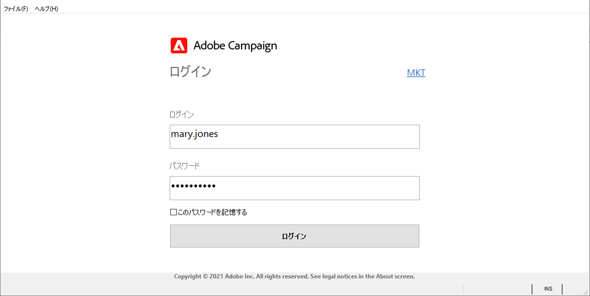
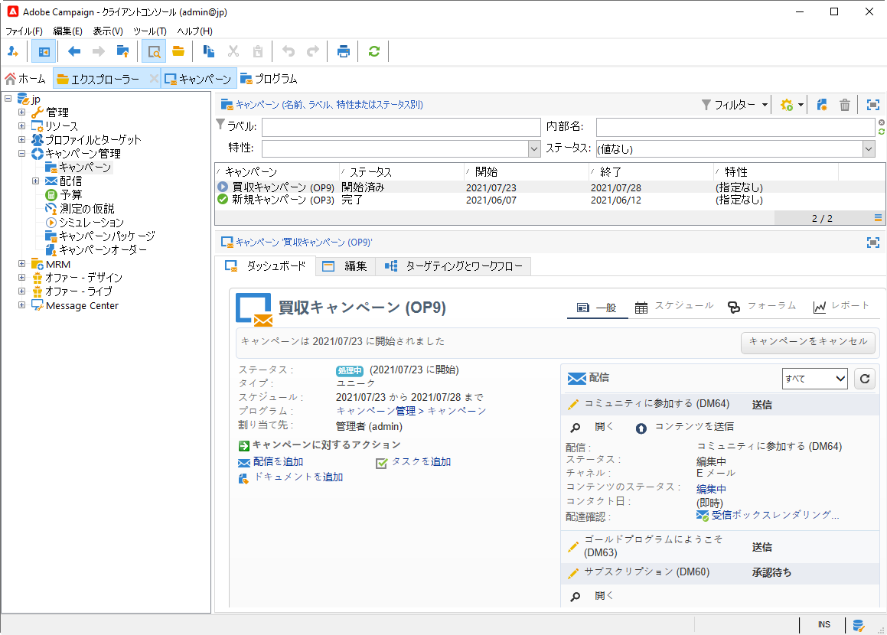
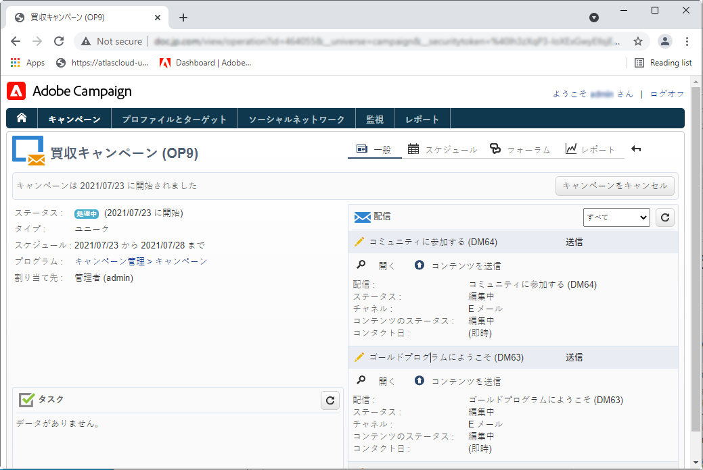

# Adobe Campaign v8 への接続{#gs-ac-connect}

Campaign クライアントコンソールは、Campaign アプリケーションサーバーに接続できるリッチクライアントです。

開始する前に、次の操作が必要です。

* [互換性マトリックス](compatibility-matrix.md)のAdobe Campaignとのシステムおよびツールの互換性を確認してください
* CampaignサーバーURLの取得
* ユーザー資格情報の取得

## クライアントコンソールのダウンロードとインストール

初めて Campaign を使用する場合、または新しいバージョンにアップグレードする必要がある場合は、クライアントコンソールをダウンロードしてインストールする必要があります。

次の 2 つのオプションを使用できます。

1. Campaign 管理者として、アドビの[ソフトウェア配布](https://experience.adobe.com/#/downloads/content/software-distribution/ja/campaign.html)に接続し、クライアントコンソールのインストールプログラムをダウンロードします。 その後、ローカルマシンにインストールできます。

1. アドビは、エンドユーザーとしてコンソールをデプロイできます。コンソールが更新されると、ポップアップウィンドウに最新のクライアントコンソールのバージョンをダウンロードするように求められます。

>[!CAUTION]
>
>アドビは、コンソールの新しいバージョンが利用可能になったときにすべてのユーザーにアラートが送信されるようにするために、「**[!UICONTROL 今後この質問をしない]**」オプションを選択しないままにすることをお勧めします。このオプションを選択すると、新しく利用可能になったバージョンは通知されません。

## 接続の作成

クライアントコンソールを新たにインストールしたら、次の手順に従ってアプリケーションサーバーへの接続を作成します。

1. Windows の&#x200B;**[!UICONTROL スタート]**&#x200B;メニューから、**Adobe Campaign** プログラムグループのコンソールを起動します。

1. 資格情報フィールドの右上隅にあるリンクをクリックして、接続設定ウィンドウにアクセスします。

1. **[!UICONTROL 追加／接続]**&#x200B;をクリックし、Adobe Campaign アプリケーションサーバーのラベルと URL を入力します。

1. URL 経由で Adobe Campaign アプリケーションサーバーへの接続を指定します。 DNS、マシンのエイリアス、または IP アドレスを使用します。

   例えば、[`https://<machine>.<domain>.com`](https://myserver.adobe.com) タイプの URL を使用できます。

1. Adobe Identity Management System（IMS）が組織に対して設定されている場合は、「**[!UICONTROL Adobe ID で接続]**」オプションをオンにします。

1. 「**[!UICONTROL OK]**」をクリックして設定を保存します。

例えば、テスト、ステージ、実稼動環境に接続するために必要な数の接続を追加できます。

>[!NOTE]
>
>「**[!UICONTROL 追加]**」ボタンを使用すると、すべての接続を整理する&#x200B;**[!UICONTROL フォルダー]**&#x200B;を作成できます。各接続をフォルダーにドラッグ＆ドロップします。

## Adobe Campaign へのログオン

既存のインスタンスにログオンするには、以下の手順に従います。

1. Windows の&#x200B;**[!UICONTROL スタート]**&#x200B;メニューで、**Adobe Campaign** プログラムグループのコンソールを起動します。

1. 資格情報フィールドの右上隅にあるリンクをクリックして、接続設定ウィンドウにアクセスします。

1. ログインする必要がある Campaign インスタンスを選択します。

1. 「**[!UICONTROL OK]**」をクリックします。

1. ユーザーログイン資格情報を入力し、「**[!UICONTROL ログイン]**」をクリックします。

   

設定に応じて、資格情報は次のようになります。

* アクセスを許可した Campaign 管理者が提供
* 自身の Adobe ID

## ユーザーへのアクセスの許可

Adobe Campaign は、様々なオペレーターに割り当てる一連の権利を定義したり、管理したりするのに役立ちます。以下の操作は、それらの権利に基づいて承認または拒否されます。

* 特定種類の機能に対するアクセス（ネームド権限など）
* 特定の要素へのアクセス、
* 要素（配信、連絡先、キャンペーン、グループなど）を作成、変更、削除します。

ユーザーの詳細と、ユーザーの権限の定義方法については、[この節](permissions.md)を参照してください。

Campaign 管理者は、オペレーターを作成し、ユーザーと資格情報を共有する責任があります。

## Adobe ID で Campaign に接続{#connect-ims}

Campaign ユーザーは、Adobe Identity Management System（IMS）から Adobe ID を使用して Adobe Campaign コンソールに接続できます。 この実装には、次のメリットがあります。

* Experience Cloud のすべてのソリューションに同じ ID を使用できます。
* Adobe Campaign で異なる統合を使用する場合にも、接続が記憶されます。
* 強力なパスワード管理ポリシーを適用します。
* Federated ID アカウント（外部の ID プロバイダー）を使用します。

[!DNL :speech_balloon:] 管理対象Cloud Servicesのユーザーは、アドビに [連絡し](campaign-faq.md#support) て、CampaignとのAdobeIMSを実装します。

## LDAP ログインを使用した Campaign への接続

Adobe Campaign のプラットフォームにアクセスするユーザーを、LDAP で認証することができます。

[!DNL :speech_balloon:] 管理対象Cloud Servicesのユーザーとして、アドビに [連絡](campaign-faq.md#support) し、CampaignとのLDAP統合を設定してください。

## Web アクセス{#web-access}

HTMLユーザーインターフェイスを使用して、シンプルなWebブラウザーでアプリケーションの特定の部分にアクセスできます。キャンペーンダッシュボード、キューブレポート、インスタンス監視など。

[!DNL :arrow_upper_right:] Webアクセスについて詳しくは、 [Campaign Classicv7のドキュメントを参照してください](https://experienceleague.adobe.com/docs/campaign-classic/using/getting-started/starting-with-adobe-campaign/campaign-workspace/adobe-campaign-workspace.html?lang=en#console-and-web-access)

Webアクセスには、コンソールに似たインターフェイスが用意されていますが、機能が少なくなります。

例えば、特定のオペレーターの場合、キャンペーンはコンソールに次のオプションと共に表示されます。

一方、Web アクセスで見たときには、次のようなオプションが表示されます。

Webアクセスは、検証プロセスでも使用されます。オペレーターは、承認リクエストのEメールをクリックし、Webブラウザーを通じてCampaignに接続して、配信コンテンツや予算を検証または却下できます。

[!DNL :arrow_upper_right:]  [Campaign Classicv7ドキュメントで承認を設定および管理する方法を説明します](https://experienceleague.adobe.com/docs/campaign-classic/using/orchestrating-campaigns/orchestrate-campaigns/marketing-campaign-approval.html?lang=ja#orchestrating-campaigns)
