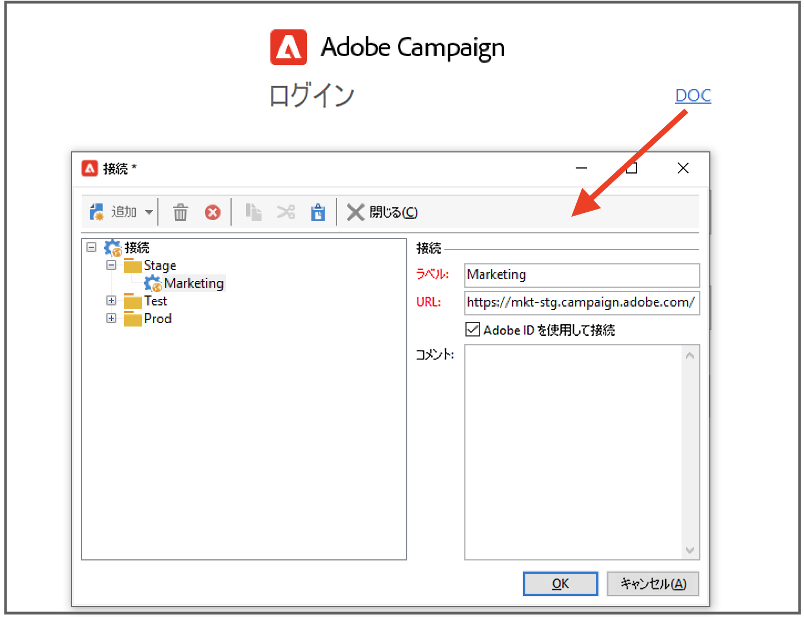
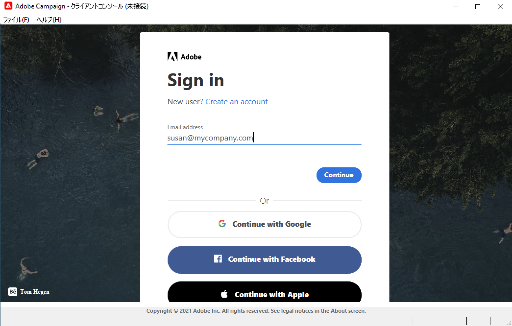

# Adobe Campaign v8 への接続{#gs-ac-connect}

Campaign アプリケーションサーバーに接続するには、Campaign クライアントコンソールをインストールする必要があります。

クライアントコンソールは、SOAP や HTTP などの標準のインターネットプロトコルを通じてAdobe Campaignアプリケーションサーバーと通信するネイティブアプリケーションです。 Campaign クライアントコンソールは、すべての機能と設定を一元化しています。また、ローカルキャッシュに依存することで、必要な帯域幅は最小限に抑えられます。簡単にデプロイできるように設計された Campaign クライアントコンソールは、インターネットブラウザーからデプロイし、自動的に更新できます。発生するトラフィックは HTTP(S) のみであり、特別なネットワーク設定は不要です。

始める前に、次の手順を実行する必要があります。

* お使いのシステムとツールについて、Adobe Campaign クライアントコンソールとの互換性を[互換性マトリックス](compatibility-matrix.md)で確認してください。
* Campaign サーバーの URL を取得する
* Adobe IDを作成するか、会社からユーザー資格情報を取得する
* Microsoft Edge Webview2 ランタイムをシステムにインストールします。 [詳細情報](#webview)

## クライアントコンソールのインストール{#download-ac-console}

### Microsoft Edge Webview2 ランタイム {#webview}

Campaign Classic8.4 のビルドバージョン以降のクライアントコンソールのインストールには、Microsoft Edge Webview 2 ランタイムのインストールが必要です。

WebView は、Windows 11 オペレーティングシステムの一部としてデフォルトでインストールされます。システムにまだ存在しない場合は、Campaign コンソールインストーラーにより、からダウンロードするよう求められます。 [Microsoft Developer Web サイト](http://www.adobe.com/go/acc-ms-webview2-runtime-download_jp){target="_blank"}. Microsoft により Internet Explorer 11 ブラウザーのサポートが非推奨（廃止予定）となったので、Internet Explorer 11 ブラウザーではダウンロードリンクは機能しません。別のブラウザーを使用してリンクにアクセスしてください。

### コンソールのダウンロード{#install-ac-console}

Campaign を初めて使用する場合は、クライアントコンソールをダウンロードしてインストールする必要があります。

クライアントコンソールをダウンロードするには、次の 2 つのオプションがあります。

1. Campaign 管理者として、Adobeに接続 [ソフトウェア配布](https://experience.adobe.com/#/downloads/content/software-distribution/ja/campaign.html){target="_blank"}.

1. エンドユーザーとして、Campaign 管理者によってクライアントコンソールがデプロイされ、専用 URL で使用できるようになります。

クライアントコンソールのインストールプログラムがダウンロードされたら、ローカルマシンにインストールします。

インストール後は、クライアントコンソールの言語を変更できないことに注意してください。

## 接続の作成{#create-your-connection}

クライアントコンソールを新たにインストールしたら、次の手順に従ってアプリケーションサーバーへの接続を作成します。

1. Windows の&#x200B;**[!UICONTROL スタート]**&#x200B;メニューから、**Adobe Campaign** プログラムグループのコンソールを起動します。

1. 資格情報フィールドの右上隅にあるリンクをクリックして、接続設定ウィンドウにアクセスします。

1. **[!UICONTROL 追加／接続]**&#x200B;をクリックし、Adobe Campaign アプリケーションサーバーのラベルと URL を入力します。

1. URL 経由で Adobe Campaign アプリケーションサーバーへの接続を指定します。 DNS、マシンのエイリアス、または IP アドレスを使用します。

   例えば、[`https://<machine>.<domain>.com`](https://myserver.adobe.com) タイプの URL を使用できます。

1. 「**[!UICONTROL Adobe ID を使用して接続]**」オプションをオンにします。

1. 「**[!UICONTROL OK]**」をクリックして設定を保存します。

例えば、テスト、ステージ、実稼動環境に接続するために必要な数の接続を追加できます。

>[!NOTE]
>
>「**[!UICONTROL 追加]**」ボタンを使用すると、すべての接続を整理する&#x200B;**[!UICONTROL フォルダー]**&#x200B;を作成できます。各接続をフォルダーにドラッグ＆ドロップします。

## Adobe Campaign へのログオン {#logon-to-ac}

Campaign ユーザーは、Adobe Identity Management System（IMS）により、Adobe ID を使用して Adobe Campaign コンソールに接続できます。 すべてのアドビソリューションで同じ ID を使用できます。Adobe Campaign を他のソリューションと共に使用する場合、接続は保存されます。でのAdobe IMSの詳細 [このページ](https://helpx.adobe.com/jp/enterprise/using/identity.html){target="_blank"}.

インスタンスにログオンするには、次の手順に従います。

1. Windows の&#x200B;**[!UICONTROL スタート]**&#x200B;メニューから、**Adobe Campaign** プログラムグループのコンソールを起動します。

1. 資格情報フィールドの右上隅にあるリンクをクリックして、接続設定ウィンドウにアクセスします。

   

1. ログインする必要がある Campaign インスタンスを選択します。

1. 「**[!UICONTROL OK]**」をクリックします。

1. これにより、[Adobe ID](#connect-ims) を使用して Campaign にログインできるようになります。

   

>[!NOTE]
>
>Campaign Classic 8.4 ビルドバージョンでは、Adobe Campaign クライアントコンソールは、プロキシ認証中にプロキシ資格情報を 2 回要求する場合があります。これは、Internet Explorer とは異なり、Microsoft Edge WebView2 がプロキシ資格情報をキャッシュ／パスワードストアに保存しないためです。

## クライアントコンソールのアップグレード{#upgrade-ac-console}

システムを新しいリリースにアップグレードする場合は、クライアントコンソールを同じバージョンに更新する必要があります。 これはベストプラクティスであり、一部のリリースでは、このアップグレードが必須です。 その場合、 [リリースノート](release-notes.md).

管理対象Cloud Servicesユーザーの場合、Adobeはクライアントコンソールをデプロイします。 アップグレードした環境に接続すると、最新のクライアントコンソールバージョンをポップアップウィンドウでダウンロードするよう求められます。 このアップグレードに同意し、必要に応じてクライアントコンソールを更新する必要があります。

>[!CAUTION]
>
>アドビは、コンソールの新しいバージョンが利用可能になったときにすべてのユーザーにアラートが送信されるようにするために、「**[!UICONTROL 今後この質問をしない]**」オプションを選択しないままにすることをお勧めします。このオプションを選択すると、新しく利用可能になったバージョンは通知されません。

## ユーザーへのアクセスの許可{#grant-access}

Adobe Campaign は、様々なオペレーターに割り当てる一連の権利を定義したり、管理したりするのに役立ちます。

Campaign 管理者は、オペレーターを作成し、ユーザーと資格情報を共有する責任があります。

ユーザーの詳細と、ユーザーの権限の定義方法については、[この節](gs-permissions.md)を参照してください。

## Web アクセス{#web-access}

アプリケーションの特定の機能（レポート、配信の承認、インスタンスの監視など）へは、HTML ユーザーインターフェイスを使用して、web ブラウザーからアクセスできます。

Web アクセスでは、コンソールと同様のインターフェースを提供しますが、機能は限定されています。

例えば、特定のオペレーターの場合、あるキャンペーンをコンソールで確認すると、次のようなオプションが表示されます。 

一方、Web アクセスで確認すると、次のようなオプションが表示されます。

Web アクセスは、検証プロセスでも使用します。オペレーターは、承認依頼のメールをクリックし、web ブラウザーで Campaign に接続して、配信コンテンツまたは予算の検証または却下を行うことができます。

Web から Campaign インスタンスにアクセスするための URL は `https://<your adobe campaign server>:<port number>/view/home` です。
