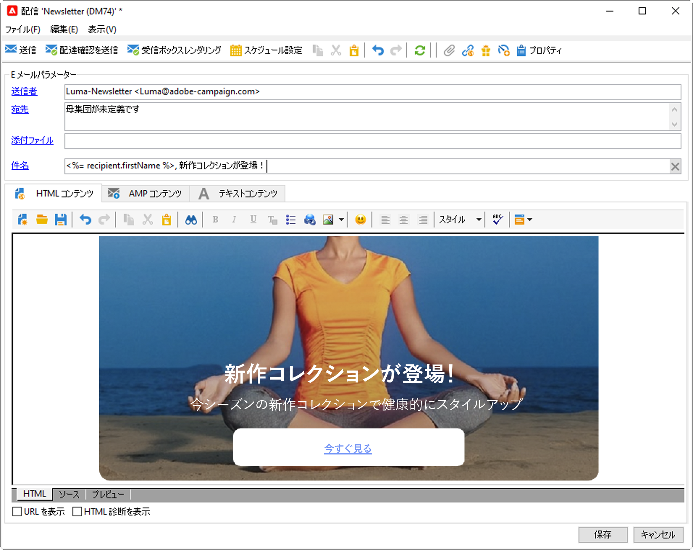
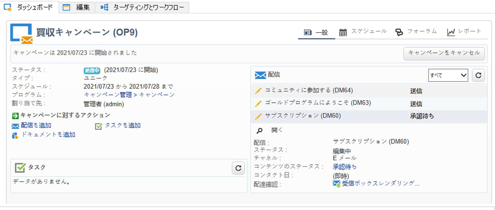
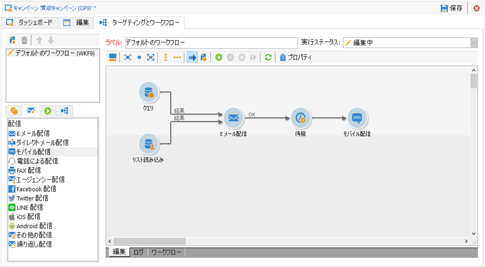
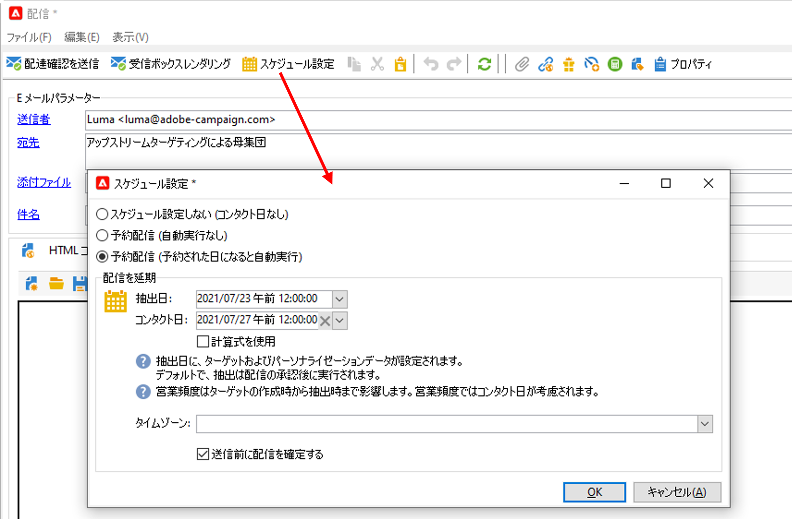

# メッセージの基本を学ぶ{#gs-ac-audiences}

Adobe Campaign を使用すると、メール、SMS、プッシュ通知、ダイレクトメールなどのクロスチャネルキャンペーンを送信し、各種の専用レポートを使用してキャンペーンの有効性を評価できます。これらのメッセージは、デザインし、配信を介して送信します。また、受信者ごとにパーソナライズすることができます。

コア機能には、ターゲティング、メッセージの定義とパーソナライゼーション、通信の実行、関連する運用可能なレポートなどがあります。主な機能のアクセスポイントは、配信ウィザードです。このアクセスポイントから、Adobe Campaign で提供される複数の機能を使用できます。

配信を作成するための主な手順については、[Campaign Classic v7 ドキュメント](https://experienceleague.adobe.com/docs/campaign-classic/using/sending-messages/key-steps-when-creating-a-delivery/steps-about-delivery-creation-steps.html?lang=ja)を参照してください。

Adobe Campaign v8 には、次の配信チャネルが付属しています。

* **E メールチャネル**：E メール配信では、パーソナライズされた E メールをターゲット母集団に送信できます。詳しくは、[このページ](../send/email.md)を参照してください。

* **ダイレクトメールチャネル**：ダイレクトメール配信では、ターゲット母集団に関するデータを含んだ抽出ファイルを生成できます。詳しくは、[このページ](../send/direct-mail.md)を参照してください。

* **モバイルチャネル**：モバイルチャネル経由の配信では、パーソナライズされた SMS または LINE メッセージをターゲット母集団に送信できます。詳しくは、[このページ](../send/sms.md)を参照してください。

* **モバイルアプリケーションチャネル**：モバイルアプリ配信では、通知を iOS システムおよび Android システムに送信できます。詳しくは、[このページ](../send/push.md)を参照してください。

<!--
* **LINE channel**: LINE deliveries let you send messages on LINE, an instant messaging application available on all smartphones. Learn more in [this page](../send/line.md)
-->

## メッセージの送信方法の選択

メッセージを作成し、体裁を整えてテストしたら、送信方法を選択できます。 Campaign は、次の一連の機能を備えています。

* メインターゲットへの手動によるメッセージ送信

   

   [!DNL :arrow_upper_right:]  [Campaign Classicv7ドキュメント](https://experienceleague.adobe.com/docs/campaign-classic/using/sending-messages/sending-emails/sending-an-email/sending-messages.html?lang=ja){target=&quot;_blank&quot;}でメッセージを送信する方法を説明します

* [マーケティングキャンペーン](campaigns.md)に関連付けられたメッセージの送信

   

   [!DNL :arrow_upper_right:] キャンペーンのコンテキストでメッセージを送信する方法については、 [Campaign Classicv7ドキュメント](https://experienceleague.adobe.com/docs/campaign-classic/using/orchestrating-campaigns/orchestrate-campaigns/marketing-campaign-deliveries.html?lang=ja){target=&quot;_blank&quot;}を参照してください。

* [ワークフロー](../config/workflows.md)を介したメッセージの送信

   

   [!DNL :arrow_upper_right:]  [Campaign Classicv7ドキュメント](https://experienceleague.adobe.com/docs/campaign-classic/using/automating-with-workflows/action-activities/delivery.html?lang=ja){target=&quot;_blank&quot;}でEメール配信を自動化する方法を説明します

* イベントからの[メッセージのトリガー](../send/transactional.md)
   [!DNL :arrow_upper_right:] [ユースケース：ファイルが添付されたトランザクションメールの送信方法を学ぶ](https://experienceleague.adobe.com/docs/campaign-classic/using/transactional-messaging/transactional-email-with-attachments.html?lang=en){target=&quot;_blank&quot;}

* メッセージのスケジュール設定

   

   [!DNL :arrow_upper_right:] [ユースケース：誕生日メールのスケジュール設定と送信方法を学ぶ](https://experienceleague.adobe.com/docs/campaign-classic/using/automating-with-workflows/use-cases/deliveries/sending-a-birthday-email.html?lang=ja){target=&quot;_blank&quot;}

## パーソナライゼーションの追加

Adobe Campaign が配信するメッセージは、様々な方法でパーソナライズすることができます。

次の操作を行うことができます。

* 動的なパーソナライゼーションフィールドを挿入する。
   [!DNL :arrow_upper_right:] パーソナライゼーションフィールドの使用方法については、[Campaign Classic v7 ドキュメント](https://experienceleague.adobe.com/docs/campaign-classic/using/sending-messages/personalizing-deliveries/personalization-fields.html?lang=ja)を参照してください{target=&quot;_blank&quot;}
* 事前に定義されたパーソナライゼーションブロックを挿入する。
   [!DNL :arrow_upper_right:] パーソナライゼーションブロックの詳細と使用方法については、[Campaign Classic v7 ドキュメント](https://experienceleague.adobe.com/docs/campaign-classic/using/sending-messages/personalizing-deliveries/personalization-blocks.html?lang=ja)を参照してください{target=&quot;_blank&quot;}
* 条件付きコンテンツを作成する。
   [!DNL :arrow_upper_right:] 条件付きコンテンツの挿入方法については、[Campaign Classic v7 ドキュメント](https://experienceleague.adobe.com/docs/campaign-classic/using/sending-messages/personalizing-deliveries/conditional-content.html?lang=ja)を参照してください{target=&quot;_blank&quot;}

## トランザクションメッセージの送信

トランザクションメッセージ（Message Center）は、トリガーメッセージを管理するために設計された Campaign モジュールです。

[!DNL :bulb:] トランザクションメッセージ機能の詳細については、[この節](../dev/architecture.md#transac-msg-archi)を参照してください

[!DNL :bulb:] トランザクションメッセージの設定と送信の手順については、[このページ](../send/transactional.md)を参照してください

[!DNL :arrow_upper_right:] [Campaign Classic v7 ドキュメント](https://experienceleague.adobe.com/docs/campaign-classic/using/transactional-messaging/transactional-email-with-attachments.html?lang=ja)でこの機能のエンドツーエンドのユースケースを確認する{target=&quot;_blank&quot;}

## 配信とトラッキングログ

送信後に配信を監視することは、効率的で顧客に働きかけるマーケティングキャンペーンにするための重要なステップです。 配信の送信後に監視したり、配信の失敗や強制隔離がどのように管理されているかを把握したりできます。

[!DNL :arrow_upper_right:]  [Campaign Classicv7ドキュメント](https://experienceleague.adobe.com/docs/campaign-classic/using/sending-messages/monitoring-deliveries/about-delivery-monitoring.html#sending-messages){target=&quot;_blank&quot;}で配信を監視する方法を説明します

Campaign Classic v7 ドキュメントの&#x200B;**関連トピック**：

[!DNL :arrow_upper_right:]  [配信のベストプラクティス](https://experienceleague.adobe.com/docs/campaign-classic/using/sending-messages/key-steps-when-creating-a-delivery/delivery-bestpractices/delivery-best-practices.html?lang=ja){target=&quot;_blank&quot;}

[!DNL :arrow_upper_right:]  [電子メールのテストと送信](https://experienceleague.adobe.com/docs/campaign-classic/using/sending-messages/sending-emails/sending-an-email/sending-messages.html){target=&quot;_blank&quot;}

[!DNL :arrow_upper_right:]  [配達確認の送信](https://experienceleague.adobe.com/docs/campaign-classic/using/sending-messages/key-steps-when-creating-a-delivery/steps-validating-the-delivery.html?lang=ja){target=&quot;_blank&quot;}
