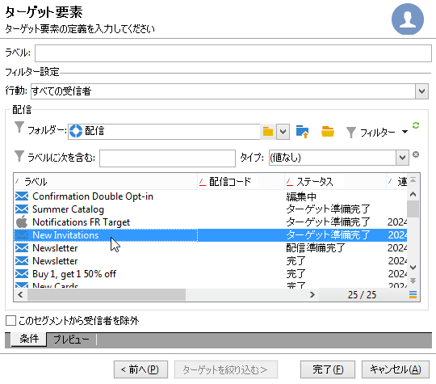

# 最初の配信の作成 {#create-a-msg}

このページでは、1 回限りの単一の配信を作成する方法について説明します。ユースケースを作成する他のタイプの配信を作成できます。様々なタイプの配信とその作成方法について詳しくは、[このページ](gs-message.md)を参照してください。

1 回限りの配信を作成する主な手順を次に示します。

1. **新しい配信の作成**[詳細を表示](#create-the-delivery)

1. **配信コンテンツの定義**[詳細情報](#content-of-the-delivery)

1. **ターゲット母集団の選択**[詳細情報](#target-population)

その後、Adobe Campaign でメッセージの準備、テスト、送信および監視を行うことができます。

>[!NOTE]
>
>この節で説明する手順では、外部配信の場合を除き、すべてのターゲット受信者とそのプロファイルがデータベース内に格納されていることを想定しています。詳しくは、[外部受信者の選択](#selecting-external-recipients)を参照してください。

## 配信の作成 {#create-the-delivery}

配信を作成するには、次の手順に従います。

1. 配信のリストを参照し、「**[!UICONTROL 作成]**」をクリックします。
1. 配信チャネルを選択します。そのためには、ドロップダウンリストから適切な配信テンプレートを選択します。

   

   メール、電話、モバイルチャネル（プッシュ／SMS）、ダイレクトメール、X（Twitter）など、インストールしたすべてのチャネルに、それぞれの組み込みテンプレートが用意されています。リストに表示されるチャネルの種類は、ライセンス契約の内容に応じて異なります。

   ニーズに合わせて特定のパラメーターを事前に設定する場合は、新しい配信テンプレートを作成できます。[詳細情報](../send/create-templates.md)。

1. 「**[!UICONTROL ラベル]**」フィールドに配信の名前を入力します。

   （オプション）また、配信には配信コードを割り当てることもできます。配信名と配信コードは、配信リストに表示されますが、受信者からは見えません。

1. （オプション）「**[!UICONTROL 説明]**」フィールドに説明を追加します。
1. （オプション）関連するフィールドで配信の特性を選択します。この情報は配信トラッキングに役立ちます。この基準に基づいて配信リストの表示をフィルタリングしたり、クエリの作成にこの選択基準を使用したりできます。
1. 「**[!UICONTROL 続行]**」をクリックして、メッセージコンテンツウィンドウを表示します。

## 配信コンテンツの定義 {#content-of-the-delivery}

配信コンテンツの設定準備が整いました。配信コンテンツ定義は、各チャネル専用です。詳しくは、該当する節を参照してください。

* [メールコンテンツの定義](../send/email.md)
* [SMS コンテンツの定義](../send/sms/sms-content.md)
* [ダイレクトメールコンテンツの定義](../send/direct-mail.md)
* [プッシュ通知コンテンツの定義](../send/push.md)

## ターゲットオーディエンスの定義 {#target-population}

配信ごとに、次の種類のターゲットオーディエンスを定義できます。

* **メインオーディエンス**：メッセージを受信するプロファイル。[詳細情報](#select-the-main-target)
* **配達確認のターゲット**：配達確認メッセージを受信するプロファイル。配達確認は、メッセージをメインターゲットに送信する前にテストする特定のメッセージです。[詳細情報](#select-the-proof-target)

さらに、マーケティングキャンペーンのコンテキストでは、次の項目を追加できます。

* **シードアドレス**：配信ターゲットには含まれないが、配信を受信する受信者。[詳細情報](../audiences/test-profiles.md)
* **コントロール母集団**：配信を受信しない母集団。行動とキャンペーンの影響の追跡に使用されます。[詳細情報](../../automation/campaigns/marketing-campaign-target.md#add-a-control-group)。

### 配信の主要受信者の選択 {#select-the-main-target}

ほとんどの場合、メインターゲットは Adobe Campaign データベースから抽出されます（デフォルトモード）。ただし、受信者は、[外部ファイル](#selecting-external-recipients)に保存することもできます。

配信の受信者を選択するには、次の手順に従います。

1. 配信エディターで、「**[!UICONTROL 宛先]**」を選択します。
1. 受信者の情報がデータベースに格納されている場合は、第 1 のオプションを選択します。

   {zoomable="yes"}

1. **[!UICONTROL ターゲットマッピング]**&#x200B;ドロップダウンリストで「[ターゲットマッピング](../audiences/target-mappings.md)」を選択します。
1. 「**[!UICONTROL 追加]**」ボタンをクリックし、制限フィルターを定義します。

   {width="60%" align="left" zoomable="yes"}

   フィルターのタイプを選択し、「**[!UICONTROL 次へ]**」をクリックして条件を定義します。「**[!UICONTROL プレビュー]**」タブからフィルタリングされた受信者を表示できます。ターゲットのタイプに応じて、「**[!UICONTROL ターゲットを絞り込む]**」ボタンを使用して、複数のターゲティング条件を組み合わせることができます。

   次のターゲットタイプを使用できます。

   * **[!UICONTROL フィルター条件]**：このオプションを使用して、クエリを定義し、結果を表示します。クエリのデザインについて詳しくは、[この節](../../automation/workflow/query.md)を参照してください。
   * **[!UICONTROL 受信者のリスト]**：このオプションを使用して、プロファイルのリストをターゲットに指定します。リストについて詳しくは、[この節](../audiences/create-audiences.md)を参照してください。
   * **[!UICONTROL 受信者]**：このオプションを使用して、データベース内の特定のプロファイルを選択します。
   * **[!UICONTROL フォルダーに含まれている受信者]**：このオプションを使用して、特定のフォルダーに含まれているすべてのプロファイルをターゲットに指定します。
   * **[!UICONTROL 配信の受信者]**：このオプションを使用して、配信の受信者からターゲットを作成します。その後、リストから配信を選択する必要があります。

     

   * **[!UICONTROL フォルダーに属する配信の受信者]**：このオプションを使用して、特定のフォルダーに含まれている受信者の配信からターゲットを作成します。

     

     受信者の行動を、次のようにドロップダウンリストから選択することでフィルタリングできます。

     

     >[!NOTE]
     >
     >「**[!UICONTROL サブフォルダーを含める]**」オプションでは、ツリー構造内の選択したノード以下にあるフォルダー内の配信をターゲットとして指定することもできます。

   * **[!UICONTROL 情報サービスの購読者]**：このオプションでは、作成する配信のターゲットとなる受信者が購読する必要のあるニュースレターを選択できます。

     

   * **[!UICONTROL ユーザーフィルター]**：このオプションでは、事前設定済みのフィルターを、データベース内のプロファイルに対するフィルター条件として使用できます。事前設定済みフィルターについて詳しくは、[この節](../audiences/create-filters.md#default-filters)を参照してください。
   * 「**[!UICONTROL このセグメントから受信者を除外]**」オプションを使用すると、定義したターゲット条件を満たさない受信者をターゲットにすることができます。これを使用するには、適切なボックスを選択し、事前に定義した、該当するプロファイルを除外するためのターゲティングを適用します。

1. 「**[!UICONTROL ラベル]**」フィールドに、このターゲティングの名前を入力します。デフォルトでは、ラベルは最初のターゲティング条件のラベルと同じです。フィルター条件を組み合わせる場合は、明示的な名前を使用することをお勧めします。
1. 「**[!UICONTROL 終了]**」をクリックして、ターゲティングオプションを検証します。

   定義したターゲット条件は、メインターゲット設定タブの中央部セクションにまとめて表示されます。特定の条件をクリックすると、その内容（設定とプレビュー）が表示されます。条件を削除するには、ラベルの後にある「X」をクリックします。

   

### 外部受信者の選択 {#selecting-external-recipients}

メッセージは、データベースではなく外部ファイルに格納されているプロファイルに送信できます。例えば、テキストファイルからインポートした受信者に配信を送信するには、次の手順に従います。

1. 「**[!UICONTROL 宛先]**」リンクをクリックして、配信の受信者を選択します。
1. 「**[!UICONTROL 外部ファイルで定義]**」オプションを選択します。
1. 受信者を含むファイルを選択します。
1. 受信者をインポートする場合は、**[!UICONTROL ファイルフォーマットの定義...]** リンクをクリックし、外部ファイルを選択して設定します。

   データのインポートについて詳しくは、[Campaign Classic v7 ドキュメント](https://experienceleague.adobe.com/ja/docs/campaign-classic/using/getting-started/importing-and-exporting-data/generic-imports-exports/executing-import-jobs#step-2---source-file-selection){target="_blank"}を参照してください。

1. 「**[!UICONTROL 終了]**」をクリックして、この配信を標準の配信として設定します。

>[!CAUTION]
>
>外部受信者へのメール配信用のメッセージコンテンツを定義する際に、ミラーページへのリンクを含めないように注意してください。この配信モードでは、ミラーページを生成できません。

### 除外設定 {#define-exclusion-settings}

[配信のオーディエンス](#target-population)を定義する際は、「**[!UICONTROL 除外]**」タブを使用してメッセージの数を制限します。デフォルトのパラメーターを使用することをお勧めしますが、ニーズに応じて設定を適応させることができます。ただし、誤用やエラーを避けるために、これらのオプションはエキスパートユーザーのみが変更してください。

>[!CAUTION]
>
>エキスパートユーザーは、具体的なユースケースに合わせて、これらの設定を変更できますが、アドビではデフォルトの設定を維持することをお勧めします。

一定回数にわたって連続してエラーが発生したアドレスや、このウィンドウで指定したしきい値を下回る低い品質評価が付けられたアドレスについては、配信から除外できます。また、データが何も返されない未適合アドレスを承認するかどうかを選択できます。

デフォルト設定を変更するには、**[!UICONTROL 編集…]** リンクをクリックします。

+++ 詳しくは、使用可能なオプションを参照してください。

* **[!UICONTROL 配信中に重複アドレスを除外]**：このオプションはデフォルトでアクティブになっており、配信中に重複したメールアドレスを削除します。適用される除外方法は、Adobe Campaign の使用方法と、データベースに格納されているデータのタイプによって異なる場合があります。このオプションの値は、配信テンプレートごとに設定できます。
* **[!UICONTROL 今後連絡を希望しない受信者を除外]**：ブロックリストに記載されたメールアドレスを持つ（オプトアウトした）受信者を除外します。E マーケティングのビジネス倫理を遵守するために、このオプションは必ずオンにしておいてください。
* **[!UICONTROL 強制隔離された受信者を除外]**：このオプションを使用すると、強制隔離されたアドレスを持つプロファイルをターゲットから除外できます。このオプションは必ずオンにしておくことをお勧めします。強制隔離の管理について詳しくは、[この節](../send/quarantines.md)を参照してください。
* **[!UICONTROL 配信を制限]**：メッセージ数の上限を設定します。送信するメッセージの最大数を指定し、配信件数を限定します。指定されたメッセージの最大数よりもターゲットオーディエンスが大きい場合は、ターゲットの中から送信先がランダムに選択されます。すべてのメッセージを送信するには、この値を「0」のままにします。
* **[!UICONTROL 重複するレコード（同じ識別子）を保持]**：このオプションを使用すると、複数のターゲティング条件を満たす受信者に対して複数の配信を許可できます。
+++

### 配達確認メッセージの受信者を選択 {#select-the-proof-target}

メール配信の場合は、配達確認を送信して、メッセージの内容を検証できます。 配達確認を送信すると、オプトアウトリンクやミラーページ、その他のリンクの確認、メッセージの検証、画像の表示の確認、エラーの検出などを行うことができます。また、様々なデバイス上でデザインとレンダリングを確認することもできます。

配達確認は、メッセージをメインオーディエンスに送信する前にテストするための特別なメッセージです。配達確認の受信者は、メッセージ（レンダリング、コンテンツ、パーソナライゼーション設定、構成）の承認を担当します。

配達確認の受信者と送信について詳しくは、[この節](../send/preview-and-proof.md#send-proofs)を参照してください。

#### チュートリアルビデオ {#seeds-and-proofs-video}

このビデオでは、既存のメールにシードと配達確認を追加する方法とそれを送信する方法を説明します。

>[!VIDEO](https://video.tv.adobe.com/v/3447000?quality=12&captions=jpn)

Campaign Classic に関するその他のハウツービデオは[こちら](https://experienceleague.adobe.com/docs/campaign-classic-learn/tutorials/overview.html?lang=ja)で参照できます。

## 配信の準備と検証 {#validate-the-delivery}

配信を作成して設定したら、メインターゲットに送信する前に検証する必要があります。

手順は次のとおりです。

1. **配信の分析**：この手順では、配信メッセージを準備できます。[詳細情報](../send/delivery-analysis.md)。

1. **配達確認の送信**：この手順では、コンテンツ、URL、パーソナライゼーションなどを制御できます。[詳細情報](../send/preview-and-proof.md)。

>[!IMPORTANT]
>
>上記の 2 つの手順は、メッセージコンテンツを変更するたびに実行する&#x200B;**必要**&#x200B;があります。

## 配信の設定と送信 {#configuring-and-sending-the-delivery}

配信パラメーターにアクセスしてさらに設定を行い、メッセージの送信方法を定義します。配信の優先順位を定義し、送信ウェーブを設定し、再試行設定を指定し、配信の送信をテストできます。この設定が完了したら、送信を確認できます。その後、メッセージは直ちに送信されるか、配信スケジュールに基づいて送信されます。

配信設定の指定方法について詳しくは、[このページ](../send/configure-and-send.md)を参照してください。
