# Query Campaign データベース

クエリは、選択したテーブルのフィールドを使用するか、数式を使用して作成します。

Adobe Campaign でクエリを作成する手順は次のとおりです。

1. [作業テーブルを選択](#step-1---choose-a-table)。
1. [抽出するデータを選択](#step-2---choose-data-to-extract)。
1. [&#x200B; データ並べ替えモードを定義](#step-3---sort-data)。
1. [&#x200B; データフィルタリングオプションを定義](#step-4---filter-data)。
1. [&#x200B; データ形式の設定](#step-5---format-data)。
1. [&#x200B; クエリの結果をプレビュー](#step-6---preview-data)。

これらの手順はすべて、[汎用クエリエディター](query-editor.md)で使用できます。 別のコンテキストでクエリを作成すると、一部の手順が欠落する可能性があります。 クエリについて詳しくは、[&#x200B; ワークフロークエリアクティビティドキュメント &#x200B;](../../automation/workflow/query.md)も参照してください。

## 手順 1 - テーブルの選択 {#step-1---choose-a-table}

Campaign データベースをクエリするには、**[汎用クエリエディター](query-editor.md)**&#x200B;を開き、**[!UICONTROL ドキュメントタイプ]** ウィンドウで、クエリするデータを含むテーブルを選択します。

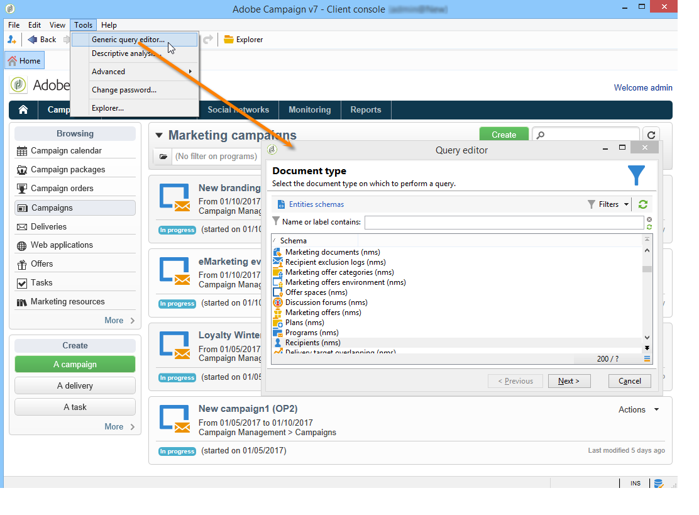

必要に応じて、フィルターフィールドまたは&#x200B;**[!UICONTROL フィルター]** ボタンを使用してデータをフィルタリングします。

## 手順 2 - 抽出するデータの選択 {#step-2---choose-data-to-extract}

**[!UICONTROL データを抽出]**&#x200B;画面で、出力に含めるフィールドを選択します。 これらのフィールドは、結果に表示される列を定義します。

例えば、**[!UICONTROL Age]**、**[!UICONTROL プライマリキー]**、**[!UICONTROL メールドメイン]**、**[!UICONTROL City]**&#x200B;を選択できます。 出力は、この選択に従って構造化されます。 列の順序を調整するには、ウィンドウの右側にある青い矢印を使用します。

式を変更するには、式を追加するか、プロセスを集計関数に適用します。 式を編集するには、**[!UICONTROL 式]**&#x200B;列フィールドをクリックし、**[!UICONTROL 式を編集]**&#x200B;を選択します。

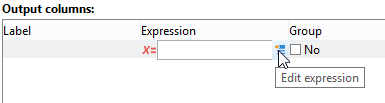

出力列に表示されるデータをグループ化できます。 これを行うには、**[!UICONTROL データから]** ウィンドウを抽出する&#x200B;**[!UICONTROL グループ]**&#x200B;列の&#x200B;**[!UICONTROL Yes]**&#x200B;を選択します。 その後、選択したグループ化軸に基づいて結果が集計されます。 グループ化を使用したクエリの例については、[このセクション &#x200B;](../../automation/workflow/query-delivery-info.md)を参照してください。

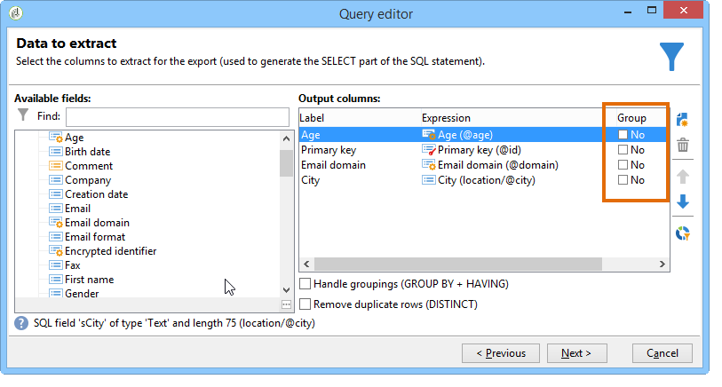

* **[!UICONTROL グループ化を処理（GROUP BY + HAVING）]** オプションを使用すると、結果をグループ化し、それらのグループに条件を適用できます。 出力列のすべてのフィールドに適用されます。 例えば、出力列の値をグループ化し、結果をフィルタリングして、35 ～ 50歳の受信者などの特定の情報のみを取得できます。

  詳しくは、[この節](../../automation/workflow/query-grouping-management.md)を参照してください。

**[!UICONTROL 重複行を削除（DISTINCT）]** オプションを使用すると、出力（重複排除）から同じ行が削除されます。 例えば、**姓**、**名**、**電子メール**&#x200B;を出力列として選択した場合、3つのフィールドすべてで同じ値を持つレコードは重複とみなされます。 結果には1つのインスタンスのみが保持され、各コンタクトが1回だけ表示されます。

## 手順 3 - データの並べ替え {#step-3---sort-data}

**[!UICONTROL 並べ替え]**&#x200B;ウィンドウでは、列のコンテンツを並べ替えることができます。 矢印を使用して列の順序を変更します。

* 「**[!UICONTROL 並べ替え]**」列では、単純な並べ替えを行うことができます。列のコンテンツを A から Z の順（昇順）に並べ替えます。
* 「**[!UICONTROL 降順ソート]**」では、コンテンツを Z から A の順（降順）に並べ替えます。 これは、売上レコードなどを表示する場合に便利で、最も大きい数字がリストの一番上に表示されます。

この例では、データは受信者の年齢に基づいて昇順で並べ替えられています。

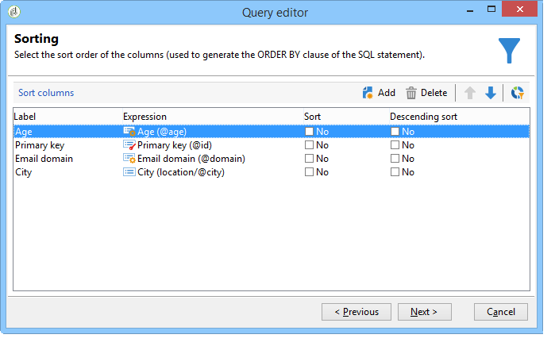

## 手順 4 - データのフィルタリング {#step-4---filter-data}

クエリエディターでは、データをフィルタリングして結果を絞り込むことができます。 使用可能なフィルターは、クエリするテーブルによって異なります。

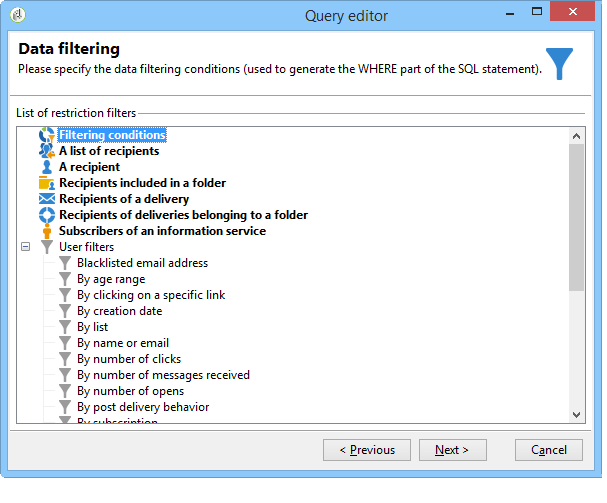

**[!UICONTROL フィルター条件]**&#x200B;を選択すると、**[!UICONTROL ターゲット要素]** セクションが開きます。 ここでは、収集するデータをフィルタリングするためのルールを定義できます。

* 新しいフィルターを作成するには、条件の作成に必要なフィールド、演算子、値を選択します。 このページ [&#128279;](filter-conditions.md)で説明したように、複数の条件を組み合わせることもできます。

* 既存のフィルターを再利用するには、**[!UICONTROL 追加]** ボタンをクリックし、**[!UICONTROL 定義済みフィルター]**&#x200B;を選択して、必要なフィルターを選択します。

  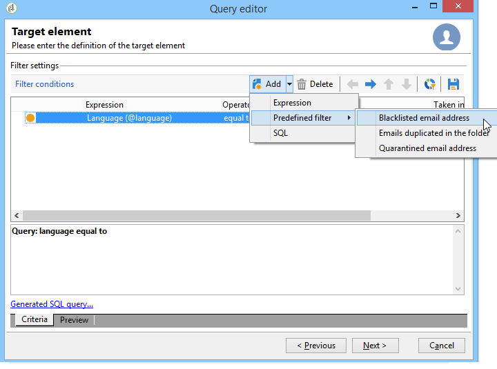

**[!UICONTROL 汎用クエリエディター]**&#x200B;で作成されたフィルターは、他のクエリアプリケーションで再利用でき、逆も同様です。 後で使用するためにフィルターを保存するには、**[!UICONTROL 保存]** アイコンをクリックします。

>[!NOTE]
>
>フィルターの作成および使用について詳しくは、[フィルターオプション](filter-conditions.md)を参照してください。

次の例に示すように、英語を話す受信者全員を取得するには、「受信者の言語が英語&#x200B;**と等しい**」を選択します。

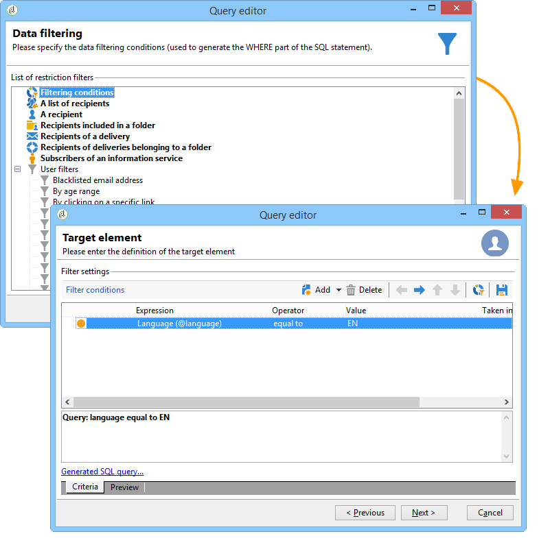

>[!NOTE]
>
>オプションに直接アクセスするには、**値** フィールドに次の数式を入力します：**$（options:OPTION_NAME）**。

フィルター条件の結果を表示するには、「**[!UICONTROL プレビュー]**」タブをクリックします。 この例では、英語を話すすべての受信者の姓、名およびメールアドレスが表示されます。

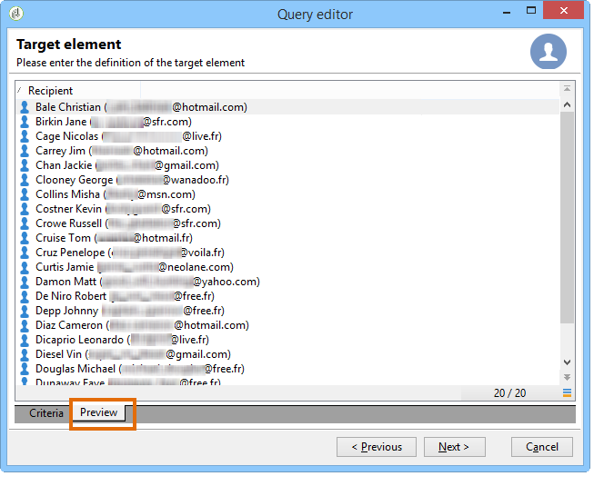

SQL 言語を理解しているユーザーは、「**[!UICONTROL 生成された SQL クエリ]**」をクリックして SQL クエリを表示できます。

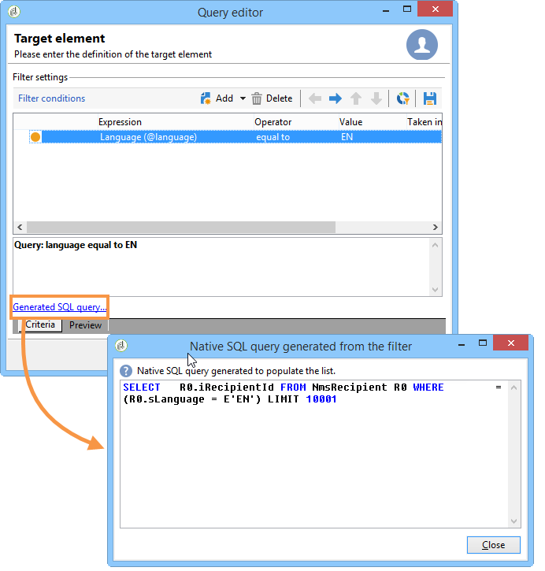

## 手順 5 - データのフォーマット {#step-5---format-data}

制限フィルターを設定すると、**[!UICONTROL データ形式]** ウィンドウが開きます。 このウィンドウでは、出力列の並べ替え、データの変換、列ラベルの大文字/小文字の調整を行うことができます。 計算フィールドを作成して、最終結果に数式を適用することもできます。

>[!NOTE]
>
>計算フィールドの種類について詳しくは、[計算フィールドの作成](filter-conditions.md#creating-calculated-fields)を参照してください。

チェックされていない列は、データプレビューウィンドウで非表示になります。

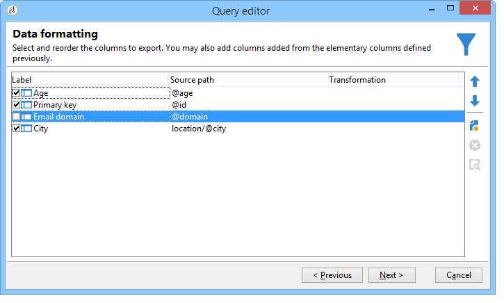

「**[!UICONTROL 変換]**」列では、列ラベルを大文字または小文字に変更できます。 列を選択し、「**[!UICONTROL 変換]**」列をクリックします。 次を選択できます。

* 「**[!UICONTROL 小文字に切り替え]**」
* 「**[!UICONTROL 大文字に切り替え]**」
* 「**[!UICONTROL 最初の文字は大文字]**」

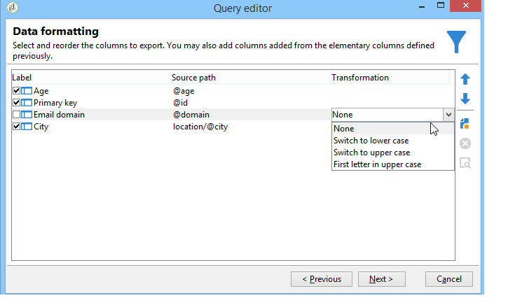

## 手順 6 - データのプレビュー {#step-6---preview-data}

**[!UICONTROL データのプレビュー]** ウィンドウは、クエリプロセスの最終段階を示します。 **[!UICONTROL データのプレビューを開始]**&#x200B;をクリックして結果を確認します。結果は列またはXML形式で表示できます。 基礎となるSQL クエリを調べるには、「**[!UICONTROL 生成されたSQL クエリ]**」タブを開きます。 この手順では、クエリをさらに使用する前に、クエリが期待どおりに動作することを確認できます。

この例では、データは受信者の年齢に基づいて昇順で並べ替えられています。

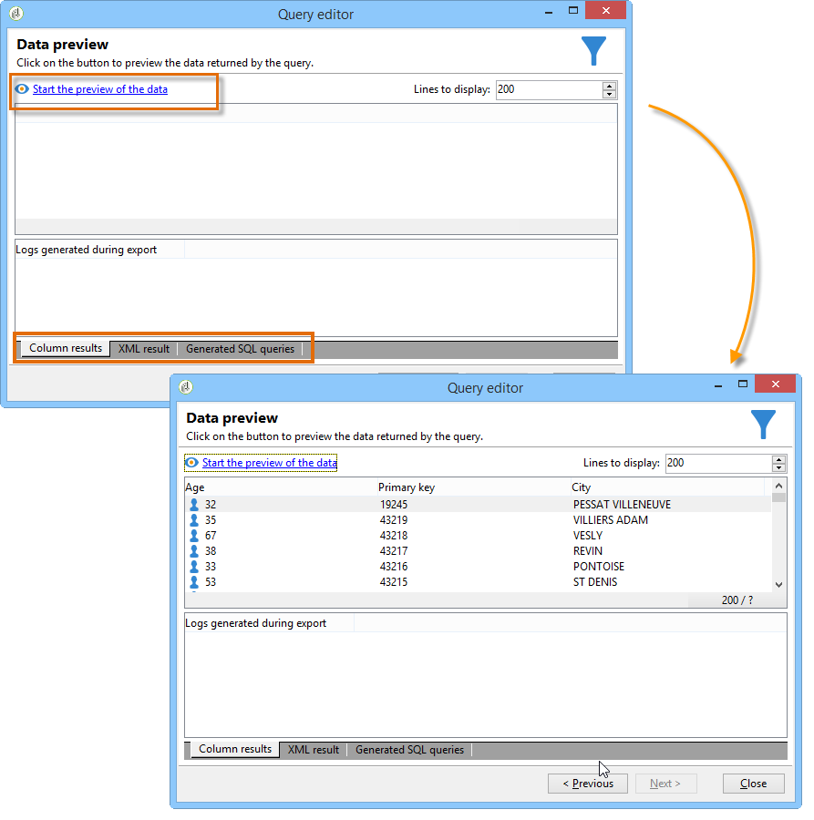

>[!NOTE]
>
>コンソールで使用可能なすべてのリストと同様に、デフォルトでは、最初の200行のみが&#x200B;**[!UICONTROL データプレビュー]** ウィンドウに表示されます。 これを変更するには、**[!UICONTROL 表示行数]** ボックスに数値を入力し、**[!UICONTROL データのプレビューを開始]**&#x200B;をクリックします。 [詳細情報](../config/ui-settings.md#manage-and-customize-lists)

**関連トピック**

* [ワークフロークエリアクティビティ](../../automation/workflow/query.md)
* [受信者テーブルのクエリ](../../automation/workflow/querying-recipient-table.md)
* [フィルター条件](filter-conditions.md)
