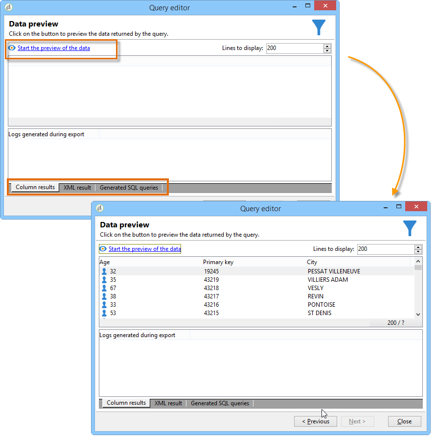

# Campaign データベースのクエリ

クエリは、選択したテーブルのフィールドを使用するか、数式を使用して作成します。

Adobe Campaign でクエリを作成する手順は次のとおりです。

1. [&#x200B; ワークテーブルを選択します &#x200B;](#step-1---choose-a-table)。
1. [&#x200B; 抽出するデータを選択します &#x200B;](#step-2---choose-data-to-extract)。
1. [&#x200B; データ並べ替えモードを定義 &#x200B;](#step-3---sort-data)。
1. [&#x200B; データのフィルターオプションを定義 &#x200B;](#step-4---filter-data) します。
1. [&#x200B; データ形式を設定 &#x200B;](#step-5---format-data) します。
1. [&#x200B; クエリの結果をプレビューする &#x200B;](#step-6---preview-data)。

これらのすべての手順は、[&#x200B; 汎用クエリエディター &#x200B;](query-editor.md) で利用できます。 別のコンテキストでクエリを作成すると、一部の手順が欠落する場合があります。 クエリについて詳しくは、[&#x200B; ワークフロークエリアクティビティのドキュメント &#x200B;](../../automation/workflow/query.md) も参照してください。

## 手順 1 - テーブルの選択 {#step-1---choose-a-table}

Campaign データベースにクエリを実行するには、**[汎用クエリエディター](query-editor.md)** を開き、「ドキュメントタイプ **[!UICONTROL ウィンドウで、クエリを実行するデータが格納されているテーブルを選択し]** す。

必要に応じて、フィルターフィールドまたは「**[!UICONTROL フィルター]** ボタンを使用してデータをフィルタリングします。

## 手順 2 - 抽出するデータの選択 {#step-2---choose-data-to-extract}

**[!UICONTROL 抽出するデータ]** 画面で、出力に含めるフィールドを選択します。 これらのフィールドでは、結果に表示される列を定義します。

例えば、「**[!UICONTROL 年齢]**」、「**[!UICONTROL プライマリキー]**」、「**[!UICONTROL メールドメイン]**」、「**[!UICONTROL 市区町村]**」を選択できます。 出力は、この選択に従って構造化されます。 列の順序を調整するには、ウィンドウの右側にある青い矢印を使用します。

式を変更するには、式を追加するか、集計関数にプロセスを適用します。 式を編集するには、「**[!UICONTROL 式]**」列フィールドをクリックし、「**[!UICONTROL 式を編集]**」を選択します。

出力列に表示されるデータをグループ化できます。 これを行うには、「**[!UICONTROL 抽出するデータ]**」ウィンドウの **[!UICONTROL グループ]** 列で **[!UICONTROL はい]** を選択します。 結果は、選択したグループ化軸に基づいて集計されます。 グループ化を使用したクエリの例については、[&#x200B; この節 &#x200B;](../../automation/workflow/query-delivery-info.md) を参照してください。

* **[!UICONTROL グループ化を処理（GROUP BY + HAVING）]** オプションを使用すると、結果をグループ化し、それらのグループに条件を適用することができます。 出力列内のすべてのフィールドに適用されます。 例えば、出力列の値をグループ化して結果をフィルタリングし、特定の情報（35 ～ 50 の年齢の受信者など）のみを取得できます。

  詳しくは、[この節](../../automation/workflow/query-grouping-management.md)を参照してください。

**[!UICONTROL 重複行を削除（DISTINCT）]** オプションは、出力から同一の行を削除（重複排除）します。 例えば、出力列として **姓**、**名** および **メール** を選択した場合、3 つのフィールドすべてに同じ値を持つレコードは重複と見なされます。 結果には 1 つのインスタンスのみが保持され、各連絡先が 1 回だけ表示されるようになります。

## 手順 3 - データの並べ替え {#step-3---sort-data}

**[!UICONTROL 並べ替え]**&#x200B;ウィンドウでは、列のコンテンツを並べ替えることができます。矢印を使用して列の順序を変更します。

* 「**[!UICONTROL 並べ替え]**」列では、単純な並べ替えをおこなうことができます。列のコンテンツを A から Z の順（昇順）に並べ替えます。
* 「**[!UICONTROL 降順ソート]**」では、コンテンツを Z から A の順（降順）に並べ替えます。これは、売上レコードなどを表示する場合に便利で、最も大きい数字がリストの一番上に表示されます。

この例では、データは受信者の年齢に基づいて昇順で並べ替えられています。

## 手順 4 - データのフィルタリング {#step-4---filter-data}

クエリエディターでは、データをフィルタリングして、結果を絞り込むことができます。 使用可能なフィルターは、クエリしているテーブルによって異なります。

**[!UICONTROL フィルター条件]** を選択すると、「**[!UICONTROL ターゲット要素]**」セクションが開きます。 ここでは、収集するデータをフィルタリングするためのルールを定義できます。

* 新しいフィルターを作成するには、条件の作成に必要なフィールド、演算子、値を選択します。 また、（このページで [&#x200B; 説明しているように、複数の条件を組み合わせるこ &#x200B;](filter-conditions.md) もできます。

* 既存のフィルターを再利用するには、「**[!UICONTROL 追加]**」ボタンをクリックし、「**[!UICONTROL 定義済みフィルター]** を選択して、必要なフィルターを選択します。

  

**[!UICONTROL 汎用クエリエディター]** で作成したフィルターは、他のクエリアプリケーションで再利用でき、その逆も当てはまります。 後で使用するためにフィルターを保存するには、「**[!UICONTROL 保存]** アイコンをクリックします。

>[!NOTE]
>
>フィルターの作成および使用について詳しくは、[フィルターオプション](filter-conditions.md)を参照してください。

次の例に示すように、英語を話す受信者全員を取得するには、「受信者の言語が英語&#x200B;**と等しい**」を選択します。

>[!NOTE]
>
>**値** フィールドに **$（options:OPTION_NAME）** の式を入力して、オプションに直接アクセスできます。

フィルター条件の結果を表示するには、「**[!UICONTROL プレビュー]**」タブをクリックします。この例では、英語を話すすべての受信者の姓、名およびメールアドレスが表示されます。

SQL 言語を理解しているユーザーは、「**[!UICONTROL 生成された SQL クエリ]**」をクリックして SQL クエリを表示できます。

## 手順 5 - データのフォーマット {#step-5---format-data}

制限フィルターを設定すると、**[!UICONTROL データの書式設定]** ウィンドウが開きます。 このウィンドウでは、出力列の並べ替え、データの変換、列ラベルの大文字/小文字の調整を行うことができます。 また、計算フィールドを作成して、最終的な結果に数式を適用することもできます。

>[!NOTE]
>
>計算フィールドのタイプについて詳しくは、[&#x200B; 計算フィールドの作成 &#x200B;](filter-conditions.md#creating-calculated-fields) を参照してください。

チェックをオフにした列は、データプレビューウィンドウでは非表示になります。

「**[!UICONTROL 変換]**」列では、列ラベルを大文字または小文字に変更できます。列を選択し、「**[!UICONTROL 変換]**」列をクリックします。次を選択できます。

* 「**[!UICONTROL 小文字に切り替え]**」
* 「**[!UICONTROL 大文字に切り替え]**」
* 「**[!UICONTROL 最初の文字は大文字]**」

## 手順 6 - データのプレビュー {#step-6---preview-data}

**[!UICONTROL データプレビュー]** ウィンドウに、クエリプロセスの最終ステージが示されます。 「**[!UICONTROL データのプレビューを開始]**」をクリックし、列または XML 形式で表示できる結果を確認します。 基になる SQL クエリを調べるには、「**[!UICONTROL 生成された SQL クエリ]**」タブを開きます。 この手順では、クエリを使用する前に、クエリが期待どおりに動作することを確認できます。

この例では、データは受信者の年齢に基づいて昇順で並べ替えられています。

>[!NOTE]
>
>コンソールで使用可能なすべてのリストと同様に、デフォルトでは、最初の 200 行のみが **[!UICONTROL データプレビュー]** ウィンドウに表示されます。 これを変更するには、「**[!UICONTROL 表示する行]**」ボックスに数値を入力し、「**[!UICONTROL データのプレビューを開始]**」をクリックします。 [詳細情報](../config/ui-settings.md#manage-and-customize-lists)

**関連トピック**

* [ワークフロークエリアクティビティ](../../automation/workflow/query.md)
* [受信者テーブルのクエリ](../../automation/workflow/querying-recipient-table.md)
* [フィルター条件](filter-conditions.md)