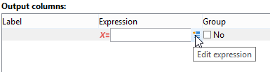

# Campaign データベースのクエリ

クエリは、選択したテーブルのフィールドを使用するか、数式を使用して作成します。

Adobe Campaign でクエリを作成する手順は次のとおりです。

1. ワークテーブルを選択します。[手順 1 - テーブルの選択](#step-1---choose-a-table)を参照してください。
1. 抽出するデータを選択します。[手順 2 - 抽出するデータの選択](#step-2---choose-data-to-extract)を参照してください。
1. データの並べ替え順を定義します。[手順 3 - データの並べ替え](#step-3---sort-data)を参照してください。
1. データをフィルターします。[手順 4 - データのフィルター](#step-4---filter-data)を参照してください。
1. データを書式設定します。[手順 5 - データのフォーマット](#step-5---format-data)を参照してください。
1. 結果を表示します。[手順 6 - データのプレビュー](#step-6---preview-data)を参照してください。

>[!NOTE]
>
>* これらのすべての手順は、[&#x200B; 汎用クエリエディター &#x200B;](query-editor.md) で利用できます。 他のコンテキストでクエリを作成する場合は、一部の手順を省略できます。
>
>* クエリの詳細と作成方法については、[Campaign ワークフロードキュメント &#x200B;](../../automation/workflow/query.md) を参照してください。

Campaign データベースにクエリを実行するには、**[汎用クエリエディター](query-editor.md)** を開き、次の手順に従います。

## 手順 1 - テーブルの選択 {#step-1---choose-a-table}

クエリを実行するデータを含むテーブルを&#x200B;**[!UICONTROL ドキュメントタイプ]**&#x200B;ウィンドウで選択します。必要に応じて、フィルターフィールドまたは「**[!UICONTROL フィルター]** ボタンを使用してデータをフィルタリングします。

## 手順 2 - 抽出するデータの選択 {#step-2---choose-data-to-extract}

**[!UICONTROL 抽出するデータ]**&#x200B;ウィンドウで、表示するデータを選択します。これらのフィールドが出力列を構成します。

例えば、「**[!UICONTROL 年齢]**」、「**[!UICONTROL プライマリキー]**」、「**[!UICONTROL メールドメイン]**」および「**[!UICONTROL 市区町村]**」を選択します。結果は、この選択内容に基づいて構成されます。列の順序を変更するには、ウィンドウの右側にある青色の矢印を使用します。

数式を挿入したり、集計関数のプロセスを実行したりして、式を編集できます。そのためには、「**[!UICONTROL 式]**」列フィールドをクリックし、「**[!UICONTROL 式を編集]**」を選択します。

出力列データはグループ化できます。それには、**[!UICONTROL 抽出するデータ]** ウィンドウの **[!UICONTROL グループ]** 列で **[!UICONTROL はい]** をチェックします。 この機能では、オンにしたグループ化項目に関する結果が生成されます。グループ化を使用したクエリの例は[この節](../../automation/workflow/query-delivery-info.md)で確認できます。

* 「**[!UICONTROL グループを処理（GROUP BY + HAVING）]**」機能では、グループ化し（「group by」）、グループ化した対象（「having」）を選択できます。この機能は、出力列のすべてのフィールドに適用されます。例えば、このオプションを使用して、出力列のすべての選択肢をグループ化し、35 ～ 50 の受信者など、特定のタイプの情報を収集できます。

  詳しくは、[この節](../../automation/workflow/query-grouping-management.md)を参照してください。

* 「**[!UICONTROL 重複行を削除（DISTINCT）]**」機能では、出力列で取得された重複結果を排除できます。例えば、出力列で「姓」、「名」および「メール」フィールドを選択して調査を行った場合、同じデータが含まれるフィールドは、同じ連絡先が複数回データベースに入力されたことを意味するので、除外されます。これにより、1 つの結果のみが考慮されるようになります。

## 手順 3 - データの並べ替え {#step-3---sort-data}

**[!UICONTROL 並べ替え]**&#x200B;ウィンドウでは、列のコンテンツを並べ替えることができます。矢印を使用して列の順序を変更します。

* 「**[!UICONTROL 並べ替え]**」列では、単純な並べ替えをおこなうことができます。列のコンテンツを A から Z の順（昇順）に並べ替えます。
* 「**[!UICONTROL 降順ソート]**」では、コンテンツを Z から A の順（降順）に並べ替えます。これは、売上レコードなどを表示する場合に便利で、最も大きい数字がリストの一番上に表示されます。

この例では、データは受信者の年齢に基づいて昇順で並べ替えられています。

## 手順 4 - データのフィルタリング {#step-4---filter-data}

クエリエディターでは、データをフィルターして検索を絞り込むことができます。

使用できるフィルターは、クエリが対象とするテーブルに応じて異なります。

「**[!UICONTROL フィルター条件]**」を選択すると、「**[!UICONTROL ターゲット要素]**」セクションが表示されます。このセクションでは、収集するデータのフィルター方法を定義できます。

* 新しいフィルターを作成するには、データを選択するために検証する数式の作成に必要なフィールド、演算子および値を選択します。また、[&#x200B; このページ &#x200B;](filter-conditions.md) で説明されているように、複数の条件を組み合わせることもできます。
* 以前に保存したフィルターを使用するには、「**[!UICONTROL 追加]**」ボタンをクリックしてドロップダウンリストを開き、**[!UICONTROL 定義済みフィルター]**&#x200B;をクリックして必要なフィルターを選択します。

  

* **[!UICONTROL 汎用クエリエディター]**&#x200B;で作成されたフィルターは他のクエリアプリケーションでも使用でき、その逆も可能です。フィルターを保存するには、**[!UICONTROL 保存]**&#x200B;アイコンをクリックします。

  >[!NOTE]
  >
  >フィルターの作成および使用について詳しくは、[フィルターオプション](filter-conditions.md)を参照してください。

次の例に示すように、英語を話す受信者全員を取得するには、「受信者の言語が英語&#x200B;**と等しい**」を選択します。

>[!NOTE]
>
>**値** フィールドに **$（options:OPTION_NAME）** の式を入力して、オプションに直接アクセスできます。

フィルター条件の結果を表示するには、「**[!UICONTROL プレビュー]**」タブをクリックします。この例では、英語を話すすべての受信者の姓、名およびメールアドレスが表示されます。

SQL 言語を理解しているユーザーは、「**[!UICONTROL 生成された SQL クエリ]**」をクリックして SQL クエリを表示できます。

## 手順 5 - データのフォーマット {#step-5---format-data}

制限フィルターを設定したら、**[!UICONTROL データフォーマット]**&#x200B;ウィンドウにアクセスします。このウィンドウでは出力列の再編成、データの変換および列ラベルの大／小文字の変更をおこなうことができます。集計フィールドを使用して、最終結果に数式を適用することもできます。

>[!NOTE]
>
>計算フィールドのタイプについて詳しくは、[&#x200B; 計算フィールドの作成 &#x200B;](filter-conditions.md#creating-calculated-fields) を参照してください。

オフになっている列は、データのプレビューウィンドウに表示されません。

「**[!UICONTROL 変換]**」列では、列ラベルを大文字または小文字に変更できます。列を選択し、「**[!UICONTROL 変換]**」列をクリックします。次を選択できます。

* 「**[!UICONTROL 小文字に切り替え]**」
* 「**[!UICONTROL 大文字に切り替え]**」
* 「**[!UICONTROL 最初の文字は大文字]**」

## 手順 6 - データのプレビュー {#step-6---preview-data}

**[!UICONTROL データのプレビュー]**&#x200B;ウィンドウは最後のステージです。「**[!UICONTROL データのプレビューを開始]**」をクリックして、クエリ結果を取得します。クエリ結果は、列または XML フォーマットで使用可能です。クエリを SQL フォーマットで表示するには、「**[!UICONTROL 生成された SQL クエリ]**」タブをクリックします。

この例では、データは受信者の年齢に基づいて昇順で並べ替えられています。

>[!NOTE]
>
>デフォルトでは、**[!UICONTROL データのプレビュー]**&#x200B;ウィンドウには最初の 200 のラインのみが表示されます。これを変更するには、「**[!UICONTROL 表示するライン]**」ボックスに数値を入力し、「**[!UICONTROL データのプレビューを開始]**」をクリックします。

**関連トピック**

* [ワークフロークエリアクティビティ](../../automation/workflow/query.md)
* [受信者テーブルのクエリ](../../automation/workflow/querying-recipient-table.md)
* [フィルター条件](filter-conditions.md)