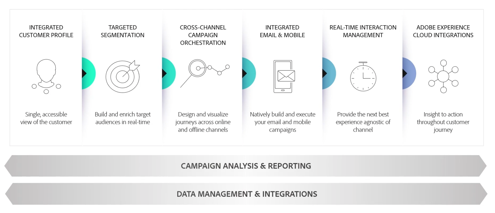

# Adobe Campaign の概要{#gs-ac-v8}

Adobe Campaign は、クロスチャネルのカスタマーエクスペリエンスを設計するためのプラットフォームと、視覚的なキャンペーンオーケストレーション、リアルタイムのインタラクション管理およびクロスチャネル実行のための環境を提供します。

Adobe Campaign v8 は、メール、プッシュ通知、SMS、ダイレクトメールなどの様々なマーケティングチャネル用に作成された次世代キャンペーンツールです。 堅牢な ETL およびデータ管理機能を提供し、最適なキャンペーンの作成とキュレーションを支援します。 そのオーケストレーションエンジンは、バッチベースのジャーニーに重点を置いた、豊富なマルチタッチマーケティングプログラムを提供します。 また、拡張性の高いリアルタイムメッセージングサーバーと組み合わせることで、マーケティングチームは任意の IT システムの包括的なペイロードに基づいて、パスワードのリセット、注文の確認、電子領収書などの通信用の事前定義されたメッセージを送信できます。

Adobe Campaign v8 では、インフラストラクチャ、セキュリティ、配信品質、監視機能が大幅に強化されています。 これは、**Managed Cloud Service** として利用でき、サービスを先を見越した監視やタイムリーな警告と組み合わせたものです。 Campaign Managed Cloud Services について詳しくは、[このページ](whats-new.md#acms-desc)を参照してください。

Campaign を使用すると、次のことを行えます。

* 顧客に関する情報をアクセス可能な単一のビューにまとめ、パーソナライズとエンゲージメントを&#x200B;**推進**
* メール、モバイル、オンライン、オフラインの各チャネルをカスタマージャーニーに&#x200B;**統合**
* 有意義でタイムリーなメッセージやオファーの配信を&#x200B;**自動化**

>[!AVAILABILITY]
>
>Adobe Campaign（コンソール）のドキュメントは、ページに記載されている場合を除き、Campaign Classic v7およびCampaign v8に適用されます。
>
>ドキュメント内の特定の参照は、以前のブランディングを参照する場合がありますが、現在のオファーに適用されます。

## Integrated Customer Profile {#integrated-customer-profile}

プロファイルは強力なクラウドデータベースに一元化されています。 プロファイルを取得しこのようなデータベースを構築するには、様々なメカニズムが考えられます。例えば、web フォームによるオンライン収集、テキストファイルの手動または自動インポート、会社のデータベースまたは他の情報システムを使用したレプリケーションなどです。 Adobe Campaign を利用すれば、マーケティング履歴、購入情報、嗜好、CRM データおよび関連する PII データを包括的に集約し、分析を行ってアクションに移すことができます。

Adobe Campaign では、受信者は配信（メール、SMS など）の送信先となるデフォルトプロファイルです。 データベースに格納された受信者データを活用して、任意の配信のターゲットを絞り込み、配信コンテンツにパーソナライゼーションデータを追加することができます。 データベースには、他のタイプのプロファイルも含まれています。 それらのプロファイルは用途が異なります。 例えば、シードプロファイルは、配信を最終的なターゲットに送信する前のテスト用に作成されます。

プロファイル管理の基本事項については、[この節](audiences.md)で説明します。

Campaign にプロファイルを追加する方法については、[この節](import.md)を参照してください。

## ターゲティングされたセグメント化 {#targeted-segmentation}

Adobe Campaign には強力で使いやすいセグメント化機能とターゲティング機能が備わっており、高度にターゲティングされた最適なオファーを作成できます。 記述分析機能を使用すると、マーケティングキャンペーンの上流および下流の情報を分析できます。また、[ フィルター管理](../audiences/create-filters.md)機能とグラフィック [ クエリエディター](query-editor.md)機能を使用すると、購読者の母集団をフィルタリングし、無制限の条件に基づいてターゲットグループをサンプリングまたは作成できます。

高度なデータ管理機能は、データ処理機能を拡張します。 データマートにモデル化されていないデータを含めることで、ターゲティングプロセスを簡素化し、最適化します。

セグメント化とオーディエンスの作成について詳しくは、[この節](audiences.md)を参照してください。

## クロスチャネルキャンペーンのオーケストレーション {#cross-channel-campaign-orchestration}

Adobe Campaign を使用すると、メール、ダイレクトメール、SMS、プッシュ通知などの複数のチャネルで、ターゲットを絞りパーソナライズしたキャンペーンの設計とオーケストレーションを行えます。 1 つのインターフェイスを通して、すべてのキャンペーンとコミュニケーションのスケジュール作成、オーケストレーション、設定、パーソナライズ、自動化、実施、測定などに必要なすべての機能を利用することができます。

キャンペーンの設計、スケジュール設定および実行の方法については、[この節](campaigns.md)を参照してください。

## ワークフロー {#wf-gsv8}

Adobe Campaignは、セグメンテーション、キャンペーンの実行、ファイル処理などの複雑なプロセスを設計できる包括的なグラフィック環境を提供します。例えば、ワークフローを使用してサーバーからファイルをダウンロードし、解凍してから、そのレコードをAdobe Campaign データベースに読み込むことができます。

ワークフローには、ユーザーにタスクを割り当てたり、実行されたタスクを承認させることによって、ユーザーの関与を促すこともできます。 つまり、1 人または複数のユーザーにタスクを割り当ててコンテンツで作業したり、ターゲットを指定したり、メッセージを送信する前に本配信前確認を承認したりできます。

ワークフローは、次のように異なるコンテキストで使用できます。

* オーディエンスを管理したり、メッセージを送信したりするためのターゲティング。
* データを操作するためのデータ管理（ETL）。
* Campaign データベースへのデータの読み込み。
* データベースのクリーンアップ、トラッキング情報の復元などの技術的プロセス。

ワークフローを設計および実行する方法については、[この節](../config/workflows.md)を参照してください。

## レポートと分析 {#analysis-and-reporting}

Adobe Campaign では、顧客のデータおよびプロファイルを段階的にエンリッチメントすることによって、顧客の行動を監視および解釈できます。 レポートおよび分析ツールを使用すると、各新規キャンペーンを収益化、マーケティング戦略のターゲティングを向上、および投資への影響や投資回収率を最適化できます。

Adobe Campaign では、すぐに使える強力なレポートテンプレートに加えて、配信、キャンペーン、ユーザー、セグメントのいずれかのレベルでカスタムレポートを作成できます。 記述的分析を行ったり、ROI を要約したり、Adobe Analytics などのソリューションにデータをエクスポートしてデータをさらに可視化または分析したりできます。

キャンペーンレポート機能により、動的レポートの作成が容易になります。 ドラッグ＆ドロップ変数を使用して、レポートをカスタマイズしたり、キャンペーンが成功するかどうかを分析したりできます。 クエリや計算の複雑さに応じて、データをリスト表示に集計したり、マーケティング分析レポートを簡単に生成できる形式でデータにアクセスしたりできます。

レポート機能とトラッキング機能について詳しくは、[この節](../reporting/gs-reporting.md)を参照してください。

## Adobe Experience Cloud 統合 {#adobe-experience-cloud-integrations}

Adobe Campaign の配信機能と高度なキャンペーン管理機能を、ユーザーエクスペリエンスをパーソナライズできるよう作成された一連のソリューション（Adobe Experience Manager、Adobe Analytics、Adobe Target、Adobe Experience Cloud トリガーなど）と組み合わせることができます。

アドビサービスおよびソリューションとの統合方法については、[この節](../connect/integration.md)を参照してください。

## Campaign 機能の詳細 {#core-capabilities-and-add-ons}

Adobe Campaign は、ニーズとアーキテクチャに応じて対話型マーケティング機能を実装し、最適化するための一連の機能を提供します。 これらの機能には、コア機能と、インストールしたパッケージおよび設定によって使える機能があります。 詳細な製品説明については、[Adobe Campaign v8 の製品説明](https://helpx.adobe.com/jp/legal/product-descriptions/adobe-campaign-managed-cloud-services.html)を参照してください。

Campaign Classic に精通している方であれば、 Campaign Classic と Campaign v8 の主な違いについては、[このページ](v7-to-v8.md)を参照してください。

**関連項目**

* [Campaign ワークスペース](campaign-ui.md)
* [Campaign v8 互換性マトリックス](compatibility-matrix.md)
* [Campaign への接続](connect.md)
* [よくある質問](campaign-faq.md)
