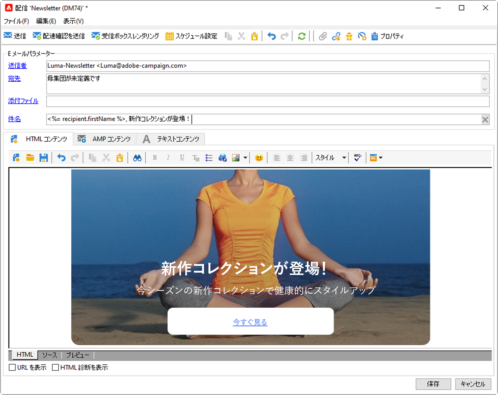

# メッセージの基本を学ぶ {#gs-ac-msg}

Adobe Campaign を使用すると、メール、SMS、プッシュ通知、ダイレクトメールなどのクロスチャネルキャンペーンを送信し、各種の専用レポートを使用してキャンペーンの有効性を評価できます。これらのメッセージは、デザインし、配信を介して送信します。また、受信者ごとにパーソナライズできます。

コア機能には、ターゲティング、メッセージの定義とパーソナライゼーション、通信の実行、関連する運用可能なレポートなどがあります。

## ユースケース {#gs-ac-delivery}

メッセージを送信するには、配信を作成する必要があります。配信作成モードは、ユースケースによって異なります。

>[!NOTE]
>
>配信を作成する際は、テンプレートを選択する必要があります。各チャネルには、デフォルトのテンプレートが用意されています。配信テンプレートについて詳しくは、[このページ](../send/create-templates.md)を参照してください。

1. **1 回限りのメッセージ** - オーディエンスに1 回限りのメッセージを送信できます。最初のメッセージを送信する方法について詳しくは、[この節](create-message.md)を参照してください。

   

1. **マーケティングキャンペーンのメッセージ** - [マーケティングキャンペーン](campaigns.md)のコンテキストでメッセージを送信し、承認プロセスを定義し、統合ダッシュボードでメッセージを送信および追跡できます。詳しくは、[この節](../../automation/campaigns/marketing-campaign-deliveries.md)を参照してください。

   

1. **ワークフローのメッセージ** - [ワークフロー](../config/workflows.md)を通じてメッセージを送信し、配信を自動化できます。詳しくは、[このページ](../../automation/workflow/delivery.md)を参照してください。

   

1. **トリガーされたメッセージ** - イベントから[メッセージをトリガー](../send/transactional.md)できます。トランザクションメッセージ（Message Center）は、トリガーメッセージを管理する目的で設計された Campaign モジュールです。トランザクションメッセージの設定と送信の手順について詳しくは、[このページ](../send/transactional.md)を参照してください。

## 通信チャネル {#gs-channel}

Adobe Campaign v8 には、以下に示す配信チャネルが付属しています。お使いの環境で使用可能なチャネルは、契約によって異なります。使用許諾契約書を確認してください。

* **メールチャネル**：メール配信では、パーソナライズされたメールをターゲット母集団に送信できます。[詳細情報](../send/email.md)

* **モバイルチャネル**：モバイルチャネル経由の配信では、パーソナライズされたメッセージをターゲット母集団に送信できます。モバイルで [SMS](../send/sms/sms.md) および [LINE](../send/line.md) のメッセージを送信できます。

* **モバイルアプリケーションチャネル**：Adobe Campaign では、専用アプリを通じて iOS および Android モバイルデバイスにパーソナライズおよびセグメント化された[プッシュ通知](../send/push.md)を送信できます。設定および統合手順を実行すると、Adobe Campaign を使用して iOS および Android 配信を作成および送信できます。また、画像やビデオを使用したリッチな通知をデザインして Android デバイスに送信することもできます。

* **ダイレクトメールチャネル**：[ダイレクトメール](../send/direct-mail.md)は、ダイレクトメールプロバイダーと共有する外部ファイルを作成、パーソナライズ、生成できるオフラインチャネルです。このチャネルを使用すると、カスタマージャーニーでオンラインチャネルとオフラインチャネルを調整できます。

  ダイレクトメール配信を準備すると、Adobe Campaign により、すべてのターゲットプロファイルと選択した連絡先情報（例えば、郵送先住所）を含むファイルが生成されます。その後、このファイルを実際の送信を行うダイレクトメールプロバイダーに送信できます。

* **その他のチャネル**：Adobe Campaign には、外部配信の作成に使用される電話による配信テンプレートも付属しています。このチャネルを使用する場合、出力ファイルを処理するための専用の方法を実装することになります。設定の手順は、[ダイレクトメールチャネル](../send/direct-mail.md)の場合と同じです。

  >[!NOTE]
  >
  >電話チャネルは組み込みのチャネルではありません。実装には、Adobe コンサルティングまたは Adobe パートナーの関与が必要です。 詳しくは、アドビ担当者にお問い合わせください。

  「その他」タイプの配信は、プロセスを実行しない特定の専門的なテンプレートを使用します。これによって、Adobe Campaign プラットフォーム以外で実行されたマーケティングアクションを管理できます。

  このチャネルには特定のメカニズムはありません。これは汎用チャネルで、Adobe Campaign で使用できる他のコミュニケーションチャネルと同様に、独自の外部アカウントルーティングオプション、配信テンプレートタイプ、キャンペーンワークフローアクティビティがあります。このチャネルは、説明のためにのみ設計されています。例えば、Adobe Campaign 以外のツールで実行されたキャンペーンのターゲットをトレースするための配信を定義する場合などです。

## 配信のタイプ {#types-of-deliveries}

Campaign には 3 つのタイプの配信オブジェクトがあります。

### 単一の配信 {#single-delivery}

**配信**&#x200B;は、一度だけ実行されるスタンドアロン配信オブジェクトです。レプリケートし、再度準備済みにすることはできますが、最終状態（キャンセル、停止、完了）になっている場合は再利用できません。

配信は、配信リストから作成したり、ワークフロー内で[配信](../../automation/workflow/delivery.md)アクティビティを介して作成したりできます。

ワークフローには、使用するチャネルのタイプに応じた特定の配信アクティビティも用意されています。これらのアクティビティについて詳しくは、[この節](../../automation/workflow/cross-channel-deliveries.md)を参照してください。

### 繰り返し配信 {#recurring-delivery}

**繰り返し配信**&#x200B;は、ワークフローのコンテキストで使用できます。アクティビティが実行されるたびに新しい配信を作成できます。これにより、繰り返しタスクのために新しい配信を手動で作成する必要がなくなります。例えば、このタイプのアクティビティを月に 1 回実行した場合、1 年後の配信の数は 12 個です。

繰り返し配信は、ワークフロー内で[繰り返し配信アクティビティ](../../automation/workflow/recurring-delivery.md)を介して作成されます。このアクティビティの使用例については、[ターゲティングワークフローでの繰り返し配信の作成](../../automation/workflow/send-a-birthday-email.md)の節で説明しています。

### 連続配信 {#continuous-delivery}

**連続配信**&#x200B;は、ワークフローのコンテキストで使用できます。既存の配信に新しい受信者を追加できるので、アクティビティが実行されるたびに新しい配信を作成する必要がありません。

配信の情報（コンテンツ、名前など）を変更すると、配信の実行時に新しい配信オブジェクトが作成されます。情報を変更しなかった場合は、同じ配信オブジェクトが再利用され、同じオブジェクトに配信ログとトラッキングログが追加されます。

例えば、このタイプのアクティビティを月に 1 回実行した場合、1 年後の配信数は 1 個です（ただし、配信に変更を加えなかった場合）。

連続配信は、ワークフロー内で[連続配信アクティビティ](../../automation/workflow/continuous-delivery.md)を介して作成されます。

## パーソナライゼーション機能 {#personalization}

Adobe Campaign が配信するメッセージは、様々な方法でパーソナライズすることができます。[パーソナライゼーション機能の詳細を説明します](../send/personalize.md)

以下を行うことができます。

* 動的パーソナライゼーションフィールドの挿入[詳細情報](../send/personalization-fields.md)
* 事前定義済みパーソナライゼーションブロックの挿入[詳細情報](../send/personalization-blocks.md)
* 条件付きコンテンツの作成[詳細情報](../send/conditions.md)

## トラッキングと監視 {#gs-tracking-logs}

送信後に配信を監視することは、マーケティングキャンペーンを効率的に実施し、顧客に働きかけるうえで重要なステップになります。 配信の送信後に監視したり、配信の失敗や強制隔離がどのように管理されているかを把握したりできます。

配信を監視する方法については、[Campaign Classic v7 ドキュメント](https://experienceleague.adobe.com/docs/campaign-classic/using/sending-messages/monitoring-deliveries/about-delivery-monitoring.html?lang=ja#sending-messages){target="_blank"}を参照してください
