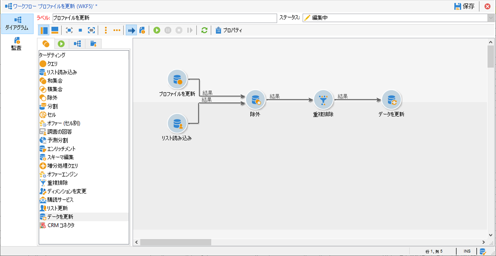
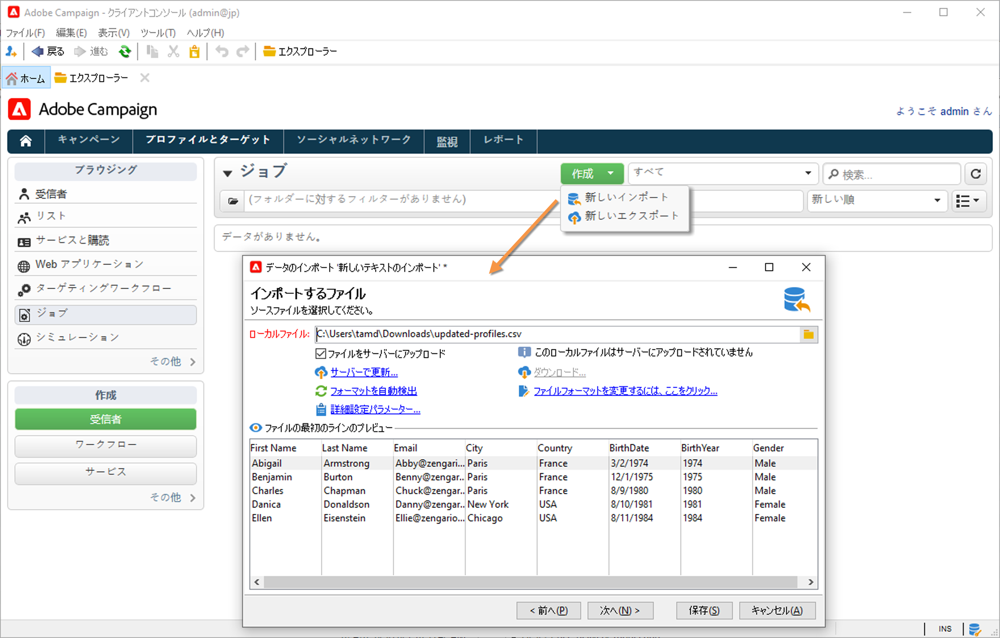
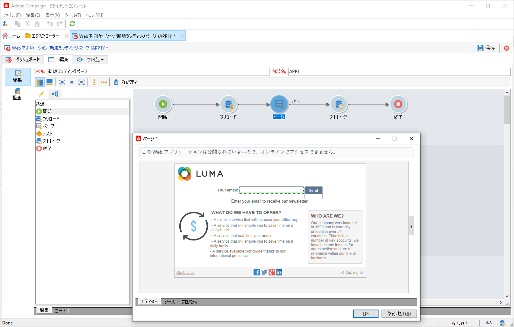

# Campaign へのデータの読み込み {#ootb-profiles}

Campaign を使用すると、クラウドデータベースに連絡先を追加できます。 ファイルを読み込んだり、複数の連絡先の更新をスケジュールして自動化したり、web でデータを収集したり、プロファイル情報を受信者テーブルに直接入力したりできます。

??[audiences](audiences.md)の概要
??Campaignの[データモデル](../dev/datamodel.md)について

## ワークフローへのプロファイルのインポート

プロファイルのインポートは、**インポート**&#x200B;アクティビティを使用したワークフローを通じて実行される専用テンプレートで設定します。 例えば、複数の情報システム間のデータ交換を自動化するために、スケジュールに従って自動的に繰り返すことができます。 詳しくは、[Campaign Classic v7 ドキュメント](https://experienceleague.adobe.com/docs/campaign-classic/using/getting-started/importing-and-exporting-data/import-export-workflows.html?lang=ja){target=&quot;_blank&quot;}を参照してください。

詳しくは、次の Campaign Classic v7 ドキュメントを参照してください：

↗️ [インポートとエクスポートの概要](https://experienceleague.adobe.com/docs/campaign-classic/using/getting-started/importing-and-exporting-data/get-started-data-import-export.html?lang=ja){target=&quot;_blank&quot;}

↗️ [読み込みと書き出しのベストプラクティス](https://experienceleague.adobe.com/docs/campaign-classic/using/getting-started/importing-and-exporting-data/best-practices/import-export-best-practices.html?lang=ja){target=&quot;_blank&quot;}

↗️ [読み込みの設定と実行](https://experienceleague.adobe.com/docs/campaign-classic/using/getting-started/importing-and-exporting-data/generic-imports-exports/executing-import-jobs.html?lang=ja){target=&quot;_blank&quot;}

## 単一インポートの実行

汎用データインポートジョブを作成して実行し、クラウドデータベースに連絡先を読み込みます。

↗️ [Campaign Classicv7ドキュメント](https://experienceleague.adobe.com/docs/campaign-classic/using/getting-started/importing-and-exporting-data/generic-imports-exports/about-generic-imports-exports.html?lang=ja){target=&quot;_blank&quot;}でデータベースにフィードする単一インポートジョブを実行する方法を説明します。

## Web アプリでのプロファイルの収集

Campaign を使用して web フォームを作成し、プロファイルの情報を簡単かつ効率的に収集および管理します。 これらのフォームは web サイトで共有できるので、連絡先にとっても情報を提供しやすくなります。ユーザーの情報が Campaign に送信され、ユーザーのプロファイルを作成したり、既にデータベースに存在する場合は情報を更新したりします。

↗️ [Campaign Classicv7ドキュメント](https://experienceleague.adobe.com/docs/campaign-classic/using/designing-content/web-forms/about-web-forms.html?lang=ja){target=&quot;_blank&quot;}でWebフォームを作成する方法を説明します。

**関連トピック**

* [オーディエンスの作成](audiences.md)
* [プロファイルの重複を排除](https://experienceleague.adobe.com/docs/campaign-classic/using/automating-with-workflows/use-cases/data-management/deduplication-merge.html?lang=ja){target=&quot;_blank&quot;}
* [プロファイルデータのエンリッチメント](https://experienceleague.adobe.com/docs/campaign-classic/using/automating-with-workflows/use-cases/data-management/enriching-data.html?lang=ja){target=&quot;_blank&quot;}
