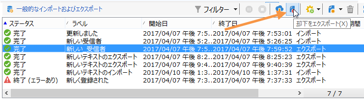

# Campaign へのデータの読み込み {#ootb-profiles}

Campaign を使用すると、データベースに連絡先を追加できます。 ファイルを読み込んだり、複数の連絡先の更新をスケジュールして自動化したり、web でデータを収集したり、プロファイル情報を受信者テーブルに直接入力したりできます。

プロファイルのインポートは、**インポート**&#x200B;アクティビティを使用したワークフローを通じて実行される専用テンプレートで設定します。 例えば、複数の情報システム間のデータ交換を自動化するために、スケジュールに従って自動的に繰り返すことができます。 詳しくは、[こちら](../../automation/workflow/recurring-import-workflow.md)を参照してください。

## 読み込みの実行

Adobe Campaign では、テキスト、CSV、TAB、XML のいずれかの形式の 1 つ以上のファイルから、データベースにデータをインポートできます。これらのファイルはテーブル（メインテーブルまたはリンクされたテーブル）に関連付けられ、ソースファイルの各フィールドはデータベースのフィールドに関連付けられます。

>[!NOTE]
>
>「**[!UICONTROL リストをインポート]**」機能を使用して、データベースデータにマッピングせずにデータをインポートできます。このデータは、ワークフローの「**[!UICONTROL リストの読み込み]**」オブジェクト経由でのみ使用できます。詳しくは、[このページ](../../automation/workflow/read-list.md)を参照してください。

## 読み込みアシスタントの使用

インポートアシスタントでは、インポートを設定し、そのオプション（データ変換など）を定義して、実行を開始できます。これは、インポートのタイプ（簡易または複数）やオペレーターの権限によって内容の異なる一連の画面です。

インポートアシスタントは、新しいインポートジョブを作成すると表示されます。

ソースファイル内の各ラインは、レコードと一致しています。レコード内のデータは、スペース、タブ、文字などの区切り記号で区切られています。つまり、データは列の形式で取得され、各列はデータベースのフィールドに関連付けられます。

### 手順 1 - インポートテンプレートの選択 {#step-1---choosing-the-import-template}

インポートアシスタントを起動するときは、まずテンプレートを選択する必要があります。例えば、ニュースレターを受け取った受信者のインポートを設定するには、以下の手順に従います。

1. **[!UICONTROL プロファイルとターゲット／ジョブ／一般的なインポートおよびエクスポート]**&#x200B;フォルダーを選択します。
1. 「**新規**」をクリックし、「**インポート**」をクリックして、インポートテンプレートを作成します。

   

1. 「**[!UICONTROL インポートテンプレート]**」フィールドの右側にある矢印をクリックしてテンプレートを選択するか、「**[!UICONTROL リンクを選択]**」をクリックしてツリーを参照します。

   ネイティブテンプレートは、「**[!UICONTROL 新しいテキストのインポート]**」です。このテンプレートは変更できませんが、必要に応じて、このテンプレートを複製して新しいテンプレートを設定できます。インポートテンプレートは、デフォルトで、**[!UICONTROL プロファイルとターゲット／テンプレート／ジョブテンプレート]**&#x200B;ノードに保存されます。

1. 「**[!UICONTROL ラベル]**」フィールドに、このインポートの名前を入力します。説明を追加できます。
1. 該当するフィールドでインポートタイプを選択します。インポートには、1 つのファイルのみをインポートする「**[!UICONTROL 簡易インポート]**」と、1 回の実行で複数のファイルをインポートする「**[!UICONTROL 複数インポート]**」の 2 つのタイプがあります。

   複数のインポートの場合、インポートアシスタントの最初の画面で&#x200B;**[!UICONTROL インポートタイプ]**&#x200B;ドロップダウンリストから「**[!UICONTROL 複数のインポート]**」を選択します。

   

1. **[!UICONTROL 追加]**&#x200B;をクリックして、インポートするフィールドを指定します。

   

   ファイルを 1 つ追加するたびに、**[!UICONTROL インポートするファイル]**&#x200B;アシスタントの画面が表示されます。[手順 2 - ソースファイルの選択](#step-2---source-file-selection)の節を参照し、アシスタントの手順に従って、簡易インポートに関するインポートオプションを定義します。

   >[!NOTE]
   >
   >「複数インポート」は、特に必要な場合にのみ使用してください。通常はお勧めしません。

#### 手順 2 - ソースファイルの選択 {#step-2---source-file-selection}

ソースファイルは、テキストフォーマット（txt、csv、tab、固定列）または xml です。

デフォルトでは、「**[!UICONTROL ファイルをサーバーにアップロードします]**」オプションが選択されています。「**[!UICONTROL ローカルファイル]**」フィールドの右側にあるフォルダーをクリックしてローカルディスクを参照し、インポートするファイルを選択します。インポートするファイルがサーバー上にある場合は、このオプションの選択を解除して、そのアクセスパスと名前を入力できます。

ファイルを指定したら、「**[!UICONTROL フォーマットを自動検出]**」をクリックすると、そのデータをウィンドウの下部セクションに表示できます。このプレビューでは、ソースファイルの最初の 200 ラインが表示されます。

このビューの上に表示されているオプションを使用して、インポートを設定できます。これらのオプションを使用して定義されたパラメーターは、プレビューに転送されます。次のオプションを使用できます。

* 「**[!UICONTROL ファイルフォーマットを変更するには、ここをクリックしてください...]**」では、ファイルフォーマットを確認し、設定を調整できます。
* 「**[!UICONTROL サーバーで更新...]**」では、ローカルファイルをサーバーに転送できます。このオプションは、「**[!UICONTROL ファイルをサーバーにアップロードします]**」オプションが選択されている場合にのみ使用できます。
* 「**[!UICONTROL ダウンロード]**」は、ファイルがサーバーにアップロードされている場合にのみ使用できます。
* 「**[!UICONTROL フォーマットを自動検出]**」は、データソースのフォーマットを再初期化する場合に使用します。このオプションを使用すると、「**[!UICONTROL ファイルフォーマットを変更するには、ここをクリックしてください...]**」オプションで書式設定したデータに、元のフォーマットを再適用できます。
* 「**[!UICONTROL 詳細設定パラメーター]**」リンクを使用すると、ソースデータをフィルターし、詳細設定オプションにアクセスできます。この画面から、インポート対象をファイルの一部のみにすることを選択できます。フィルターを定義して、例えば、対応するラインの値に従って、「見込み客」または「顧客」タイプのユーザーのみをインポートすることもできます。これらのオプションを使用するのは、エキスパート JavaScript ユーザーのみである必要があります。

### ファイルフォーマットの変更 {#changing-the-file-format}

「**[!UICONTROL ファイルフォーマットを変更するには、ここをクリックしてください...]**」オプションを使用すると、ソースファイルのデータを書式設定でき、特に列区切り記号および各フィールドのデータタイプを指定できます。この設定は、次のウィンドウで実行します。

この手順では、ファイルフィールドの値をどのように読み取るかを指定できます。例えば、日付の場合、日付データまたは日付 + 時刻データをフォーマット（yyyy/mm/dd、mm/dd/yyyy など）に関連付けることができます。入力データが想定されるフォーマットと一致していない場合、インポート中に却下が発生します。

ウィンドウの下部のプレビューゾーンで、設定の結果を表示できます。

「**[!UICONTROL OK]**」をクリックしてフォーマットを保存し、「**[!UICONTROL 次へ]**」をクリックして次の手順を表示します。

### 手順 3 - フィールドマッピング {#step-3---field-mapping}

次に、宛先スキーマを選択し、各列のデータをデータベースのフィールドにマッピングする必要があります。

* 「**[!UICONTROL 宛先スキーマ]**」フィールドで、データがインポートされるスキーマを選択できます。この情報は必須です。**[!UICONTROL リンクを選択]**&#x200B;アイコンをクリックして、既存のスキーマのいずれかを選択します。**[!UICONTROL リンクを編集]**&#x200B;をクリックして、選択したテーブルのコンテンツを表示します。
* 中央のテーブルには、ソースファイルで定義されているすべてのフィールドが表示されます。宛先ファイルを関連付けるために、インポートするフィールドを選択します。これらのフィールドは、手動または自動でマッピングできます。

  フィールドを手動でマッピングするには、チェックボックスをクリックしてソースフィールドを選択し、2 番目の列をクリックして、選択したフィールドに対応するセルを有効にします。次に、**[!UICONTROL 式を編集]**&#x200B;アイコンをクリックして、現在のテーブルのすべてのフィールドを表示します。宛先フィールドを選択し、「**[!UICONTROL OK]**」をクリックしてマッピングを検証します。

  ソースフィールドと宛先フィールドを自動的に関連付けるには、フィールドのリストの右側にある&#x200B;**[!UICONTROL 宛先フィールドを推測]**&#x200B;アイコンをクリックします。提案されたフィールドは、必要に応じて変更できます。

  >[!IMPORTANT]
  >
  >この操作の結果は、次の手順に進む前に必ず確認する必要があります。

* インポートされるフィールドに変換を適用できます。そのためには、該当するフィールドに対応する「**[!UICONTROL 変換]**」列のセル内をクリックし、適用する変換を選択します。

  

  >[!IMPORTANT]
  >
  >変換はインポート時に適用されます。ただし、宛先フィールドに対する制約が定義されている場合は（前述の例では、@lastname フィールドに対して）、制約が優先されます。

* 中央のテーブルの右側にある該当するアイコンを使用して、計算フィールドを追加できます。計算フィールドを使用すると、複雑な変換の実行、仮想列の追加または複数の列のデータの結合を実行できます。様々な可能性について詳しくは、以降の節を参照してください。

#### 計算フィールド {#calculated-fields}

計算フィールドは、ソースファイルに追加される新しい列で、他の列から計算されます。計算フィールドは、Adobe Campaign データベースのフィールドに関連付けることができます。ただし、計算フィールドに対して紐付け操作は実行できません。

次の 4 つのタイプの計算フィールドがあります。

* **[!UICONTROL 固定文字列]**：計算フィールドの値は、ソースファイルのすべてのラインに対して同じです。挿入または更新されるレコードのフィールドの値を設定できます。例えば、インポートされるすべてのレコードに対して、マーカーを「はい」に設定できます。
* **[!UICONTROL JavaScript タグを含む文字列]**：計算フィールドの値は、JavaScript コマンドを含む文字列です。
* **[!UICONTROL JavaScript 式]**：計算フィールドの値は、JavaScript 関数の評価の結果です。返される値は、数値、日付などです。
* **[!UICONTROL 列挙]**：フィールドの値は、ソースファイルに含まれている値に従って決定されます。エディターを使用して、次の例に示すように、ソース列を指定して列挙値のリストを入力できます。

  

  「**[!UICONTROL プレビュー]**」タブで、定義した設定の結果を表示できます。ここでは、「**[!UICONTROL サービス]**」列が追加されています。値は「**ステータス**」フィールドから計算されます。

  

### 手順 4 - 紐付け {#step-4---reconciliation}

インポートアシスタントでの紐付け手順では、ファイルのデータとデータベース内の既存のデータの紐付けのモードを定義し、ファイルデータとデータベースデータ間の優先順位ルールを設定できます。設定ウィンドウは次のように表示されます。

画面の中央のセクションには、データがインポートされる Adobe Campaign データベースのフィールドおよびテーブルのツリーがあります。

ノード（テーブルまたはフィールド）ごとに特別なオプションを使用できます。リスト内の該当するノードをクリックすると、そのパラメーターと簡単な説明が下に表示されます。各要素に対して定義されている行動が、対応する「**[!UICONTROL 行動]**」列に表示されます。

#### 操作のタイプ {#types-of-operation}

インポート対象の各テーブルについて、操作のタイプを定義する必要があります。データベースの主要な要素に対して使用可能な操作は次のとおりです。

* **[!UICONTROL 更新または挿入]**：データベース内にレコードが存在する場合は更新し、存在しない場合は作成します。
* **[!UICONTROL 挿入]**：データベースにレコードを挿入します。
* **[!UICONTROL 更新]**：既存のレコードのみを更新します（その他のレコードは無視します）。
* **[!UICONTROL 紐付けのみ]**：データベース内のレコードを検索しますが、更新は実行しません。例えば、フォルダー内のデータを更新せずに、ファイルの列に従って、インポートする受信者のフォルダーを関連付けることができます。
* **[!UICONTROL 削除]**：データベース内のレコードを破棄できます。

インポート対象のテーブル内の各フィールドに対して使用可能なオプションは次のとおりです。

* **[!UICONTROL ソースの値が空の場合に（空）を更新]**：更新が発生した際に、ソースファイルで該当のフィールドが空の場合、フィールドの値によってデータベースの値が削除されます。それ以外の場合、データベースフィールドは保持されます。
* **[!UICONTROL 宛先が空の場合にのみ更新]**：データベースフィールドが空の場合を除き、ソースファイルの値によってデータベースフィールドの値が上書きされません。空の場合、ソースファイルの値が取得されます。
* **[!UICONTROL レコードが挿入された場合にのみフィールドを更新]**：更新または挿入操作中、ソースファイルレコードのうち新規のレコードのみがインポートされます。

>[!NOTE]
>
>重複のない挿入の場合を除き、紐付けキーの定義は常に&#x200B;**必須**&#x200B;です。

#### 紐付けキー {#reconciliation-keys}

重複排除を管理するために、少なくとも 1 つの紐付けキーを入力する必要があります。

紐付けキーは、レコードを識別するために使用される一連のフィールドです。例えば、受信者をインポートする場合、紐付けキーは、アカウント番号、「電子メール」フィールドまたは「姓、名、会社」フィールドなどです。

この場合、ファイルのラインがデータベース内の既存の受信者と一致するかどうかを判別するために、インポートエンジンでは、キーのすべてのフィールドについて、ファイルの値をデータベースの値と比較します。フィールドが 1 つのレコードに固有の場合、ソースデータと宛先データ間の適切な比較を実行でき、インポート後のデータの整合性が保証されます。同じテーブルに対して 2 番目の紐付けキーを入力できます。これは、最初のキーが空のラインに対して使用されます。

インポート中に変更される可能性があるフィールドを選択することは避けます。これが発生すると、エンジンにより追加レコードが作成される場合があります。

>[!NOTE]
>
>受信者のインポートでは、選択したフォルダーの識別子が暗黙的にキーに追加されます。
>
>したがって、紐付けはこのフォルダーに対してのみ実行されます（フォルダーが選択されない場合を除く）。

#### 重複の除外 {#deduplication}

>[!NOTE]
>
>「コピー」は、インポートされるファイル内に 2 回以上存在する項目です。
>
>「重複」は、インポートされるファイル内とデータベース内の両方に存在する項目です。

「**[!UICONTROL コピーの管理]**」フィールドで、データの重複排除を設定できます。重複排除は、**ソースファイル内**（複数ファイルのインポートの場合は複数のソースファイル）に複数回存在するレコード、つまり紐付けキーのフィールドが同一であるラインが対象となります。

* 「**[!UICONTROL 更新]**」モード（デフォルトのモード）での重複の管理では、重複排除は実行されません。直前のレコードのデータは更新されるので、結果として、最後のレコードが優先されます。このモードでは、重複のカウントは実行されません。
* 「**[!UICONTROL 無視]**」モードまたは「**[!UICONTROL エンティティを却下]**」モードでの重複の管理では、重複はインポートから除外されます。この場合、レコードはインポートされません。
* 「**[!UICONTROL エンティティを却下]**」モードでは、要素はインポートされず、インポートログにエラーが生成されます。
* 「**[!UICONTROL 無視]**」モードでは、要素はインポートされませんが、エラーのトレースは保持されません。このモードを使用すると、パフォーマンスを最適化できます。

>[!IMPORTANT]
>
>重複排除は、メモリ内のみで実行されます。そのため、重複排除でのインポートのサイズは制限されます。制限は、複数のパラメーター（アプリケーションサーバーの処理能力、アクティビティ、キーのフィールド数など）によって異なります。重複排除の最大サイズは、約 1,000,000 ラインです。

重複排除は、ソースファイルとデータベースの両方に存在するレコードを対象とします。更新を伴う操作（「**[!UICONTROL 更新または挿入]**」または「**[!UICONTROL 更新]**」）のみを対象とします。「**[!UICONTROL 重複の管理]**」オプションを使用すると、レコードがソースファイルとデータベースの両方に存在する場合にレコードを更新または無視できます。「**[!UICONTROL 起源に応じて更新または挿入]**」オプションは、オプションのモジュールに属しており、標準のコンテキストでは使用できません。

オプション「**[!UICONTROL 却下]**」および「**[!UICONTROL 無視]**」は、前述のように動作します。

### エラーの場合 {#behavior-in-the-event-of-an-error}

ほとんどのデータ転送操作で、様々なタイプのエラー（一貫性のない行形式、無効なメールアドレスなど）が発生します。インポートエンジンによって生成されるすべてのエラーおよびすべての警告は、保存され、インポートインスタンスにリンクされます。

これらの却下の詳細は、「**[!UICONTROL 却下]**」タブで表示できます。

次の 2 つのタイプの却下があります（タイプは「**[!UICONTROL コネクタ]**」列に表示されます）。

* テキストコネクタの却下は、ファイルラインの処理中に発生するエラーに関係します（計算フィールド、データ分析など）。この場合、エラーが発生すると、常にライン全体が却下されます。
* データベースコネクタの却下は、データの紐付けまたはデータベースへの書き込み中に発生するエラーに関係します。複数のテーブルへのインポートの場合は、却下はレコードの一部にのみ関係することがあります（例えば、受信者および関連するイベントのインポートの場合、エラーが発生すると、イベントの更新が回避され、受信者が却下されないことがあります）。

データの紐付けページで、目的のエラー管理タイプをフィールドごとおよびテーブルごとに定義できます。

* **[!UICONTROL 警告を無視してログに保存]**：エラーが発生したフィールドを除き、すべてのフィールドがデータベースにインポートされます。
* **[!UICONTROL 親要素を却下]**：エラーが発生したフィールドだけでなく、レコードのライン全体が却下されます。
* **[!UICONTROL すべての要素を却下]**：インポートは停止し、レコードのすべての要素が却下されます。

  

インポートインスタンスの却下画面のツリーには、却下されたフィールドとエラーが発生した場所が示されます。

**[!UICONTROL 却下をエクスポート]**&#x200B;アイコンを使用すると、これらのレコードを含むファイルを生成できます。

### 手順 5 - 受信者をインポートする際の追加手順 {#step-5---additional-step-when-importing-recipients}

インポートアシスタントの次の手順では、データのインポート先となるフォルダーを選択または作成し、（新規または既存の）リストを使用してインポートされた受信者を自動的にマッピングし、受信者をサービスに登録できます。

>[!NOTE]
>
>この手順は、受信者のみを読み込む場合と、デフォルトのAdobe Campaign受信者テーブル（**nms:recipient**）を使用する場合に表示されます。

* 「**[!UICONTROL 編集]**」リンクをクリックして、受信者の関連付けまたは購読登録をおこなうフォルダー、リストまたはサービスを選択します。

   1. フォルダーへのインポート

      「**[!UICONTROL フォルダーにインポート]**」セクションの「**[!UICONTROL 編集...]**」リンクを使用して、受信者がインポートされるフォルダーを選択または作成できます。デフォルトでは、パーティションが定義されていない場合、データはオペレーターのデフォルトのフォルダーにインポートされます。

      >[!NOTE]
      >
      >オペレーターのデフォルトのフォルダーは、オペレーターが書き込みアクセス権を持つ最初のフォルダーです。詳しくは、[フォルダーとビューの管理](../audiences/folders-and-views.md)を参照してください。

      インポートフォルダーを選択するには、「**[!UICONTROL フォルダー]**」フィールドの右側にある矢印をクリックし、関係するフォルダーを選択します。**[!UICONTROL リンクを選択]**&#x200B;アイコンを使用して新しいウィンドウでツリーを表示するか、新しいフォルダーを作成することもできます。

      

      新しいフォルダーを作成するには、フォルダーを追加するノードを選択し、右クリックします。「**[!UICONTROL 新しい「受信者」フォルダーを作成]**」を選択します。

      

      現在のノードの下に新しいフォルダーが追加されます。新しいフォルダーの名前を入力し、Enter キーを押して確定して、「**[!UICONTROL OK]**」をクリックします。

      

   1. リストへの関連付け

      「**[!UICONTROL リストに受信者を追加]**」セクションの「**[!UICONTROL 編集...]**」リンクを使用して、受信者がインポートされるリストを選択または作成できます。

      

      これらの受信者用に新しいリストを作成するには、**[!UICONTROL リンクを選択]**&#x200B;をクリックしてから、**[!UICONTROL 作成]**&#x200B;をクリックします。

      

      受信者をリスト内の既存の受信者に追加するか、または新しい受信者でリストを再作成するかを決定できます。後者の場合、リストに既に受信者が含まれていた場合は、それらは削除され、インポートされた受信者に置き換えられます。

   1. サービスの購読登録

      インポートされたすべての受信者を情報サービスに購読登録するには、受信者を購読登録する対象となる情報サービスを選択または作成するために、「**[!UICONTROL 受信者をサービスに購読登録する]**」セクションの「**[!UICONTROL 編集...]**」リンクをクリックします。「**[!UICONTROL 確認メッセージを送信]**」オプションを選択できます。このメッセージの内容は、購読サービスに関連付けられた配信テンプレートで定義されています。

      

      これらの受信者用に新しいサービスを作成するには、**[!UICONTROL リンクを選択]**&#x200B;をクリックしてから、**[!UICONTROL 作成]**&#x200B;アイコンをクリックします。情報サービスの管理については、[この節](../start/subscriptions.md)で説明しています。

* 「**[!UICONTROL 接触チャネル]**」フィールドを使用して、受信者の接触チャネルに関する情報をプロファイルに追加します。この情報は、複数インポートのフレームワークで特に役立ちます。

この手順を検証して次の手順を表示するには、「**[!UICONTROL 次へ]**」をクリックします。

### 手順 6 - インポートの開始 {#step-6---launching-the-import}

アシスタントの最後の手順では、データのインポートを開始できます。これを行うには、「**[!UICONTROL 開始]**」ボタンをクリックします。

その後、インポートジョブの実行を監視できます（[ワークフロー実行の監視](../../automation/workflow/monitor-workflow-execution.md)を参照）。

## データのエクスポート

エクスポートジョブを使用すると、データベースにアクセスして連絡先、クライアント、リスト、セグメントなどのデータを抽出できます。

例えば、キャンペーントラッキングデータ（トラッキング履歴など）をスプレッドシート形式で使用すると便利な場合があります。出力データは、CSV、TAB、XML のいずれかの形式です。

エクスポートアシスタントでは、エクスポートの設定、オプションの定義、実行の開始を行うことができます。これは、エクスポートのタイプ（簡易または複数）やオペレーターの権限によって内容の異なる一連の画面です。

エクスポートアシスタントは、新しいエクスポートジョブを作成すると表示されます。

### 手順 1 - エクスポートテンプレートの選択 {#step-1---choosing-the-export-template}

エクスポートアシスタントを起動するときは、まずテンプレートを選択する必要があります。例えば、最近登録した受信者のエクスポートを設定するには、以下の手順に従います。

1. **[!UICONTROL プロファイルとターゲット／ジョブ／一般的なインポートおよびエクスポート]**&#x200B;フォルダーを選択します。
1. 「**新規**」をクリックし、「**エクスポート**」をクリックして、エクスポートテンプレートを作成します。

   

1. 「**[!UICONTROL エクスポートテンプレート]**」フィールドの右側にある矢印をクリックしてテンプレートを選択するか、「**[!UICONTROL リンクを選択]**」をクリックしてツリーを参照します。

   ネイティブテンプレートは、「**[!UICONTROL 新しいテキストのエクスポート]**」です。このテンプレートは変更できませんが、このテンプレートを複製して新しいテンプレートを設定することができます。エクスポートテンプレートは、デフォルトで、**[!UICONTROL リソース／テンプレート／ジョブテンプレート]**&#x200B;ノードに保存されます。

1. 「**[!UICONTROL ラベル]**」フィールドに、エクスポートの名前を入力します。説明を追加できます。
1. エクスポートタイプを選択します。利用できるエクスポートタイプは 2 つあります。1 つのファイルのみをエクスポートする「**[!UICONTROL 簡易エクスポート]**」と、1 つ以上のタイプのソースドキュメントから 1 回の実行で複数のファイルをエクスポートする「**[!UICONTROL 複数エクスポート]**」です。

### 手順 2 - エクスポートするファイルのタイプ {#step-2---type-of-file-to-export}

エクスポートするドキュメントのタイプ、つまりエクスポートするデータのスキーマを選択します。

デフォルトでは、エクスポートが「**[!UICONTROL ジョブ]**」ノードから開始された場合、データは受信者テーブルから取得されます。エクスポートがデータのリストから開始された場合（**[!UICONTROL 右クリック／エクスポート]**&#x200B;メニュー）、データが属するテーブルが自動的に「**[!UICONTROL ドキュメントタイプ]**」フィールドに入力されます。

* デフォルトでは、「**[!UICONTROL エクスポート後にサーバーで生成されたファイルをダウンロードする]**」オプションが選択されています。「**[!UICONTROL ローカルファイル]**」フィールドで、作成するファイルの名前とパスを入力するか、フィールドの右側にあるフォルダーをクリックしてローカルディスクを参照します。このオプションの選択を解除して、サーバー出力ファイルのアクセスパスと名前を入力できます。

  >[!NOTE]
  >
  >自動インポートおよびエクスポートジョブは、常にサーバーで実行されます。
  >
  >データの一部のみをエクスポートするには、「**[!UICONTROL 詳細設定パラメーター]**」をクリックし、エクスポートするライン数を該当するフィールドに入力します。

* 差分エクスポートを作成して、最終実行以降に変更されたレコードのみをエクスポートできます。そのためには、「**[!UICONTROL 詳細設定パラメーター]**」リンクをクリックし、「**[!UICONTROL 差分エクスポート]**」タブをクリックして、「**[!UICONTROL 差分エクスポートを有効化します]**」を選択します。

  

  前回の変更日を入力する必要があります。前回の変更日は、フィールドから取得するか、計算できます。

### 手順 3 - 出力フォーマットの定義 {#step-3---defining-the-output-format}

エクスポートファイルの出力フォーマットを選択します。テキスト、固定列テキスト、CSV および XML フォーマットを使用できます。

* 「**[!UICONTROL テキスト]**」フォーマットの場合、列を区切る区切り記号（タブ、コンマ、セミコロンまたはカスタム）および文字列を区切る区切り記号（シングルコーテーション、ダブルコーテーションまたはなし）を選択します。
* 「**[!UICONTROL テキスト]**」および「**[!UICONTROL CSV]**」の場合、オプション「**[!UICONTROL 先頭行を列ヘッダーとして使用]**」を選択できます。
* 日付フォーマットおよび数字のフォーマットを指定します。そのためには、該当するフィールドの「**[!UICONTROL 編集]**」ボタンをクリックし、エディターを使用します。
* 列挙値が含まれるフィールドの場合、「**[!UICONTROL 列挙の内部値の代わりにラベルをエクスポート]**」を選択できます。例えば、タイトルは **1=Mr.**、**2=Miss**、**3=Mrs. というフォームで保存できます。**.このオプションを選択した場合、**Mr.**、**Miss** および **Mrs.** がエクスポートされます。

### 手順 4 - データの選択 {#step-4---data-selection}

エクスポートするフィールドを選択します。手順は次のとおりです。

1. 「**[!UICONTROL 出力列]**」セクションに追加するために、「**[!UICONTROL 使用可能フィールド]**」リストで目的のフィールドをダブルクリックします。
1. リストの右側にある矢印を使用して、出力ファイルでのフィールドの順序を定義します。

   

1. 関数を呼び出すには、**[!UICONTROL 追加]**&#x200B;ボタンをクリックします。

### 手順5 - 列の並べ替え {#step-5---sorting-columns}

列の並べ替え順を選択します。

### 手順 6 - フィルター条件 {#step-6---filter-conditions-}

フィルター条件を追加して、すべてのデータがエクスポートされないようにすることができます。このフィルターの設定は、配信アシスタントにおける受信者のターゲティングと同じです。

### 手順 7 - データのフォーマット設定 {#step-7---data-formatting}

出力ファイルのフィールドの順序およびラベルを変更し、ソースデータに変換を適用できます。

* エクスポートする列の順序を変更するには、該当する列を選択し、テーブルの右側の青色の矢印を使用します。
* フィールドのラベルを変更するには、変更するフィールドに対応する「**[!UICONTROL ラベル]**」列のセル内をクリックし、新しいラベルを入力します。キーボードの Enter キーを押して確定します。
* フィールドのコンテンツに大文字と小文字の変換を適用するには、「**[!UICONTROL 変換]**」列で選択します。次の項目を選択できます。

   * 小文字に切り替え
   * 大文字に切り替え
   * 最初の文字は大文字

  

* 新しい計算フィールド（姓 + 名を含む列など）を作成する場合は、**[!UICONTROL 計算フィールドを追加]**&#x200B;をクリックします。詳しくは、データのインポートの節を参照してください。

要素のコレクション（受信者の購読、受信者が属するリストなど）をエクスポートする場合は、エクスポートするコレクション内の要素数を指定する必要があります。

### 手順 8 - データのプレビュー {#step-8---data-preview}

エクスポート結果をプレビューするには、「**[!UICONTROL データのプレビューを開始]**」をクリックします。デフォルトでは、最初の 200 ラインが表示されます。この値を変更するには、「**[!UICONTROL 表示するライン]**」フィールドの右側にある矢印をクリックします。

アシスタントの下部にあるタブをクリックして、結果のプレビューを列表示から XML に切り替えます。また、生成された SQL クエリを表示することもできます。

### 手順 9 - エクスポートの開始 {#step-9---launching-the-export}

「**[!UICONTROL 開始]**」をクリックしてデータのエクスポートを開始します。

その後、インポートジョブの実行を監視できます。

## Web アプリでのプロファイルの収集

Campaign を使用して web フォームを作成し、プロファイルの情報を簡単かつ効率的に収集および管理します。 これらのフォームは web サイトで共有できるので、連絡先にとっても情報を提供しやすくなります。ユーザーの情報が Campaign に送信され、ユーザーのプロファイルを作成したり、既にデータベースに存在する場合は情報を更新したりします。

Web フォームの作成方法について詳しくは、[Campaign Classic v7 ドキュメント](https://experienceleague.adobe.com/docs/campaign-classic/using/designing-content/web-forms/about-web-forms.html?lang=ja){target="_blank"}を参照してください。

**関連トピック**

* [オーディエンスの作成](audiences.md)
* [プロファイルの重複排除](../../automation/workflow/deduplication-merge.md)
* [プロファイルデータのエンリッチメント](../../automation/workflow/enrich-data.md)
* Campaign [データモデル](../dev/datamodel.md)について