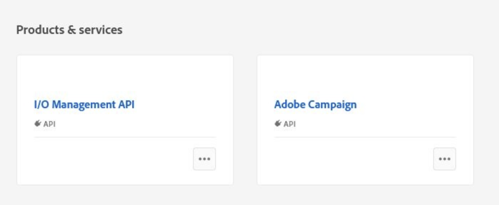
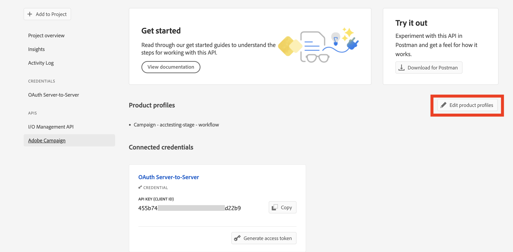

# Campaign の技術オペレーターのAdobe Developer Console への移行 {#migrate-tech-users-to-ims}

Campaign v8.5 以降、Campaign v8 への認証プロセスが改善されました。 技術オペレーターは [AdobeIdentity Managementシステム (IMS)](https://helpx.adobe.com/jp/enterprise/using/identity.html){target="_blank"} をクリックして、Campaign に接続します。 テクニカルオペレーターは、API 統合用に明示的に作成された Campaign ユーザープロファイルです。 この記事では、技術オペレーターをAdobe Developer Console のテクニカルアカウントに移行するために必要な手順について詳しく説明します。

## 変更点{#ims-changes}

Campaign の正規ユーザーは、既にAdobe IDを使用してAdobe CampaignコンソールにAdobeIdentity Management System(IMS) を通じて接続しています。 セキュリティと認証プロセスを強化する取り組みの一環として、Adobe Campaignクライアントアプリケーションは、IMS テクニカルアカウントトークンを使用して Campaign API を直接呼び出すようになりました。

新しいサーバー間認証プロセスの詳細については、 [Adobe Developer Console ドキュメント](https://developer.adobe.com/developer-console/docs/guides/authentication/ServerToServerAuthentication/){target="_blank"}.

この変更は Campaign v8.5 以降に適用され、 **必須** Campaign v8.6 を起動します。


## 影響の有無{#ims-impacts}

Campaign API を使用している場合は、以下に説明するように、技術オペレーターをAdobe Developerコンソールに移行する必要があります。

## 移行方法{#ims-migration-procedure}

### 前提条件{#ims-migration-prerequisites}

Adobeプロセスを開始する前に、Adobe担当者に問い合わせて、移行の技術チームが既存のオペレーターグループとネームド権限をAdobeIdentity Management System(IMS) に移行できるようにする必要があります。

### 手順 1 - Adobe Developer Console で Campaign プロジェクトを作成/更新する{#ims-migration-step-1}

統合は、 **プロジェクト** Adobe Developer Console 内 でのプロジェクトの詳細を説明します。 [Adobe Developer Console ドキュメント](https://developer.adobe.com/developer-console/docs/guides/projects/){target="_blank"}.

Campaign v8 ユーザーは、Adobe Developerコンソールに既にプロジェクトが存在するはずです。 そうでない場合は、プロジェクトを作成する必要があります。 プロジェクトの作成手順の詳細 [(Adobe Developer Console ドキュメント )](https://developer.adobe.com/developer-console/docs/guides/getting-started/){target="_blank"}.

Campaign プロジェクトにアクセスできたら、API、Adobe Campaign、I/O 管理 API などのサービスを追加できます。 この移行をおこなうには、プロジェクトに次の API を追加する必要があります。 **I/O 管理 API** および **Adobe Campaign**.




### 手順 2 — サーバー認証を使用してプロジェクトに API を追加する{#ims-migration-step-2}

プロジェクトをAdobe Developerコンソールで作成したら、サーバー間認証を使用する API を追加します。 で OAuth サーバー間証明書を設定する方法を説明します。 [Adobe Developer Console ドキュメント](https://developer.adobe.com/developer-console/docs/guides/authentication/ServerToServerAuthentication/implementation/){target="_blank"}.

API が正常に接続されると、クライアント ID やクライアント秘密鍵など、新しく生成された資格情報にアクセスし、アクセストークンを生成できます。

### 手順 3 — 製品プロファイルをプロジェクトに追加する{#ims-migration-step-3}

以下に示すように、Campaign 製品プロファイルをプロジェクトに追加できます。

1. Adobe Campaign API を開きます。
1. 次をクリック： **製品プロファイルの編集** ボタン

   

1. 関連するすべての製品プロファイルを API に割り当て（例：messagecenter）、変更を保存します。
1. 次を参照： **資格情報の詳細** 」タブをクリックし、 **テクニカルアカウントの電子メール** の値です。

### 手順 4 — クライアントコンソールでテクニカルオペレーターを更新する {#ims-migration-step-4}

最後の手順は、Adobe Campaignクライアントコンソールでテクニカルオペレーターを更新することです。

>[!CAUTION]
>
>テクニカルオペレーターの認証タイプを更新すると、このテクニカルオペレーターとの API 統合がすべて機能しなくなります。 必ず [API 統合の更新](#ims-migration-step-6).

テクニカルオペレーターの認証モードを IMS に更新するには、次の手順に従います。

1. Campaign クライアントコンソールのエクスプローラーで、 **管理/アクセス管理/オペレーター**.
1. API で使用している既存のテクニカルオペレーターを編集します。
1. を **名前（ログイン）** 先ほど取得したテクニカルアカウント電子メールによるこの技術オペレーターの
1. 次を参照： **編集** の左上にあるボタン **ファイル**&#x200B;を選択し、 **XML ソースを編集**.
1. 認証モードをに更新します。 `ims`、次のようにします。

   ```javascript
   <operator 
   ...
       <access authenticationType="ims" ...
       ...
       </access>
   ...
   </operator>
   ```

1. 変更内容を保存します。

また、SQL スクリプトや Campaign API を使用して、テクニカルオペレーターをプログラムで更新することもできます。 これらのモードを使用すると、オペレーターの名前を、関連するテクニカルアカウントの電子メールアドレスや認証タイプで更新する手順を自動化できます。

* 次を使用します。 **SQL スクリプト** オペレーター名を関連する電子メールに置き換えるには、次の手順に従います。

   ```sql
   UPDATE xtkoperator
   SET sauthenticationtype = 'ims',
           sname = '{email}'
   WHERE sname = '{name}' AND itype = 0;
   ```

* 次を使用します。 `queryDef.ExecuteQuery` **キャンペーン API** 特定の技術オペレーターの id を取得するには：

   ```javascript
   <?xml version="1.0" encoding="utf-8"?>
   <soap:Envelope xmlns:soap="http://schemas.xmlsoap.org/soap/envelope/">
       <soap:Body>
           <ExecuteQuery xmlns="urn:xtk:queryDef">
               <sessiontoken>{session_token}</sessiontoken>
               <entity>
                   <queryDef schema="xtk:operator" operation="select">
                       <select>
                           <node expr="@id"/>
                       </select>
                       <where>
                           <condition expr="@name='{name}'"/>
                           <condition expr="@type=0"/>
                       </where>
                   </queryDef>
               </entity>
           </ExecuteQuery>
       </soap:Body>
   </soap:Envelope>
   ```

* 次を使用します。 `session.Write` **キャンペーン API** 指定されたテクニカルアカウントの電子メールアドレスで名前を更新するには：

   ```javascript
   <?xml version="1.0" encoding="utf-8"?>
   <soap:Envelope xmlns:soap="http://schemas.xmlsoap.org/soap/envelope/">
       <soap:Body>
           <Write xmlns="urn:xtk:session">
               <sessiontoken>{session_token}</sessiontoken>
               <domDoc xsi:type='ns:Element' SOAP-ENV:encodingStyle='http://xml.apache.org/xml-soap/literalxml'>
                   <operator _operation="update" id="{id}" name="{email}" xtkschema="xtk:operator">
                       <access authenticationType="ims" />
                   </operator>
               </domDoc>
           </Write>
       </soap:Body>
   </soap:Envelope>
   ```

### 手順 5 — 設定を検証する {#ims-migration-step-5}

接続を試すには、 [Adobe Developer Console 資格情報ガイド](https://developer.adobe.com/developer-console/docs/guides/authentication/ServerToServerAuthentication/implementation/#generate-access-tokens){target="_blank"} アクセストークンを生成し、提供されたサンプル cURL コマンドをコピーする場合。


### 手順 6 — サードパーティ API 統合を更新する {#ims-migration-step-6}

API 統合をサードパーティのシステムと更新する必要があります。

統合をスムーズにおこなうためのサンプルコードを含む、API 統合手順について詳しくは、 [Adobe Developer Console 認証ドキュメント](https://developer.adobe.com/developer-console/docs/guides/authentication/ServerToServerAuthentication/){target="_blank"}.


### SOAP 呼び出しのサンプル{#ims-migration-samples}

移行プロセスが達成および検証されると、Soap 呼び出しは次のように更新されます。

* 移行前

   ```sql
   POST /nl/jsp/soaprouter.jsp HTTP/1.1
   Host: localhost:8080
   Content-Type: application/soap+xml;
   SOAPAction: "nms:rtEvent#PushEvent"
   charset=utf-8
   
   <?xml version="1.0" encoding="utf-8"?>  <soapenv:Envelope xmlns:soapenv="http://schemas.xmlsoap.org/soap/envelope/" xmlns:urn="urn:nms:rtEvent">
   <soapenv:Header/>
   <soapenv:Body>
       <urn:PushEvent>
           <urn:sessiontoken>SESSION_TOKEN</urn:sessiontoken>
           <urn:domEvent>
               <!--You may enter ANY elements at this point-->
               <rtEvent type="type" email="name@domain.com"/>
           </urn:domEvent>
       </urn:PushEvent>
   </soapenv:Body>
   </soapenv:Envelope>
   ```

* 移行後

   ```sql
   POST /nl/jsp/soaprouter.jsp HTTP/1.1
   Host: localhost:8080
   Content-Type: application/soap+xml;
   SOAPAction: "nms:rtEvent#PushEvent"
   charset=utf-8
   Authorization: Bearer <IMS_Technical_Token_Token>
   
   <?xml version="1.0" encoding="utf-8"?>  <soapenv:Envelope xmlns:soapenv="http://schemas.xmlsoap.org/soap/envelope/" xmlns:urn="urn:nms:rtEvent">
   <soapenv:Header/>
   <soapenv:Body>
       <urn:PushEvent>
           <urn:sessiontoken></urn:sessiontoken>
           <urn:domEvent>
               <!--You may enter ANY elements at this point-->
               <rtEvent type="type" email="name@domain.com"/>
           </urn:domEvent>
       </urn:PushEvent>
   </soapenv:Body>
   </soapenv:Envelope>
   ```
