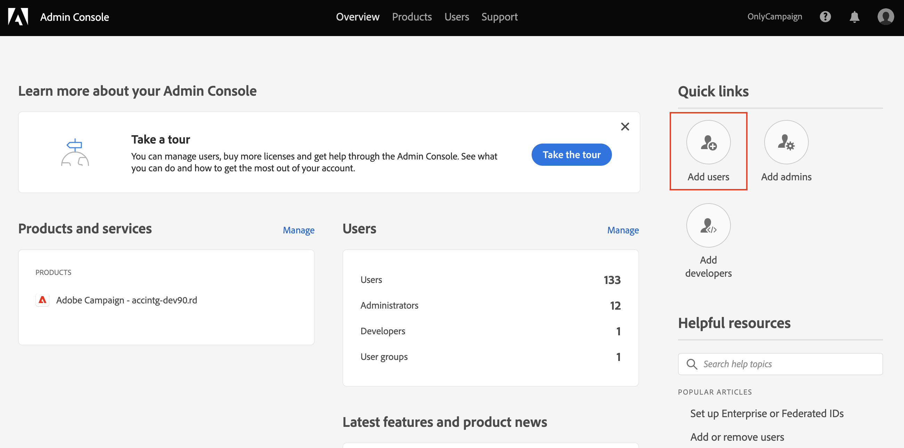
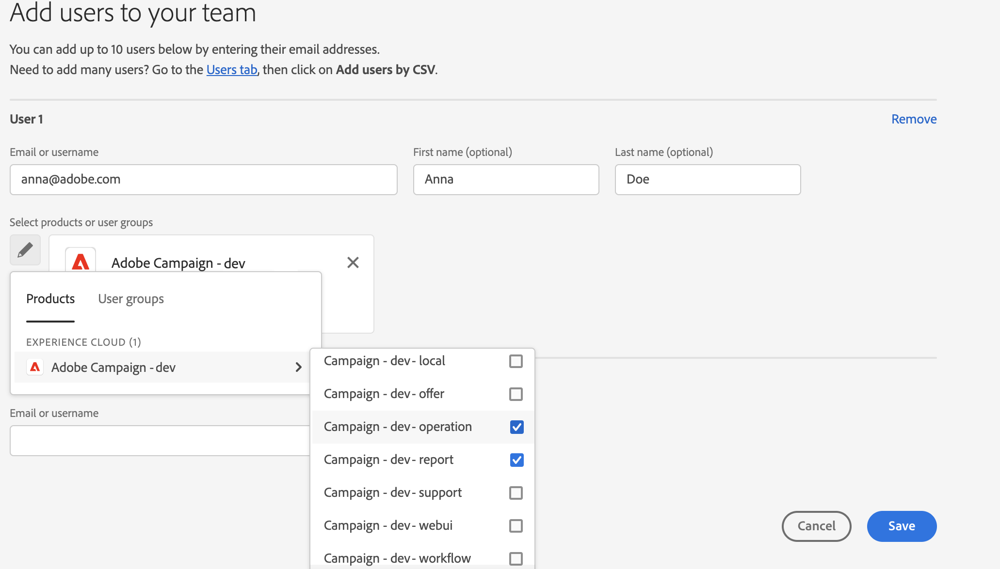
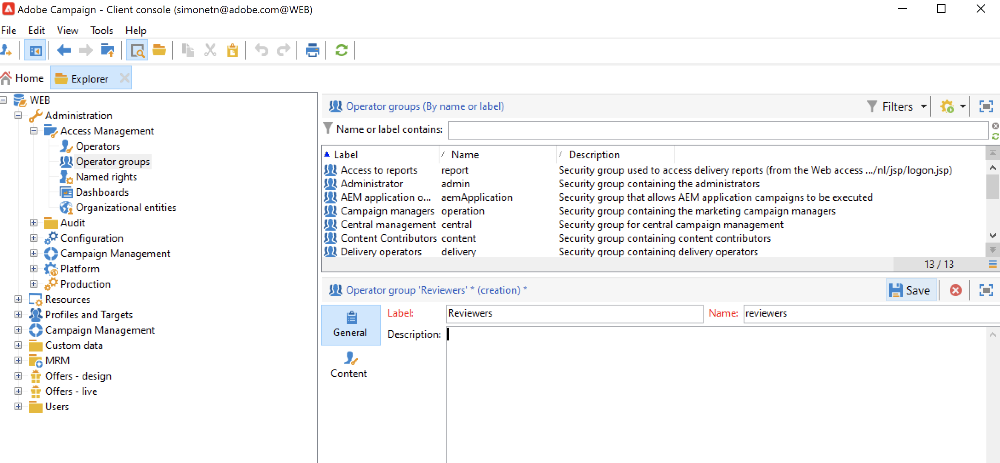
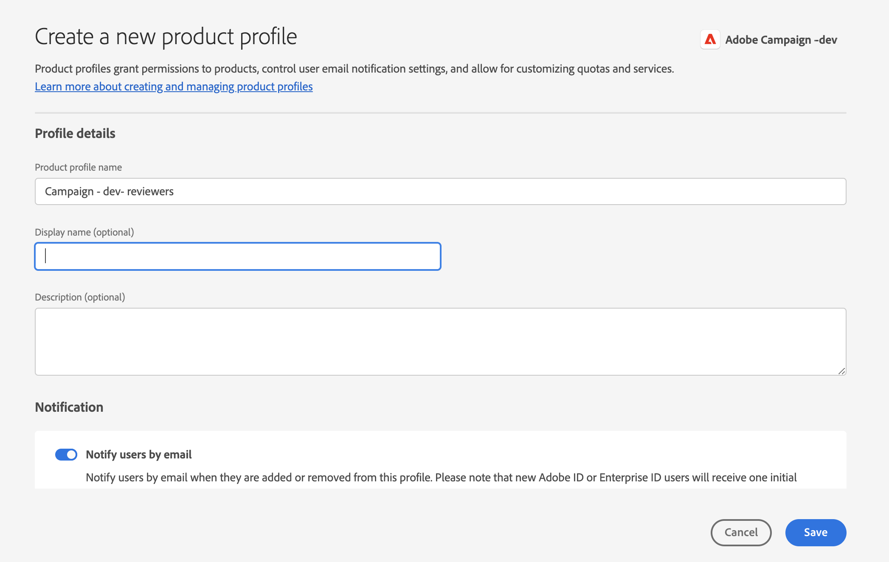
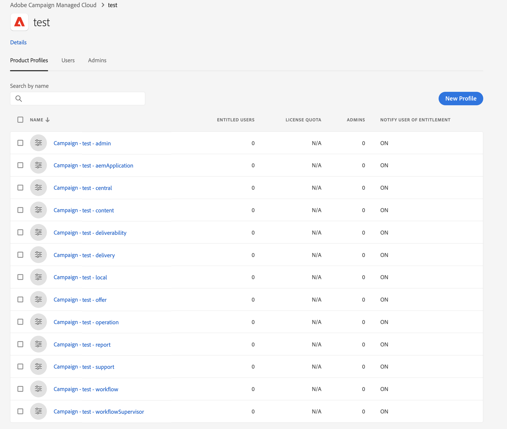

# ユーザー権限の管理{#manage-permissions}

## ユーザーを追加 {#add-users}

製品管理者は、ユーザーを追加し、Campaign へのアクセス権を付与できます。

ユーザーを追加するには、次の手順に従います。

1. 内 [Admin Console](https://adminconsole.adobe.com/enterprise){target=&quot;_blank&quot;} ホームページ、「 **ユーザーを追加**.

   

1. ユーザーの電子メールアドレスを入力します。
1. 「+」記号を使用して、ユーザーに割り当てる製品プロファイルまたはユーザーグループを選択します。

   

   Campaign の組み込み製品プロファイルのリストは、 [この節](#ootb-productprofiles).

   でユーザーグループを作成する方法を説明します。 [この節](#user-groups)

1. 「**保存**」をクリックします。ユーザーが追加され、「ユーザー」リストに表示されます。 管理者の役割または製品プロファイルをユーザーに割り当てると、ユーザーに電子メール通知が送信されます。 ユーザーは、リンクをたどって自分のプロファイルを完成する必要があります。

ユーザーの作成について詳しくは、 [このページ](https://helpx.adobe.com/ie/enterprise/using/manage-users-individually.html){target=&quot;_blank&quot;}。

新規ユーザーの場合 [Campaign にログオン](connect.md) これらは、Adobe IDと共に、クライアントコンソールの Campaign オペレーターリストに追加されます。 キャンペーンオペレーターは、 **[!UICONTROL 管理/アクセス管理/オペレーター]** Campaign エクスプローラーのフォルダー。

## 製品プロファイルの操作{#product-profiles}

製品プロファイルを使用して、製品に含まれる機能の権利をユーザーに付与します。

* Admin Console上の製品ごとに、1 つ以上の製品プロファイルを作成できます。
* 各製品プロファイルで、（組織内の）ユーザーおよびユーザーグループを割り当てます。
* 製品プロファイルで指定された資格情報を使用してログインすると、ユーザーは、製品プロファイルの基となる製品のアプリやサービスにアクセスできます。

これらの製品プロファイルは、 **[!UICONTROL 管理/アクセス管理/オペレーターグループ]** Campaign エクスプローラーのフォルダー。

Admin Consoleでは、製品プロファイルは次の構文を使用します。

キャンペーン — `<your instance>`  — オペレーターグループの内部名

例えば、 **配信オペレーター** 「テスト」インスタンスのグループのAdmin Console:

キャンペーン — テスト — 配信

デフォルトの製品プロファイルを使用することも、新しく作成することもできます。

### 製品プロファイルの作成{#create-product-profile}

新しい製品プロファイルをAdobeに追加するには、まず Campaign クライアントコンソールで製品プロファイルを作成し、次にAdmin Consoleで追加する必要があります。

例えば、「レビュー担当者」の製品プロファイルを作成するには、次の手順に従います。

#### Campaign でのオペレーターグループの作成{#create-op-group}

1. Campaign に接続し、エクスプローラーを開いて、 **[!UICONTROL 管理/アクセス管理/オペレーターグループ]**.
1. クリック **[!UICONTROL 新規]**」、「 」、「 」、「 」、「 」、「 」、「 」、「 」、「 」、「 」、「 」、「 」、「 」、「 」、「 」、「 」、「 」、「 」、「 」、「 」、「 」、「 」、「 」、「 」、「 」、「 」、「 」と「 」の内部名を設定」
   
1. ネームド権限を選択して、関連する権限を定義します。 ネームド権限について詳しくは、 [この節](#use-named-rights)
1. 新しいオペレーターグループを保存します。

#### 製品プロファイルをAdmin Console{#create-profile-in-admin-console}

1. に接続 [Admin Console](https://adminconsole.adobe.com/enterprise){target=&quot;_blank&quot;}。
1. 次の **製品とサービス** 「 」セクションで、Campaign 製品を開きます。
1. クリック **新しいプロファイル** 作成する製品プロファイルの名前を、説明に従って正しい構文で入力します。 [ここ](#product-profiles). この例では、次のように入力します。キャンペーン — `<your-instance-name>`  — レビュー担当者

   

1. 変更内容を保存します。

これで、この新しい製品プロファイルにユーザーを追加できます。詳しくは、 [この節](#add-users).

ベストプラクティスは、製品プロファイルをユーザーグループに割り当てることです。 ユーザーによる権限の管理は、持続可能なモデルではありません。

### デフォルトの製品プロファイルおよびオペレーターグループ {#ootb-productprofiles}

Adobe Campaignには組み込みの **製品プロファイル** ( 環境が環境を有効にする際にAdobeが定義 )

これらの製品プロファイルは、Campaign と一致します **オペレーターグループ**. デフォルトのオペレーターグループとその [ネームド権限](#use-named-rights) を次に示します。

1. **[!UICONTROL 管理者]** (admin)

   このグループのオペレーターは、インスタンスに対して完全なアクセス権を持ちます。管理者は、ユーザーインターフェイスの技術面に関する最も重要な部分にアクセスできるユーザーです。

   このグループには以下のネームド権限が設定されています。

   * **[!UICONTROL 管理者]**：ワークフロー、配信、スクリプトなどの任意のオブジェクトの実行／作成／編集／削除する権限。

1. **[!UICONTROL 配信オペレーター]** (配信)

   このグループのオペレーターは、配信の管理を担当します。配信の作成と準備に必要とされる主なリソース（キャンペーンタイポロジ、配信マッピング、デフォルトテンプレート、パーソナライゼーションブロックなど）にアクセスできます。

   このグループには以下のネームド権限が設定されています。

   * **[!UICONTROL 配信を準備]**：配信分析を作成、編集および開始する権限。
   * **[!UICONTROL 配信を開始]**：分析済みの配信を承認する権限。

1. **[!UICONTROL キャンペーンマネージャー]** （操作）

   このグループのオペレーターは、マーケティングキャンペーンの管理を実行できます。**[!UICONTROL Campaign]**（オプションの Adobe Campaign モジュール）のフレームワーク内で、キャンペーンにリンクされたオブジェクト（プラン、プログラム、ワークフロー、予算など）にアクセスできます。

   このグループには以下のネームド権限が設定されています。

   * **[!UICONTROL フォルダーを挿入]**：Adobe Campaign ツリーにフォルダーを挿入する権限（関係する分岐に対して編集権限を持っていることが前提）。
   * **[!UICONTROL ワークフロー]**：ワークフローを使用する権限。

   >[!NOTE]
   >
   >このグループのオペレーターに配信開始の権利は付与されません。

1. **[!UICONTROL コンテンツ寄稿者]** (content)

   このグループのユーザーは、 **[!UICONTROL コンテンツ管理]** アドオン。 このグループは追加の権限を付与しません。

1. **[!UICONTROL レポートへのアクセス]** （報告）

   このグループは、配信レポートに [Web アクセス](../start/campaign-ui.md#web-browser).

1. **[!UICONTROL ワークフローの実行]** （ワークフロー）

   **[!UICONTROL ワークフローの実行]**&#x200B;グループにより、ターゲティングワークフローの実行と承認を制御できます。WORKFLOW ネームド権限は、このグループのオペレーターにマッピングされます。データファイルへのアクセス権に加えて、これは、ワークフローのすべてのアクションに必要です。デフォルトでは、**[!UICONTROL ワークフローの実行]**&#x200B;グループには、標準のターゲティングワークフローファイルとワークフローテンプレートに対する読み取り専用アクセス権があります。このグループのオペレーターは、保留中の承認ファイルに対して読み取りと書き込みのアクセスができます。

1. **[!UICONTROL ワークフロースーパーバイザー]** (workflowSupervisor)

   このグループのユーザーは、ワークフローの承認を管理し、キャンペーンワークフローに関するアラートが発生した場合に E メール通知を受け取ります。

1. **ローカル/セントラル管理** （中央/ローカル）

   このグループのユーザーは、 **[!UICONTROL 分散型マーケティング]** アドオン。

1. **[!UICONTROL オファーマネージャー]** （オファー）

   このグループのオペレーターは、インタラクションアドオンの使用時にオファーを作成および管理できます。 [詳細情報](../interaction/interaction-operators.md)。

   このグループには以下のネームド権限が設定されています。

   * **[!UICONTROL フォルダーを挿入]**：Adobe Campaign ツリーにフォルダーを挿入する権限（関係する分岐に対して編集権限を持っていることが前提）。
   * **[!UICONTROL フォルダーを編集]**：内部名、ラベル、関連する画像、サブフォルダーの順序など、フォルダーのプロパティを変更する権利。

   オファーマネージャーに割り当てられた権限で実行できるタスクは次のとおりです。

   * **[!UICONTROL デザイン]**&#x200B;環境を修正する。
   * **[!UICONTROL ライブ]**&#x200B;環境を表示する。
   * 管理機能（定義済みスペースおよびフィルター）を設定します。
   * カテゴリを作成および更新します。
   * オファーを作成する。
   * オファーの実施要件を設定する。
   * オファーを承認する。

   >[!NOTE]
   >
   >**オファーマネージャー** は、レビュー担当者が指定されていない場合、またはオファーテンプレートでレビュー担当者として設定されている場合にのみ、オファーを承認できます。

   環境ごとのオファーマネージャー権限マトリックスは、 [このページ](../interaction/interaction-operators.md#recap-of-rights-according-to-operator).

## ユーザーグループの操作{#user-groups}

このAdmin Consoleを使用して、ユーザーグループを作成し、それらにユーザーを割り当てることができます。

ユーザーグループは、共有された一連の権限を付与する必要がある様々なユーザーの集まりです。 でユーザーグループを作成する方法を説明します。 [この節](https://helpx.adobe.com/ie/enterprise/using/user-groups.html){target=&quot;_blank&quot;}。

製品プロファイルは、ユーザーグループに割り当てることができます。 そのため、そのグループ内のすべてのユーザーが同じ製品権限のセットを受け取ります。

## ネームド権限{#use-named-rights}

Adobe Campaignには、ユーザーとユーザーのグループに割り当てる権限を定義できる一連のネームド権限が用意されています。 これらの権限は、 **[!UICONTROL 管理/アクセス管理/ネームド権限]** Campaign エクスプローラーのフォルダー。

ネームド権限では、次の権限を付与します。

* 操作の実行
たとえば、配信エディターの「**分析**」ボタンは、**配信準備**&#x200B;ネームド権限を持つ&#x200B;**配信オペレーター**&#x200B;グループのメンバーに対して有効になります。

* フォルダーへのアクセス
オペレーターグループのメンバーであれば、フォルダーのセキュリティ設定を変更することにより、フォルダーへのアクセス権を付与したり制約したりすることができます。[詳細情報](folder-permissions.md#restrict-access-to-a-folder)。

   例えば、新しいエンティティ（配信、プロファイルなど）を作成するための&#x200B;**書き込みアクセス**、エンティティを使用するための&#x200B;**読み取りアクセス**、エンティティを削除するための&#x200B;**削除アクセス**&#x200B;などに影響を与える可能性があります。

Adobe Campaignのデフォルトのネームド権限は次のとおりです。

* **[!UICONTROL 管理]**：**[!UICONTROL 管理]**&#x200B;権限を持つオペレーターは、インスタンスに対する完全なアクセス権を持ちます。管理者ユーザーは、ワークフロー、配信、スクリプトなどの任意のオブジェクトの実行／作成／編集／削除が可能です。

* **[!UICONTROL 承認の管理]**：担当のオペレーターやグループが現在の状態を承認したことを確認するため、ワークフローや配信内で複数の承認手順を設定できます。**[!UICONTROL 承認の管理]**&#x200B;権限を持つユーザーは、承認手順を設定したり、これらの手順を承認する必要のあるオペレーターまたはオペレーターグループを割り当てたりできます。

* **[!UICONTROL セントラル処理]**：セントラル管理の権限（分散型マーケティング）。

* **[!UICONTROL フォルダーを削除]**：フォルダーを削除する権限。この権限を持つユーザーは、エクスプローラービューからフォルダーを削除できます。

* **[!UICONTROL フォルダーを編集]**：内部名、ラベル、関連する画像、サブフォルダーの順序など、フォルダーのプロパティを変更する権利。

* **[!UICONTROL エクスポート]**：ユーザーは、**[!UICONTROL エクスポート]**&#x200B;ワークフローアクティビティを使用して、サーバーまたはローカルマシン上のファイルに、Adobe Campaign インスタンスのデータをエクスポートできます。

* **[!UICONTROL ファイルアクセス]**：スクリプトを介したファイルの読み取り／書き込みアクセス権。このスクリプトは **[!UICONTROL JavaScript]** ワークフローアクティビティに記述してサーバー上のファイルの読み取り／書き込みをおこなうことができます。

* **[!UICONTROL インポート]**：データのインポート全般を実行する権限。**[!UICONTROL インポート]**&#x200B;では他のすべてのテーブルにデータをインポートできますが、**[!UICONTROL 受信者のインポート]**&#x200B;権限は、受信者テーブルにのみインポートできます。

* **[!UICONTROL フォルダーを挿入]**：フォルダーを挿入する権限。**[!UICONTROL フォルダーを挿入]**&#x200B;権限を持つユーザーは、エクスプローラービューのフォルダーツリーに新しいフォルダーを作成できます。

* **[!UICONTROL ローカル]**：ローカル管理の権限（分散型マーケティング）。

* **[!UICONTROL 結合]**：選択したレコードを 1 つに結合する権限。受信者が重複して存在する場合、**[!UICONTROL 結合]**&#x200B;権限があれば、重複を選択し、それらを単一の主な受信者に結合できます。

* **[!UICONTROL 配信を準備]**：配信分析を作成、編集および保存する権限。**[!UICONTROL 配信を準備]**&#x200B;権限を持つユーザーは、配信分析プロセスを開始できます。

* **[!UICONTROL プライバシーデータ権限]**：プライバシーデータを収集および削除する権限。[詳細情報](privacy.md)。

* **[!UICONTROL プログラム実行]**：様々なプログラミング言語でコマンドを実行する権限。

* **[!UICONTROL 受信者のインポート]**：受信者をインポートする権限。**[!UICONTROL 受信者のインポート]**&#x200B;権限を持つユーザーは、ローカルファイルを受信者テーブルにインポートできます。

* **[!UICONTROL SQL スクリプトの実行]**：データベースで SQL コマンドを直接実行する権限。

* **[!UICONTROL 配信を開始]**：分析済みの配信を承認する権限。配信の分析後、配信は様々な承認手順で一時停止し、再開するには承認が必要になります。**[!UICONTROL 配信を開始]**&#x200B;権限を持つユーザーは、配信を承認できます。

* **[!UICONTROL SQL データ管理アクティビティを使用]**:作業用テーブルを作成および設定するために SQL データ管理アクティビティを使用して独自の SQL スクリプトを作成する権限。 [詳細情報](../../automation/workflow/sql-data-management.md)。

* **[!UICONTROL ワークフロー]**:このネームド権限は、ワークフローに固有です。ワークフローを作成、開始、停止できます。 ネームド権限が適用するには、ワークフローの読み取り権限が必要です。ターゲティングワークフローの場合、 **[!UICONTROL プロファイルとターゲット]** フォルダーが必要です。

* **[!UICONTROL Web アプリ]**：Web アプリケーションを使用する権限。

>[!NOTE]
>
>このリストは、お使いの環境にインストールされているアドオンによって異なる場合があります。

## その他のリソース{#additional-res}

* [ワークフローの権限管理](../../automation/workflow/managing-rights.md)
* [分散型マーケティングの権限管理](../../automation/distributed-marketing/about-distributed-marketing.md#operators)
* [インタラクションモジュールの権限管理](../interaction/interaction-operators.md)
* [スキーマへのアクセスのフィルタリング](../dev/filter-schema.md)
* [PI ビューの制限](../dev/restrict-pi-view.md)
