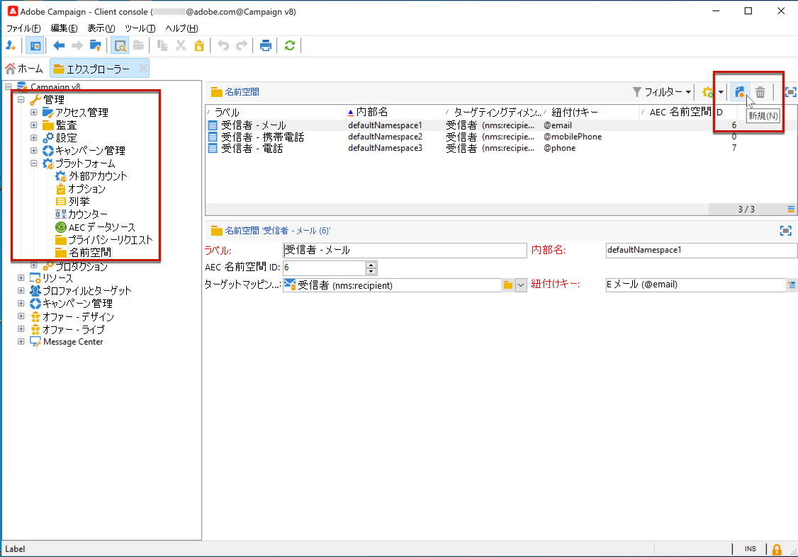
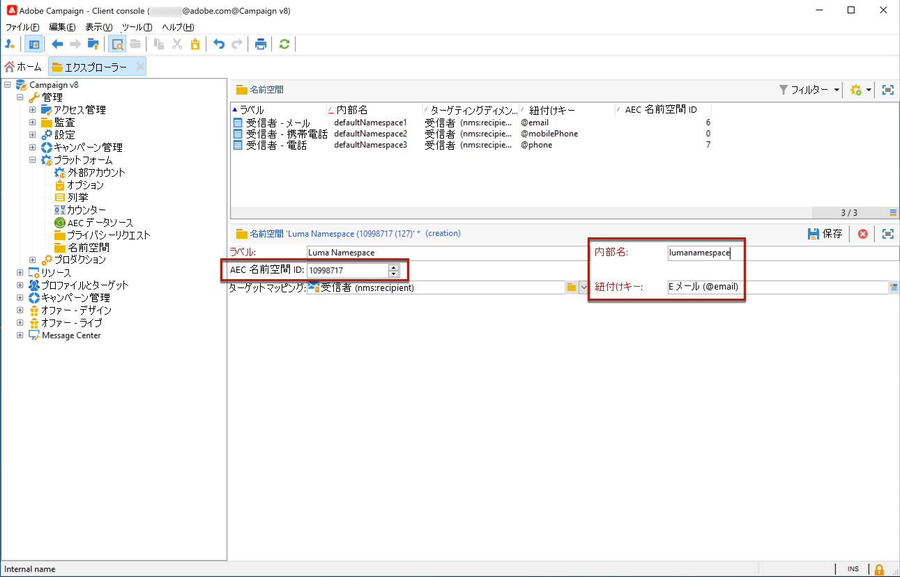

# Campaign でのプライバシーリクエストの管理 {#privacy}

<!--Adobe Campaign is a powerful tool for collecting and processing large volume of data, including personal information and sensitive data. It is therefore essential that you receive and monitor consent from your recipients.-->

>[!NOTE]
>
>この機能は、Campaign v8.3 以降で使用できます。バージョンを確認するには、 [この節](compatibility-matrix.md#how-to-check-your-campaign-version-and-buildversion)

プライバシーの準備を容易にするために、Adobe Campaign でアクセス要求と削除要求の処理が可能になりました。

 詳しくは、 **アクセス権** そして **忘れられる権利** （削除リクエスト） [Adobe Campaign Classic v7 ドキュメント](https://experienceleague.adobe.com/docs/campaign-classic/using/getting-started/privacy/privacy-management.html#right-access-forgotten){target=&quot;_blank&quot;}。

これらの要求を実行するには、**Privacy Core Service** 統合を使用する必要があります。 Privacy Core Service からすべての Experience Cloud ソリューションにプッシュされたプライバシーリクエストは、専用のワークフローで Campaign によって自動的に処理されます。[詳細情報](#create-privacy-request)

Adobeは、データ管理者に、Campaign に保存されているデータに対するプライバシーリクエストを作成および処理するためのツールを提供します。 ただし、要求者であるデータ主体の身元を確認し、要求者に返されるデータがデータ主体に関するものであることを確認するのは、データ管理者としての責任です。 個人データおよびデータを管理する様々なエンティティの詳細 [Adobe Campaign Classic v7 ドキュメント](https://experienceleague.adobe.com/docs/campaign-classic/using/getting-started/privacy/privacy-and-recommendations.html#personal-data){target=&quot;_blank&quot;}。

## 名前空間を定義 {#namespaces}

プライバシーリクエストを作成する前に、次の操作を行う必要があります **名前空間を定義する** を使用します。 名前空間は、Adobe Campaign データベースでデータ主体を識別するために使用するキーです。

>[!NOTE]
>
>ID 名前空間について詳しくは、 [Experience Platform文書](https://experienceleague.adobe.com/docs/experience-platform/identity/namespaces.html){target=&quot;_blank&quot;}。

現在、Adobe Campaignは、名前空間 ID 名前空間サービスからのExperience Platformのインポートをサポートしていません。 したがって、ID 名前空間サービスで名前空間を作成したら、対応する名前空間をAdobe Campaignインターフェイスで手動で作成する必要があります。 それには、次の手順に従います。

<!--v7?
Three namespaces are available out-of-the-box: email, phone and mobile phone. If you need a different namespace (a recipient custom field, for example), you can create a new one from **[!UICONTROL Administration]** > **[!UICONTROL Platform]** > **[!UICONTROL Namespaces]**.

>[!NOTE]
>
>For optimal performance, it is recommended to use out-of-the-box namespaces.
-->

1. で名前空間を作成する [ID 名前空間サービス](https://developer.adobe.com/experience-platform-apis/references/identity-service/#tag/Identity-Namespace){target=&quot;_blank&quot;}。

1. 条件 [id 名前空間のリスト](https://developer.adobe.com/experience-platform-apis/references/identity-service/#operation/getIdNamespaces)組織で使用可能な {target=&quot;_blank&quot;}。例えば、次の詳細の名前空間が得られます。

   ```
   {
           "updateTime": 1632903236731,
           "code": "lumanamespace",
           "status": "ACTIVE",
           "description": "new namespace for Luma privacy requests",
           "id": 10998717,
           "createTime": 1632903236731,
           "idType": "Email",
           "namespaceType": "Custom",
           "name": "Luma Namespace",
           "custom": true
   }
   ```

1. Adobe Campaignで、に移動します。 **[!UICONTROL 管理]** > **[!UICONTROL Platform]** > **[!UICONTROL 名前空間]** を選択し、 **[!UICONTROL 新規]**.

   

1. **[!UICONTROL ラベル]**&#x200B;を入力します。

1. 新しい名前空間の詳細を入力し、ID 名前空間サービスで作成した名前空間に一致するようにします。

   * の **[!UICONTROL AEC 名前空間 ID]** は、「id」属性に一致する必要があります。
   * の **[!UICONTROL 内部名]** は、「code」属性に一致する必要があります。
   * の **[!UICONTROL 紐付けキー]** は、「idType」属性に一致する必要があります。

   

   この **[!UICONTROL 紐付けキー]** フィールドは、Adobe Campaignデータベースでデータ主体を識別するために使用されます。

1. ターゲットマッピングを選択 <!--(**[!UICONTROL Recipients]**, **[!UICONTROL Real time event]** or **[!UICONTROL Subscriptions]**)--> Adobe Campaignでの名前空間の紐付け方法を指定します。

   >[!NOTE]
   >
   >    複数のターゲットマッピングを使用する場合は、ターゲットマッピングごとに 1 つの名前空間を作成する必要があります。

1. 変更内容を保存します。

これで、新しい名前空間に基づいてプライバシーリクエストを作成できます。複数の名前空間を使用する場合、同じ紐付け値に対して、名前空間ごとに 1 つのプライバシーリクエストを作成します。

## プライバシーリクエストの作成 {#create-privacy-request}

この **Privacy Core Service** 統合を使用すると、1 回の JSON API 呼び出しで、複数のソリューションのコンテキストでプライバシーリクエストを自動化できます。 Adobe Campaignは、専用のワークフローを通じて Privacy Core Service からプッシュされたリクエストを自動的に処理します。

>[!CAUTION]
>
>プライバシーリクエストを処理するには、Adobe Campaignインスタンスに、Experience PlatformID 名前空間サービスで作成した名前空間に一致する名前空間を作成する必要があります。

詳しくは、 [Experience PlatformPrivacy Service](https://experienceleague.adobe.com/docs/experience-platform/privacy/home.html?lang=ja){target=&quot;_blank&quot;} のドキュメントを参照してください。

各 Privacy コアサービスジョブは、使用されている名前空間の数に基づいて、Adobe Campaignで複数のプライバシーリクエストに分割されます。1 つのリクエストが 1 つの名前空間に対応します。

また、1 つのジョブを複数のインスタンスで実行できます。 したがって、1 つのジョブに対して複数のファイルが作成されます。 例えば、リクエストに 2 つの名前空間があり、3 つのインスタンスで実行されている場合、合計 6 つのファイルが送信されます。 名前空間およびインスタンスごとに 1 つのファイル。

ファイル名のパターンは次のとおりです。`<InstanceName>-<NamespaceId>-<ReconciliationKey>.xml`

* **InstanceName**：Campaign インスタンス名
* **NamespaceId**：使用する名前空間の ID サービス名前空間 ID
* **紐付けキー**：エンコードされた紐付けキー

>[!CAUTION]
>
>カスタムの名前空間タイプを使用してリクエストを送信するには、[JSON メソッド](https://experienceleague.adobe.com/docs/experience-platform/privacy/ui/user-guide.html?lang=ja#json){target=&quot;_blank&quot;} を実行してリクエストに namespaceId を追加するか、[API 呼び出し](https://experienceleague.adobe.com/docs/experience-platform/privacy/api/privacy-jobs.html?lang=ja#access-delete){target=&quot;_blank&quot;} を使用してリクエストを行います。
>
>標準の名前空間タイプを使用して、[プライバシーユーザーインターフェイス](https://experienceleague.adobe.com/docs/experience-platform/privacy/ui/user-guide.html?lang=ja#request-builder){target=&quot;_blank&quot;} のみを使用してリクエストを送信します。

### リクエストの処理時に検索されるテーブル {#list-of-tables}

プライバシーに関連する削除またはアクセスリクエストの実行時に、受信者テーブル（独自タイプ）にリンクされたすべてのテーブルの&#x200B;**[!UICONTROL 紐付け値]**&#x200B;に基づいて、データ主体のすべてのデータを検索します。

以下は、プライバシーリクエストの実行時に考慮される標準テーブルをリストしたものです。

* 受信者（recipient）
* 受信者配信ログ（broadLogRcp）
* 受信者トラッキングログ（trackingLogRcp）
* アーカイブしたイベント配信ログ（broadLogEventHisto）
* 受信者リストのコンテンツ（rcpGrpRel）
* 訪問者オファー提案（propositionVisitor）
* 訪問者（visitor）
* 購読履歴（subHisto）
* 購読（subscription）
* 受信者のオファーの提案（propositionRcp）

受信者テーブル（独自タイプ）にリンクされるカスタムテーブルを作成した場合は、そのテーブルも考慮されます。例えば、受信者テーブルにリンクしているトランザクションテーブルと、そのトランザクションテーブルにリンクしているトランザクション詳細テーブルがある場合、両方のテーブルが考慮されます。
<!--
>[!CAUTION]
>
>If you perform Privacy batch requests using profile deletion workflows, please take into consideration the following remarks:
>* Profile deletion via workflows do not process children tables.
>* You need to handle the deletion for all the children tables.
>* Adobe recommends that you create an ETL workflow that add the lines to delete in the Privacy Access table and let the **[!UICONTROL Delete privacy requests data]** workflow perform the deletion. We suggest to limit to 200 profiles per day to delete for performance reasons.-->

### プライバシーリクエストのステータス {#privacy-request-statuses}

次に、Adobe Campaignのプライバシーリクエストに対する様々なステータスを示します。

* **[!UICONTROL 新規]**／**[!UICONTROL 再試行待ち]**：ワークフローは進行中で、リクエストの処理は完了していません。
* **[!UICONTROL 処理中]**／**[!UICONTROL 再試行中]**：ワークフローはリクエストを処理しています。
* **[!UICONTROL 削除待ち]**：ワークフローにおいて、削除対象のすべての受信者データが特定済みです。
* **[!UICONTROL 削除中]**：ワークフローは削除を処理しています。
* **[!UICONTROL 完了]**：リクエストの処理が終了しました。エラーは発生していません。
* **[!UICONTROL エラー]**：ワークフローにおいて、エラーが発生しました。理由は、 **[!UICONTROL リクエストステータス]** 列。 例えば、「**[!UICONTROL エラー: データが見つかりません]**」は、データ主体の&#x200B;**[!UICONTROL 紐付け値]**&#x200B;と一致する受信者データがデータベースに見つからなかったことを示します。

Campaign Classic v7 ドキュメントの&#x200B;**関連トピック**：

* [プライバシーと同意](https://experienceleague.adobe.com/docs/campaign-classic/using/getting-started/privacy/privacy-and-recommendations.html){target=&quot;_blank&quot;}

* [プライバシー管理の概要](https://experienceleague.adobe.com/docs/campaign-classic/using/getting-started/privacy/privacy-management.html){target=&quot;_blank&quot;}

* [プライバシー管理に関する規制](https://experienceleague.adobe.com/docs/campaign-classic/using/getting-started/privacy/privacy-management.html#privacy-management-regulations){target=&quot;_blank&quot;} (GDPR、CCPA、PDPA、LGPD)

* [個人情報の販売のオプトアウト](https://experienceleague.adobe.com/docs/campaign-classic/using/getting-started/privacy/privacy-requests/privacy-requests-ccpa.html){target=&quot;_blank&quot;} （CCPA に固有）