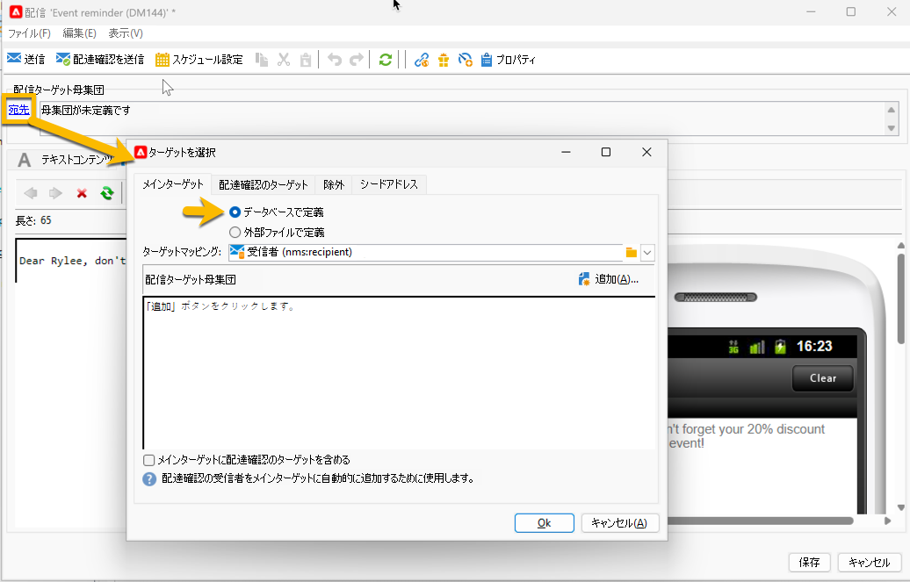

# Campaign データベースのクエリ

クエリツールはアプリケーションの様々なレベルで使用でき、ターゲット母集団の定義、顧客のセグメント化、トラッキングログの抽出とフィルタリング、フィルターの作成などに使用できます。

**[!UICONTROL ツール/汎用クエリエディター…」メニューからアクセスできる専用のアシスタントである汎用クエリエディターが用意されて]** ます。 このエディタを使用すると、データベース・クエリーで情報の抽出、整理、グループ化、ソートを行うことができます。 例えば、特定の期間中にニュースレターリンクで n 回を超えてクリックした受信者を取得できます。

汎用クエリエディターは、すべてのクエリ機能を一元化します。 これにより、制限フィルターを作成して保存し、そのフィルターをターゲティングワークフローのクエリボックスなどの他のコンテキストで再利用できます。

クエリの作成手順について詳しくは [&#x200B; このページ &#x200B;](design-queries.md) を参照してください。

<!--
Contexts to use the query editor iin Campaign are listed below:

|Usage|Example|
|  ---  |  ---  |
|**Define a Query activity in a workflow**: Define the criteria to query Campaign database in a workflow. [Learn how to configure the Query activity](../../automation/workflow/query.md)|{width="200" align="center" zoomable="yes"}|
|**Define audiences**: Specify the population you want to target in your messages, and effortlessly create new audiences tailored to your needs. [Learn how to build audiences](../start/create-message.md#define-the-target-audience)|{width="200" align="center" zoomable="yes"}|
|**Define audiences**: Specify the population you want to target in your messages or workflows, and effortlessly create new audiences tailored to your needs. [Learn how to build audiences](../audiences/create-audiences.md)|{width="200" align="center" zoomable="yes"}|
|**Customize workflow activities**: Apply rules within workflow activities, such as **Split** and **Reconciliation**, to align with your specific requirements. [Learn more about workflow activities](../../automation/workflow/activities.md)|{width="200" align="center" zoomable="yes"}|
|**Predefined filters**: Create predefined filters that serve as shortcuts during various filtering operations, whether you're working with data lists or forming the audience for a delivery. [Learn how to work with predefined filters](../get-started/predefined-filters.md)|{width="200" align="center" zoomable="yes"}|
|**Filter reports data**: Add rules to filter the data displayed in reports. [Learn how to work with reports](../reporting/gs-reports.md)|{width="200" align="center" zoomable="yes"}|
|**Customize lists**: Create custom rules to filter the data displayed in lists such as recipients or deliveries lists. [Learn how to filter lists](../get-started/list-filters.md#list-built-in-filters)|{width="200" align="center" zoomable="yes"}|
|**Build conditional content**: Make email content dynamic by creating conditions that define which content should be displayed to different recipients, ensuring personalized and relevant messaging. [Learn how to build conditional content](../personalization/conditions.md)|{width="200" align="center" zoomable="yes"}|
-->

**関連トピック**

* [ワークフロークエリアクティビティ](../../automation/workflow/query.md)
* [受信者テーブルのクエリ](../../automation/workflow/querying-recipient-table.md)
* [フィルター条件](filter-conditions.md)