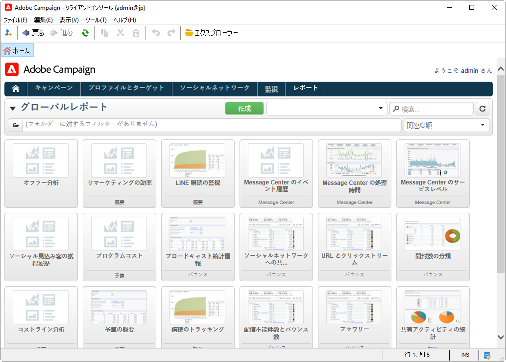
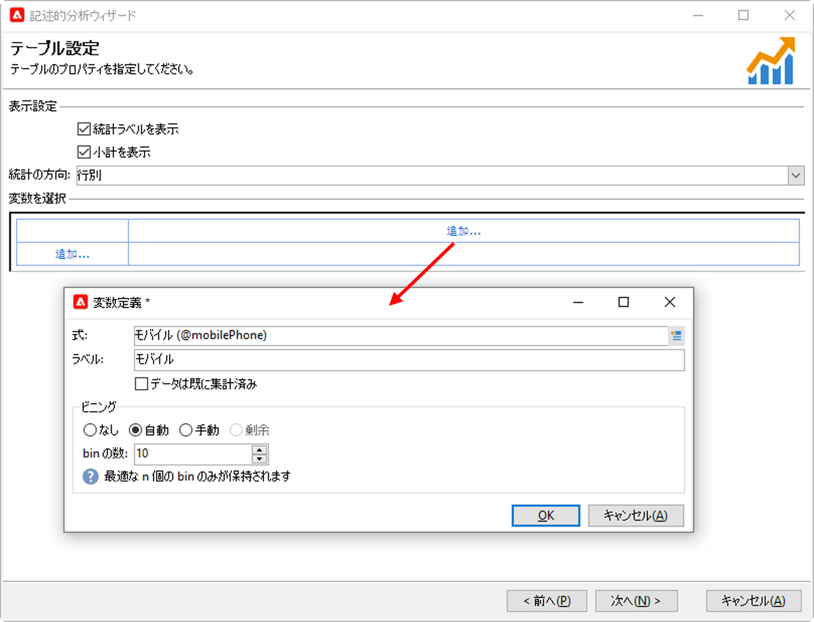
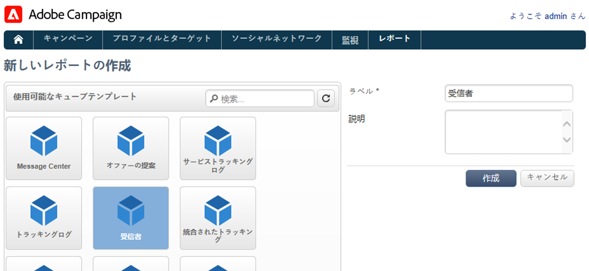

# 指標とレポート

## レポートの概要{#gs-ac-reports}

Adobe Campaign では、このページにリストされている一連のレポートツールを提供しています。

* **ビルトインレポート**

   Adobe Campaign には、配信、キャンペーン、プラットフォームアクティビティ、オプション機能などに関するレポートが付属しています。これらのレポートは、関連する様々な機能を通じて使用できます。具体的なニーズに合わせてレポートをカスタマイズすることもできます。

   これらのレポートにアクセスするには、「**レポート**」タブを使用します。

   

    Campaign の組み込みレポートは、[Campaign Classic v7 ドキュメント](https://experienceleague.adobe.com/docs/campaign-classic/using/reporting/accessing-built-in-reports/about-campaign-built-in-reports.html?lang=ja){target=&quot;_blank&quot;}に記載されています

* **記述的データ分析**

   Adobe Campaign では、データベース内のデータに関する統計情報を生成できる視覚的なツールを提供しています。専用のアシスタントを使用して記述的な分析レポートを作成し、ニーズに応じてコンテンツやレイアウトをカスタマイズできます。

   **[!UICONTROL ツール／記述的分析...]**&#x200B;メニューを使用して、新しいレポートを作成します。

   

   Campaign の記述的分析レポートは、[Campaign Classic v7 ドキュメント](https://experienceleague.adobe.com/docs/campaign-classic/using/reporting/analyzing-populations/about-descriptive-analysis.html?lang=ja){target=&quot;_blank&quot;}に記載されています。

* **パーソナライズされたレポート**

   Adobe Campaign を使用すると、データベース内のデータに関するレポートを作成できます。作成したレポートは、適切なコンテキストで参照できるようになります。

    レポートの作成手順について詳しくは、[Campaign Classic v7 ドキュメント](https://experienceleague.adobe.com/docs/campaign-classic/using/reporting/creating-new-reports/about-reports-creation-in-campaign.html?lang=ja){target=&quot;_blank&quot;}を参照してください。パーソナライズされたレポートの作成は、上級ユーザーがおこないます。

* **キューブ**

   キューブでは、データの分析と測定、統計の計算、レポート作成と計算の単純化と最適化をおこないます。データベースの調査と分析の能力を拡張し、エンドユーザーがレポートとテーブルを簡単に設定できるようにします。レポートやテーブルを作成して計算、測定、統計を処理する際に、既存の（完全に設定された）キューブを選択するだけで済みます。

   

   これらのレポートで分析するデータは、クエリ、計算、量などの複雑さに応じて、クエリで収集したり、リスト（データ管理タイプのワークフロー）やキューブ（Marketing Analytics を使用）で事前に集計したりすることができます。データは、ピボットテーブルやグループリストの形式で表示されます。

   キューブの作成方法については、[Campaign Classic v7 ドキュメント](https://experienceleague.adobe.com/docs/campaign-classic/using/reporting/designing-reports-with-cubes/about-cubes.html?lang=ja){target=&quot;_blank&quot;}を参照してください

Adobe Campaign レポートは最適化されており、Campaign Classic v7 よりも優れたスケール機能を提供します。 キューブに関する既存の制限は適用されません。
