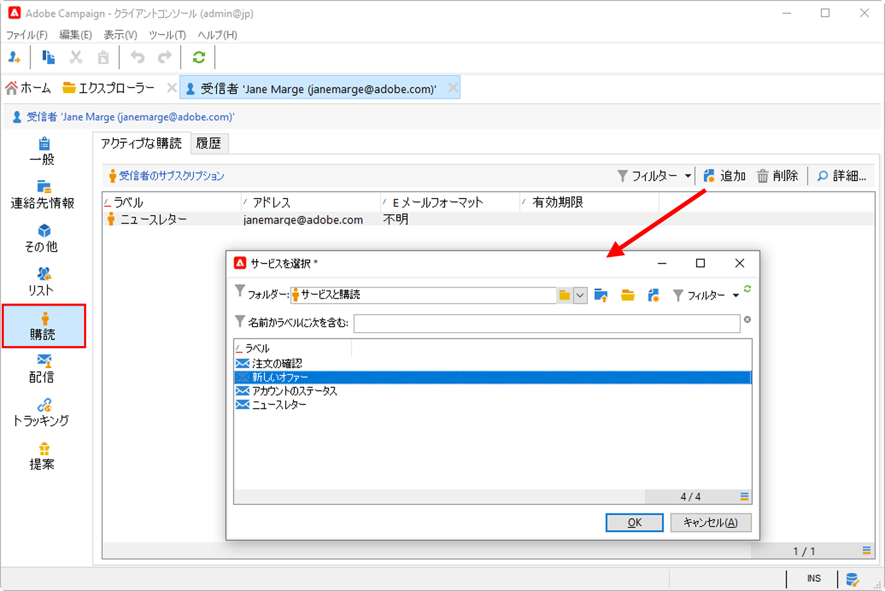
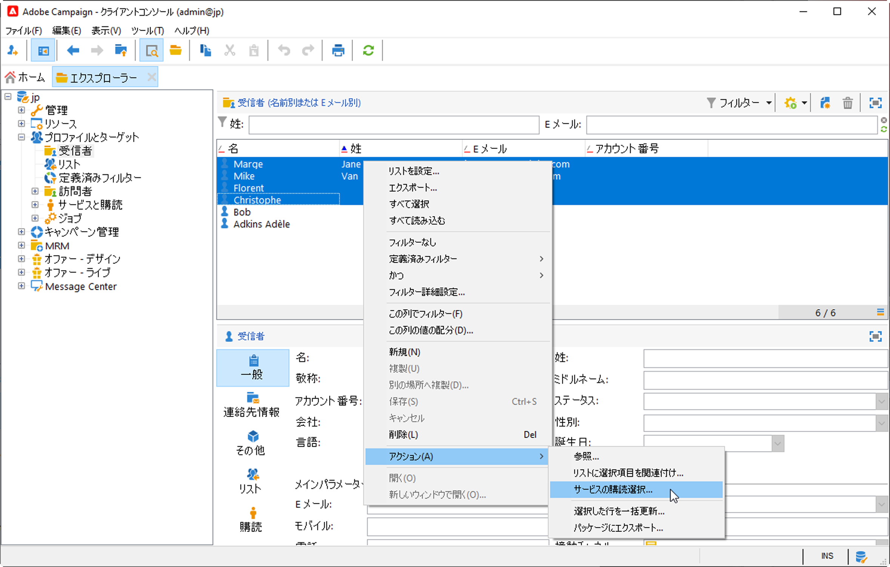
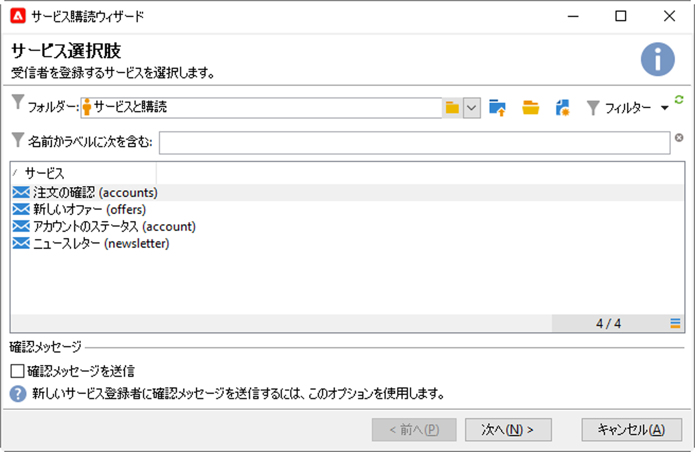
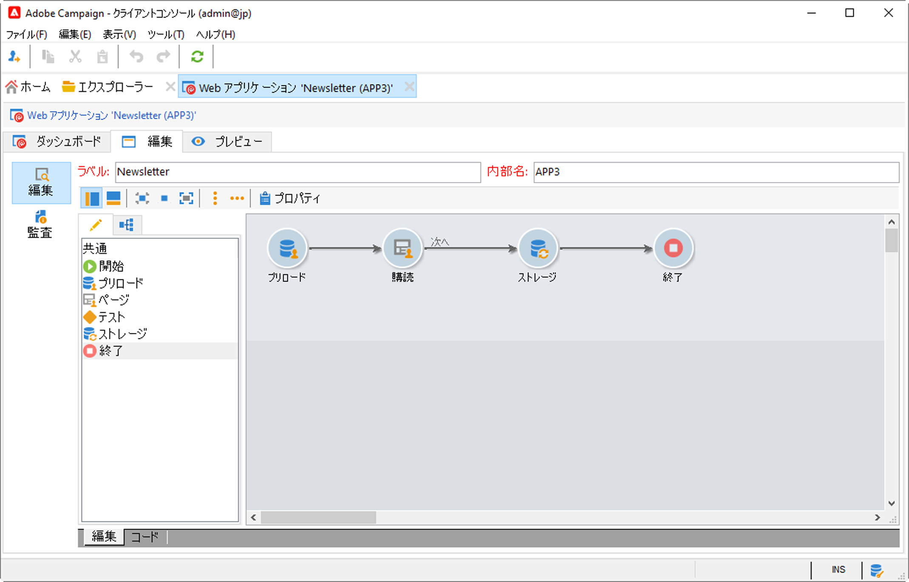
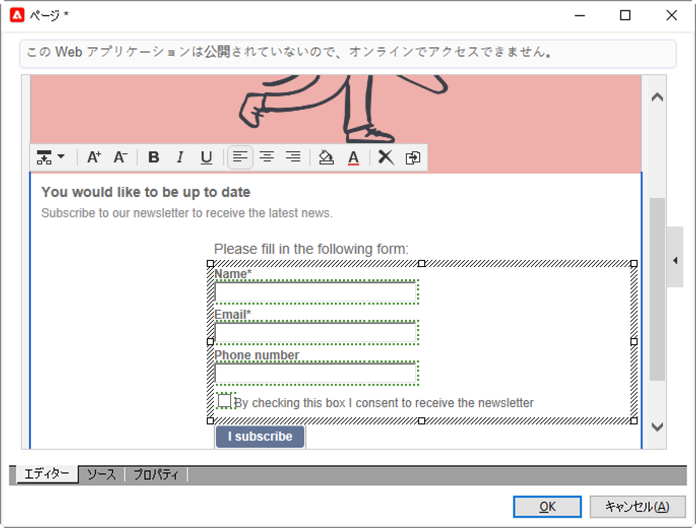
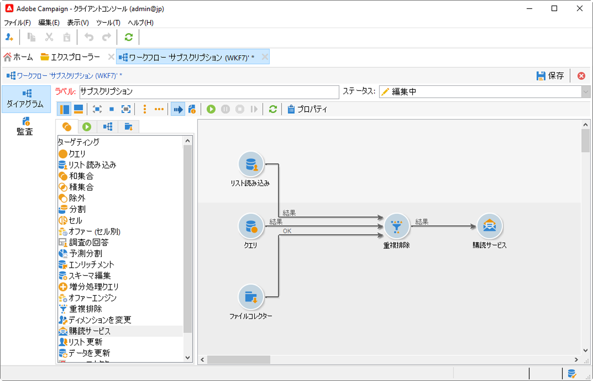

# 購読と購読解除の管理{#optin-optout}

Adobe Campaign を使用すると、ニュースレターなどの情報サービスの作成と監視を行い、これらのサービスの購読／購読解除を管理できます。 複数のサービスを並行して定義できます。例えば、Web サイトの特定の商品カテゴリ、テーマまたは分野に関する専門家向けのニュースレター、様々なタイプのアラートメッセージやリアルタイム通知の購読などです。 購読の管理を参照してください。

↗️[Campaign Classicv7ドキュメント](https://experienceleague.adobe.com/docs/campaign-classic/using/sending-messages/subscriptions-and-referrals/managing-subscriptions.html?lang=ja){target=&quot;_blank&quot;}での情報サービスの作成、ニュースレターの送信、オプトインとオプトアウトの管理の方法について説明します

プロファイルをサービスに購読（オプトイン）するには、次のオプションを使用できます。

* 受信者のプロファイルにサービスを手動で追加するには、プロファイルの「**[!UICONTROL 購読]**」タブから「 **[!UICONTROL 追加]**」をクリックし、該当する情報サービスを選択します。

   

   ↗️詳しくは、[Campaign Classicv7ドキュメント](https://experienceleague.adobe.com/docs/campaign-classic/using/getting-started/profile-management/editing-a-profile.html?lang=ja#deliveries-tab){target=&quot;_blank&quot;}を参照してください

* 受信者のセットを、このサービスに自動的に購読登録します。受信者のリストは、フィルタリング操作、グループ、フォルダー、読み込み、手動での直接選択などの方法で取得できます。これらの受信者を購読登録するには、プロファイルを選択して右クリックします。 **[!UICONTROL アクション／サービスの購読選択...]**&#x200B;を選択します。

   

   該当するサービスを選択し、操作を開始します。

   

   ↗️詳しくは、[Campaign Classicv7ドキュメント](https://experienceleague.adobe.com/docs/campaign-classic/using/getting-started/profile-management/editing-a-profile.html?lang=en#deliveries-tab){target=&quot;_blank&quot;}を参照してください

* 受信者をインポートして、情報サービスに自動的に購読登録します。そのためには、インポートウィザードの最後の手順で該当するサービスを選択します。

   ↗️詳しくは、[Campaign Classicv7ドキュメント](https://experienceleague.adobe.com/docs/campaign-classic/using/getting-started/importing-and-exporting-data/generic-imports-exports/executing-import-jobs.html?lang=ja#step-5---additional-step-when-importing-recipients){target=&quot;_blank&quot;}を参照してください

* 受信者がサービスの購読を登録できる Web フォームを使用します。

   

   Campaign には、オプトインを管理するためのデフォルトの Web フォームが用意されています。 これをパーソナライズし、プロファイルデータをマッピングできます。

   

   ↗️詳しくは、[Campaign Classicv7ドキュメント](https://experienceleague.adobe.com/docs/campaign-classic/using/designing-content/web-forms/use-cases--web-forms.html?lang=ja#create-a-subscription--form-with-double-opt-in){target=&quot;_blank&quot;}を参照してください

* **[!UICONTROL 購読サービス]**&#x200B;アクティビティを使用して.ターゲティングワークフローを作成します。

   

   ↗️詳しくは、[Campaign Classicv7ドキュメント](https://experienceleague.adobe.com/docs/campaign-classic/using/automating-with-workflows/targeting-activities/subscription-services.html?lang=ja#example--subscribe-a-list-of-recipients-to-a-newsletter){target=&quot;_blank&quot;}を参照してください

プロファイルをサービスから購読解除（オプトアウト）するには、次のオプションを使用できます。

**手動での購読解除**

* パーソナライズされた購読解除のリンクまたは web フォーム
* 手動による情報サービスの削除
* 特定の購読サービスからの手動による受信者の削除

**自動での購読解除**

* 情報サービスの期限を指定します。有効期間が終了すると、受信者は自動的に購読解除されます。 この期間は、サービスプロパティの「編集」タブで指定します。期間は日数で表します。
* 母集団の購読解除ワークフローの設定.

↗️詳しくは、[Campaign Classicv7ドキュメント](https://experienceleague.adobe.com/docs/campaign-classic/using/sending-messages/subscriptions-and-referrals/managing-subscriptions.html?lang=ja#unsubscribing-a-recipient-from-a-service){target=&quot;_blank&quot;}を参照してください

>[!CAUTION]
>
>購読の登録と解除は、**非同期**&#x200B;プロセスです。 オプトインとオプトアウトのリクエストは、1 時間ごとに処理されます。[詳細情報](../dev/new-apis.md#sub-apis)

配信受信者が友人にメッセージを転送できるようにすることもできます。 それには、関連リンクを配信に挿入します。 この共有プロセスと、該当するページへのアクセス数もトラッキングできます。

↗️この機能について詳しくは、[Campaign Classicv7ドキュメント](https://experienceleague.adobe.com/docs/campaign-classic/using/sending-messages/subscriptions-and-referrals/viral-and-social-marketing.html?lang=ja#viral-marketing--forward-to-a-friend){target=&quot;_blank&quot;}を参照してください。