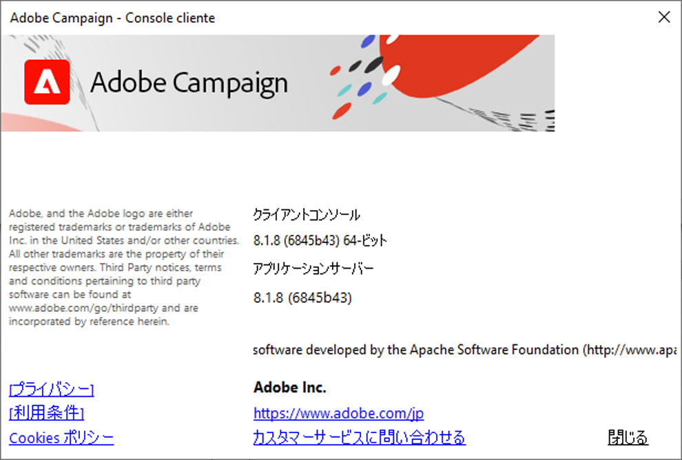

# バージョン、アップグレード、セキュリティ {#upgrades}

Adobe Campaign v8は、**Managed Cloud Services** ソリューションとしてのみ提供されます。 Adobeは、あらゆるサーバーサイドのアップグレードを管理および実行します。v8のオンプレミスまたはハイブリッドのデプロイメントはなく、自分でスケジュールを設定したり実行したりするサーバーアップグレードもありません。

Adobe Campaign は定期的にアップデートされています。 この定期的なアップデートの目的は、最新かつ最高の状態を維持し、環境を安全に保ち、アドビ製品の使用体験を向上させることです。

Managed Cloud Services ユーザーとして：

* Campaign サーバーインスタンスは、新しいバージョンごとにAdobeによって自動的にアップグレードされ、ユーザー側での操作は必要ありません。
* お客様の環境に影響を与えるアップグレードの前に、Adobe担当者から連絡を取ります。
* **クライアントコンソールは、現在の機能を維持する1つのコンポーネントです。** Campaign サーバーと同じバージョンにアップグレードする必要があります。 クライアントコンソールのアップグレード方法について詳しくは、[このページ](../start/connect.md#upgrade-ac-console)を参照してください。

また、[互換性マトリックス](compatibility-matrix.md)にリストされているシステムのサポートされている最新バージョンを使用していることも確認してください。

>[!IMPORTANT]
>
>Adobeは、脆弱性をできる限り迅速に修正するために、予告なしに、いつでもホスト環境に重要なセキュリティパッチを適用する権利を有します。 これらのパッチは、サービスを中断することなくデプロイされます。 重大な脆弱性の修正は、事前通知よりも優先されます。

## Campaign のバージョンとアップグレード {#versions}

Adobe Campaign は、Campaign インフラストラクチャのパフォーマンス、セキュリティ、ロジック、使いやすさを向上させる製品バージョンを定期的にリリースします。

アップグレードの内容を以下に示します。

* **メジャーアップグレード**：メジャーバージョンから別のバージョンへ（例えば、v7 から v8 へ）。 このアップグレードにより、新機能、機能強化、互換性とセキュリティの更新および修正がもたらされます。
* **マイナーアップグレード** （v8.5からv8.6など）をマイナーバージョンから別のバージョンにアップグレードします。 これらのアップグレードは、改善、互換性およびセキュリティ更新プログラム、および修正をもたらします。
* **パッチアップグレード**&#x200B;は、パッチバージョンから別のバージョン（v8.5.1からv8.5.2など）にアップグレードされます。 これらのアップグレードでは、セキュリティの更新と修正が行われます。

新しい各バージョンについて詳しくは、[リリースノート](release-notes.md)を参照してください。 セキュリティ関連の修正は、各リリースのノート内で確認できます。 セキュリティ通知の詳細については、[情報を提供し続ける](#security-staying-informed)を参照してください。

安定した設定を確保するために、アドビでは、すべての Campaign サーバーに&#x200B;**まったく同じバージョン**&#x200B;をインストールすることをお勧めします。 また、[リリースノート](release-notes.md)で特に明記されていない限り、クライアントコンソールはサーバーインスタンスと&#x200B;**まったく同じバージョン**&#x200B;上にある必要があります。 クライアントコンソールのアップグレード方法について詳しくは、[こちらのページ](../start/connect.md#upgrade-ac-console)を参照してください。

### クライアントコンソールを最新の状態に保つ {#ac-upgrades}

Campaign Managed Servicesをご利用のお客様は、新しいCampaign バージョンが利用可能になると、お客様のサーバーインフラストラクチャはAdobeによってアップグレードされます。お客様は操作を行う必要はありません。

サーバーのアップグレードは自動的に行われるため、**クライアントコンソール**&#x200B;は、同時に更新されない場合にギャップが発生する可能性のある場所です。 コンソールのバージョンがサーバーのバージョンと一致しない場合：

* コンソールが更新されるまで、Campaign インスタンスに接続できなくなる場合があります。
* サーバー自体が最新の状態であっても、サーバーが既に移動したバージョンに付属している修正とセキュリティアップデートの恩恵を受けるのはコンソールが停止します。

これを回避するには、新しいバージョンの通知を受け取ったら、すぐにクライアントコンソールをアップグレードします。 クライアントコンソールを[ アップグレードする方法について説明します](../start/connect.md#upgrade-ac-console)。

また、お客様は、[互換性マトリックス ](compatibility-matrix.md)に記載されている最新のサポートされているバージョンのシステムを使用していることを確認する必要があります。

### Campaign のバージョンの確認 {#version}

Campaign のバージョンを確認するには、クライアントコンソールから&#x200B;**ヘルプ／バージョン情報…**&#x200B;メニューにアクセスします。

次の情報にアクセスします。

* クライアントコンソールとアプリケーションサーバーの&#x200B;**バージョン**&#x200B;番号。 上記の例では、クライアントコンソールとアプリケーションサーバーのバージョンはどちらも 8.1.5 です。
* 括弧の中は SHA 番号です。
* アドビカスタマーサポートに連絡するためのリンク。
* アドビのプライバシーポリシー、利用条件、Cookie ポリシーへのリンク。

>[!NOTE]
>
>クライアントコンソールに表示されるバージョンが、アプリケーションサーバーに表示されるバージョンと一致しない場合は、[ クライアントコンソールを最新の状態に保つ](#ac-upgrades)の説明に従って、コンソールをアップグレードしてください。

### 製品リリースのお知らせ {#upgrades-0}

新しいバージョンとその変更は、[ リリースノート ](release-notes.md)に記載されています。

製品リリースのアップデートについては、[Adobe優先製品アップデート ](https://www.adobe.com/jp/subscription/priority-product-update.html){target="_blank"}に登録するか、[Campaign Community](https://experienceleaguecommunities.adobe.com/t5/custom/page/page-id/Community-TopicsPage?style=all&sort=date&order=desc&filters=adobe-campaign-classic-community&topic=Campaign+v8){target="_blank"}にアクセスしてください。

セキュリティ通知およびセキュリティ更新の準備に関するガイダンスについては、[情報を提供し続ける](#security-staying-informed)を参照してください。

### アップグレードの利点 {#upgrades-1}

アップグレードすることで、アカウントが脆弱性から保護され、最新のパフォーマンステクノロジーを使用していることを確認できます。

通常、最新バージョンにアップグレードすると次のような機能強化がもたらされます。

* **セキュリティの向上**

  常時焦点を当て、プロアクティブな保全をおこなわなければセキュリティは確保できません。 セキュリティリスクは存在し、無視することはできません。Adobe Campaignをアップグレードするたびに、セキュリティが向上します。 テクノロジーの組み合わせは、Adobe Campaignの強化に役立ちます。これらはすべて、最新の状態に保つ必要があります。 Adobeでは、これらのアップデートがサーバーに自動的に適用されます。手順でクライアントコンソールをアップグレードすると、同じ保護がサーバーにも適用されます。

* **サポートの向上**

  最も重要な問題はアップグレードで解決され、完全に回避できます。 定期的なアップグレードにより、直面する課題を軽減し、効率性を向上させることができます。 カスタマーケアの数を減らすことで、より迅速な解決が可能になり、アップグレードに関連しない問題により多くの注意を払うことができます。

* **メンテナンスと安定性の向上**

  Adobe Campaign チームは、製品の安定性とパフォーマンスを向上させる方法を特定し、既知の問題も解決します。 アップグレードにより、これらの改善によりインスタンスが最新の状態に保たれ、Campaign インスタンス内で急速な成長や複雑さを経験する組織が直面する一般的な課題が解消されます。 Adobe Campaignを支えるテクノロジースタック全体の改善は、組織内のマーケティング部門とIT部門の両方に実感されます。

* **接続を維持**

  クライアントコンソールは、同じバージョンを実行しているサーバーとのみ確実に通信できます。 サーバーがアップグレードされるたびに、コンソールを最新の状態に保つことは、この接続とそれに伴うセキュリティと修正を維持するものです。

### アップグレードプロセスとタイムライン {#upgrades-2}

Adobeは、v8のお客様として、サーバーのアップグレードをエンドツーエンドで管理します。

1. 新しいバージョンが利用可能な場合、またはアカウントが新しいバージョンに移行する必要があると判断された場合は、Adobeの担当者が通知します。
1. Adobeは、サーバーインフラストラクチャをアップグレードします。この手順では、ユーザーの操作は必要ありません。
1. お客様の側では、必要なアクションは、クライアントコンソールを一致するようにアップグレードすることだけです。また、[互換性マトリックス ](compatibility-matrix.md)のシステムが引き続きサポートされていることを確認してください。 「[ クライアントコンソールを最新の状態に保つ](#ac-upgrades)」を参照してください。

専任のカスタマーサポート担当者、プロダクトマネージャー、エンジニア、TechOps スペシャリスト、製品コンサルタントのチームが、エクスペリエンスの円滑な支援と提供を行います。

>[!NOTE]
>
>重要なセキュリティパッチは、この通知サイクル以外のホスト環境に適用される場合があります。このページの上部にあるメモを参照してください。

## Adobe Campaignのお客様をより迅速に保護：Adobeがセキュリティに対応する方法 {#campaign-security}

### より多く、より早く {#finding-more-faster}

[お客様の迅速な保護：AdobeがAIによって加速された脆弱性の発見にどのように対応しているか](https://blog.adobe.com/security/protecting-customers-faster-how-adobe-is-responding-to-ai-accelerated-vulnerability-discovery)で説明したように、Adobeのセキュリティチームは、AI支援ツールを使用して脆弱性をより迅速に特定し、対処します。 このアプローチをAdobe Campaignを含めたアドビ製品にも適用しています。

このセクションでは、セキュリティの問題を評価して優先順位付けする方法、修正をデプロイする方法、およびそれがユーザーにとって何を意味するのかを説明します。

### セキュリティ問題の評価と優先順位付け {#assess-security-issues}

すべてのセキュリティ問題が同じリスクを伴うわけではありません。 Adobeは各問題を重大度で選定し、その重大度によって優先度レベルが設定されます。

ゼロデイの脆弱性は、攻撃者が修正が利用可能になる前に悪用する可能性がある以前に知られていない欠陥であるため、定期的なリリーススケジュール外で緊急のアクションが必要になる場合があります。 その他のほとんどの脆弱性は、[Adobe セキュリティ速報](https://www.adobe.com/trust/security/bulletins-and-advisories.html)を通じて対処します。通常、毎月第2火曜日と第4火曜日に公開されます。

対応目標は、この重大度評価に従っています。 最も深刻な問題については、まず露光量ウィンドウを閉じ、その後できるだけ早くサポートの詳細を共有します。 そのため、一部の修正は、事前の通知がほとんどまたはほとんどなく、あなたに到達します。 そのタイミングは、脆弱性の重大度によって左右されます。 緊急の更新を含むあらゆる更新は、出荷前に品質検証を行います。

### 修正のデプロイ方法 {#deploy-security-fixes}

リリース前にセキュリティアップデートを検証し、変更の範囲に基づいてデプロイメントアプローチを選択します。 目標は、混乱を最小限に抑えることです。

更新の範囲に応じて、次の2つのデプロイメント方法のいずれかを使用します。

* **セキュリティスタックのメンテナンス**：ビルド番号を変更したり、製品機能に意図した変更を加えたりしない、ターゲットを絞った更新。 通常、標準設定を使用しているお客様は、アクションを実行する必要はありません。
* **セキュリティを重視したビルドのアップグレード**：ビルド番号を変更し、Adobeの標準の通知、リリースノート、ロールアウトプロセスに従うアップデート。

標準のすぐに使用できる設定では、統合や実行中のキャンペーンが以前と同じように動作し続けます。

Adobe Campaignの標準的な構成との互換性を維持し、お客様の運用への混乱を最小限に抑えるために、セキュリティアップデートを設計します。 環境にカスタム統合、スクリプト、またはその他の変更が含まれる場合は、ビルドのアップグレード後に組織の検証プロセスに従います。 予期しない動作が発生した場合は、Adobe カスタマーサポートにお問い合わせください。

### 常に情報を提供 {#security-staying-informed}

直ちに行動を起こす必要はありませんが、次のステップを実施することで、情報を常に把握し、効率的に対応することができます。

* Adobe Admin Consoleでは、アカウントとテクニカルな連絡先を最新の状態に保ち、適切な担当者に通知を届けることができます。
* 新しい速報やアドバイザーについては、[Adobe セキュリティ通知](https://www.adobe.com/subscription/adobesecuritynotifications.html)を購読してください。
* 組織の変更管理プロセスを見直し、セキュリティ更新を迅速に評価して対応できるようにします。

### コミットメント {#security-commitment}

Adobeは、お客様のAdobe Campaign環境を保護し、セキュリティ上の問題が発生した場合に迅速に対応できるように尽力しています。 引き続きセキュリティプロセスを強化し、業務の混乱を最小限に抑えるよう努めてまいります。