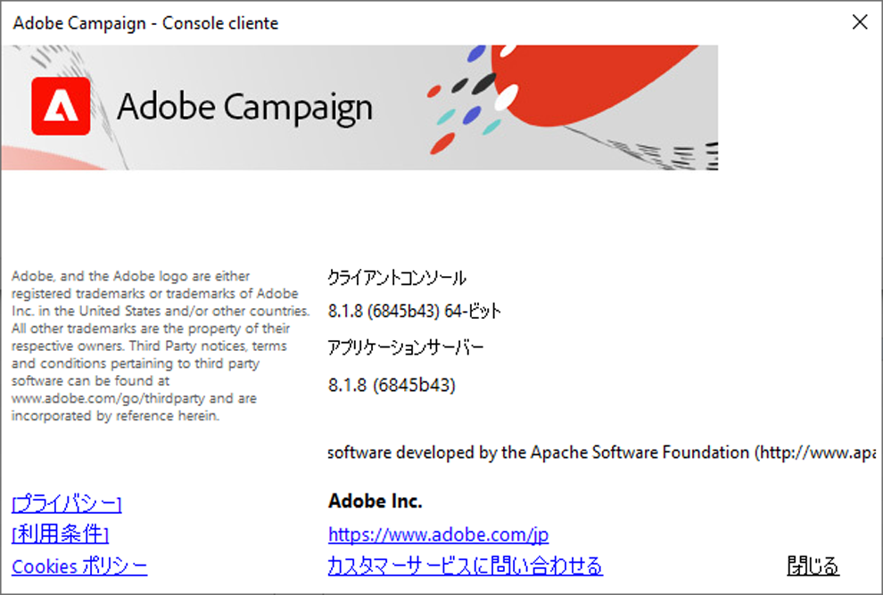

# バージョンとアップグレード {#upgrades}

Adobe Campaign v8は、**Managed Cloud Services** ソリューションとしてのみ提供されます。 Adobeは、あらゆるサーバーサイドのアップグレードを管理および実行します。v8のオンプレミスまたはハイブリッドのデプロイメントはなく、自分でスケジュールを設定したり実行したりするサーバーアップグレードもありません。

Adobe Campaign は定期的にアップデートされています。 この定期的なアップデートの目的は、最新かつ最高の状態を維持し、環境を安全に保ち、アドビ製品の使用体験を向上させることです。

Managed Cloud Services ユーザーとして：

* Campaign サーバーインスタンスは、新しいバージョンごとにAdobeによって自動的にアップグレードされ、ユーザー側での操作は必要ありません。
* お客様の環境に影響を与えるアップグレードの前に、Adobe担当者から連絡を取ります。
* **クライアントコンソールは、現在の機能を維持する1つのコンポーネントです。** Campaign サーバーと同じバージョンにアップグレードする必要があります。 クライアントコンソールのアップグレード方法について詳しくは、[このページ](../start/connect.md#upgrade-ac-console)を参照してください。

また、[互換性マトリックス](compatibility-matrix.md)にリストされているシステムのサポートされている最新バージョンを使用していることも確認してください。

>[!IMPORTANT]
>
>Adobeは、脆弱性をできる限り迅速に修正するために、予告なしに、いつでもホスト環境に重要なセキュリティパッチを適用する権利を有します。 これらのパッチは、サービスを中断することなくデプロイされます。 重大な脆弱性の修正は、事前通知よりも優先されます。

## Campaign のバージョン {#versions}

Adobe Campaign は、Campaign インフラストラクチャのパフォーマンス、セキュリティ、ロジック、使いやすさを向上させる製品バージョンを定期的にリリースします。

アップグレードの内容を以下に示します。

* **メジャーアップグレード**：メジャーバージョンから別のバージョンへ（例えば、v7 から v8 へ）。 このアップグレードにより、新機能、機能強化、互換性とセキュリティの更新および修正がもたらされます。
* **マイナーアップグレード** （v8.5からv8.6など）をマイナーバージョンから別のバージョンにアップグレードします。 これらのアップグレードは、改善、互換性およびセキュリティ更新プログラム、および修正をもたらします。
* **パッチアップグレード**&#x200B;は、パッチバージョンから別のバージョン（v8.5.1からv8.5.2など）にアップグレードされます。 これらのアップグレードでは、セキュリティの更新と修正が行われます。

新しい各バージョンについて詳しくは、[リリースノート](release-notes.md)を参照してください。 セキュリティ関連の修正は、各リリースのメモ内で確認できます。[新しいバージョンのリリースについて知らせる方法を教えてください。](#upgrades-0) 下。

安定した設定を確保するために、アドビでは、すべての Campaign サーバーに&#x200B;**まったく同じバージョン**&#x200B;をインストールすることをお勧めします。 また、[リリースノート](release-notes.md)で特に明記されていない限り、クライアントコンソールはサーバーインスタンスと&#x200B;**まったく同じバージョン**&#x200B;上にある必要があります。 クライアントコンソールのアップグレード方法について詳しくは、[こちらのページ](../start/connect.md#upgrade-ac-console)を参照してください。

## クライアントコンソールを最新の状態に保つ {#ac-upgrades}

Campaign Managed Servicesをご利用のお客様は、新しいCampaign バージョンが利用可能になると、お客様のサーバーインフラストラクチャはAdobeによってアップグレードされます。お客様は操作を行う必要はありません。

サーバーのアップグレードは自動的に行われるため、**クライアントコンソール**&#x200B;は、同時に更新されない場合にギャップが発生する可能性のある場所です。 コンソールのバージョンがサーバーのバージョンと一致しない場合：

* コンソールが更新されるまで、Campaign インスタンスに接続できなくなる場合があります。
* サーバー自体が最新の状態であっても、サーバーが既に移動したバージョンに付属している修正とセキュリティアップデートの恩恵を受けるのはコンソールが停止します。

これを回避するには、新しいバージョンの通知を受け取ったら、すぐにクライアントコンソールをアップグレードします。 クライアントコンソールを[&#x200B; アップグレードする方法について説明します](../start/connect.md#upgrade-ac-console)。

また、お客様は、[互換性マトリックス &#x200B;](compatibility-matrix.md)に記載されている最新のサポートされているバージョンのシステムを使用していることを確認する必要があります。

## よくある質問 {#upgrades-faq}

### Campaign のバージョン確認方法 {#version}

Campaign のバージョンを確認するには、クライアントコンソールから&#x200B;**ヘルプ／バージョン情報…**&#x200B;メニューにアクセスします。

次の情報にアクセスします。

* クライアントコンソールとアプリケーションサーバーの&#x200B;**バージョン**&#x200B;番号。 上記の例では、クライアントコンソールとアプリケーションサーバーのバージョンはどちらも 8.1.5 です。
* 括弧の中は SHA 番号です。
* アドビカスタマーサポートに連絡するためのリンク。
* アドビのプライバシーポリシー、利用条件、Cookie ポリシーへのリンク。

>[!NOTE]
>
>クライアントコンソールに表示されるバージョンが、アプリケーションサーバーに表示されるバージョンと一致しない場合は、[&#x200B; クライアントコンソールを最新の状態に保つ](#ac-upgrades)の説明に従って、コンソールをアップグレードしてください。

### 新しいバージョンのリリースの通知の受信方法 {#upgrades-0}

新しいバージョンと、セキュリティの修正を含む変更点は、[&#x200B; リリースノート &#x200B;](release-notes.md)に記載されています。 新しいバージョンが利用可能になると、Adobeの担当者から連絡が来て、サーバー環境をアップグレードします。個別にクライアントコンソールをアップグレードする必要があります（[&#x200B; クライアントコンソールを最新の状態に保つ](#ac-upgrades)を参照）。

新しいExperience Cloud ソリューションのリリースとその内容について知るには、[Adobe優先製品アップデート &#x200B;](https://www.adobe.com/jp/subscription/priority-product-update.html){target="_blank"}のコミュニケーションを購読してください。

また、[Campaign コミュニティ &#x200B;](https://experienceleaguecommunities.adobe.com/t5/custom/page/page-id/Community-TopicsPage?style=all&sort=date&order=desc&filters=adobe-campaign-classic-community&topic=Campaign+v8){target="_blank"}にアクセスして、リリースの更新について確認することもできます。

### 組織がアップグレードを必要とする理由 {#upgrades-1}

アップグレードすることで、アカウントが脆弱性から保護され、最新のパフォーマンステクノロジーを使用していることを確認できます。

通常、最新バージョンにアップグレードすると次のような機能強化がもたらされます。

* **セキュリティの向上**

  常時焦点を当て、プロアクティブな保全をおこなわなければセキュリティは確保できません。 セキュリティリスクは存在し、無視することはできません。Adobe Campaignをアップグレードするたびに、セキュリティが向上します。 テクノロジーの組み合わせは、Adobe Campaignの強化に役立ちます。これらはすべて、最新の状態に保つ必要があります。 Adobeでは、これらのアップデートがサーバーに自動的に適用されます。手順でクライアントコンソールをアップグレードすると、同じ保護がサーバーにも適用されます。

* **サポートの向上**

  最も重要な問題はアップグレードで解決され、完全に回避できます。 定期的なアップグレードにより、直面する課題を軽減し、効率性を向上させることができます。 カスタマーケアの数を減らすことで、より迅速な解決が可能になり、アップグレードに関連しない問題により多くの注意を払うことができます。

* **メンテナンスと安定性の向上**

  Adobe Campaign チームは、製品の安定性とパフォーマンスを向上させる方法を特定し、既知の問題も解決します。 アップグレードにより、これらの改善によりインスタンスが最新の状態に保たれ、Campaign インスタンス内で急速な成長や複雑さを経験する組織が直面する一般的な課題が解消されます。 Adobe Campaignを支えるテクノロジースタック全体の改善は、組織内のマーケティング部門とIT部門の両方に実感されます。

* **接続を維持**

  クライアントコンソールは、同じバージョンを実行しているサーバーとのみ確実に通信できます。 サーバーがアップグレードされるたびに、コンソールを最新の状態に保つことは、この接続とそれに伴うセキュリティと修正を維持するものです。

### アップグレードのプロセスとタイムライン {#upgrades-2}

Adobeは、v8のお客様として、サーバーのアップグレードをエンドツーエンドで管理します。

1. 新しいバージョンが利用可能な場合、またはアカウントが新しいバージョンに移行する必要があると判断された場合は、Adobeの担当者が通知します。
1. Adobeは、サーバーインフラストラクチャをアップグレードします。この手順では、ユーザーの操作は必要ありません。
1. お客様の側では、必要なアクションは、クライアントコンソールを一致するようにアップグレードすることだけです。また、[互換性マトリックス &#x200B;](compatibility-matrix.md)のシステムが引き続きサポートされていることを確認してください。 「[&#x200B; クライアントコンソールを最新の状態に保つ](#ac-upgrades)」を参照してください。

専任のカスタマーサポート担当者、プロダクトマネージャー、エンジニア、TechOps スペシャリスト、製品コンサルタントのチームが、エクスペリエンスの円滑な支援と提供を行います。

>[!NOTE]
>
>重要なセキュリティパッチは、この通知サイクル以外のホスト環境に適用される場合があります。このページの上部にあるメモを参照してください。
