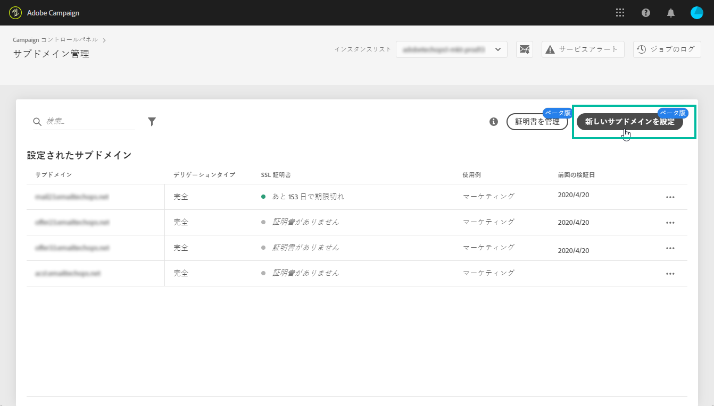

# Adobe Campaign v8 の新機能 {#ac-gs-what-is-new}

Adobe Campaign v8 は、企業規模のクロスチャネルキャンペーン管理にクラス最高のクラウドソリューションを必要とする、クロスチャネルマーケター向けに設計されています。 堅牢な ETL およびデータ管理機能を提供し、最適なキャンペーンの作成とキュレーションを支援します。 そのオーケストレーションエンジンは、バッチベースのジャーニーに重点を置いた、豊富なマルチタッチマーケティングプログラムを提供します。 また、拡張性の高いリアルタイムメッセージングサーバーと組み合わされ、マーケティングチームは、任意の IT システムの包括的なペイロードに基づいて、パスワードのリセット、注文の確認、電子メールの受信などに備えて事前定義されたメッセージを送信できます。

Adobe Campaign v8 では、インフラストラクチャ、セキュリティ、配信品質、監視機能が大幅に強化されました。

## 主な機能{#key-capabilities}

主な機能は次のとおりです。

* **一元化されたワークフロー管理**. セグメントの作成やメッセージの準備から配信まで、マーケティングキャンペーンのあらゆる側面の速度とスケールを向上させます。

   Adobe Campaignを使用すると、campaign オーケストレーション用の使いやすい単一のインターフェイスで、チャネルの同期を簡単におこなえます。 したがって、電子メール、Web、モバイル、ソーシャルなどのオンラインチャネルは、ダイレクトメール、コールセンター、店舗などのオフラインチャネルと一致します。 これにより、デジタルチャネルと従来のチャネルの両方で、一貫したコンテキストに沿ったエクスペリエンスを顧客に提供できます。 Adobe Campaignでは、あらゆるチャネルで、顧客がたどるすべてのパスに簡単にコンテンツを配信できます。

    [Campaign ワークフローの詳細を説明します](../config/workflows.md)

* **パーソナライズされた電子メールマーケティング**. その後の顧客体験と一貫する、パーソナライズされた関連性の高いメールを作成します。

   Adobe Campaignを使用すると、E メールをより良く、よりパーソナライズし、より利益を上げることができます。 E メールは簡単に作成でき、配信も容易です。 Campaign v8 では、送信するすべてのメッセージを柔軟に設計、パーソナライズ、テスト、調整、改善し、改善できます。

    [パーソナライゼーション機能の詳細を説明します](create-message.md)

* **顧客データ管理**. 顧客の全体像を確認して、大規模なパーソナライズされたキャンペーンをすばやく作成できます。

   Adobe Campaignは、すべてのチャネルで収集されたデータから顧客プロファイルを作成するのに役立ちます。 このプロファイルを使用して、複数のチャネルにわたってキャンペーンを調整できます。 すべてのマーケティングチャネルを接続することで、顧客が理解できる方法で各顧客がとる様々なジャーニーをカスタマイズできます。

    [顧客データ管理の詳細](audiences.md)

* **クラス最高のキャンペーン管理**. Adobe Campaign v8 は、様々なチャネルをまたいでキャンペーンを計画、開始、測定するクラス最高の機能をマーケターに提供します。

   機能には、顧客の単一のビューを提供する統合プロファイルが含まれます。 大規模なキャンペーンオーディエンス構築のためのデータ管理とセグメント化。 マルチチャネルおよびマルチウェーブキャンペーンの自動化のためのクロスチャネルワークフロー管理。 統合された電子メールにより、コストの高い ESP への依存を軽減 顧客の行動とキャンペーンのパフォーマンスを把握するためのレポートと分析。

    [キャンペーン管理の詳細を説明します](campaigns.md)

* **Adobe Experience Platformへの接続**. Adobe Campaign v8 は、Real-Time CDPとAdobe Experience Platformの Data Connectors をサポートしているので、組織はリアルタイムの統合顧客プロファイルを活用できます。

   また、Adobe Campaign v8 は、リアルタイムジャーニーオーケストレーション機能とネイティブに統合されているので、マーケターは、Adobe Campaignで同じテンプレートと配信機能を再利用して、顧客とリアルタイムでエンゲージできます。 これらの投資により、Adobe Campaign の顧客体験が最適化され、パーソナライズされたリアルタイムのカスタマージャーニーをキャンペーンに追加できるなど、新しいユースケースが可能になります。

   また、ジャーニー AI を使用して、予測送信時間の最適化と予測エンゲージメントスコアを設定し、オープン率、クリック数、売上高を増やすこともできます。

    Campaign 統合の詳細については、[こちら](../connect/integration.md)を参照してください。

* **Managed Cloud Services**. Adobe Campaign v8 は管理Cloud Serviceとして利用でき、事前の監視、タイムリーな警告、サービスガバナンスを提供します。

   Adobe管理Cloud Serviceは、低い TCO（総所有コスト）で、より機敏で安全で拡張性の高いクロスチャネルキャンペーン管理ソリューションをマーケターに提供します。 この新しい製品は、プロアクティブな監視とタイムリーな警告を備えたサービスを組み合わせています。

* **速度と拡張性**。Adobe Campaignは、クラウドスケールのデータベーステクノロジーを活用して、規模と速度を大幅に改善できるようになりました。

   [Campaign v8 Enterprise](../architecture/enterprise-deployment.md) ～という概念をもたらす **Federated Data Access** (FFDA):すべてのデータがクラウドデータベース上でリモートになりました。 この新しい機能により、Campaign v8 は以下のようなデータ管理をシンプル化します。クラウドデータベースにインデックスは必要ありません。 テーブルを作成して、データをコピーし、利用を開始するだけです。[!DNL Snowflake] は Campaign のクラウドデータベースです。スピードと耐久性を実現し、システムアクティビティのピーク時にも過負荷が発生しません。クラウドデータベーステクノロジーでは、パフォーマンスレベルを保証するために特別なメンテナンスを行う必要はありません。

    [エンタープライズ (FFDA) デプロイメントの詳細を説明します](../architecture/enterprise-deployment.md)

>[!CAUTION]
>
>* Campaign v8 は **のみ** は管理対象Cloud Serviceとして使用でき、オンプレミス環境またはハイブリッド環境にデプロイすることはできません。
>
>* 既存の Campaign Classic v7 環境からは移行できません。

## セルフサービス管理インターフェイス{#self-service-admin}

製品管理者は、**Campaign コントロールパネル**&#x200B;で各 Campaign v8 インスタンスの設定を管理し使用状況を追跡することができます。

管理者は、直感的なユーザーインターフェイスを使用して、主要なアセットの使用状況を監視し、IP アドレスの許可リストへの登録、SFTP ストレージのモニタリング、キーの管理などの高度なタスクを実行できます。このセルフサービスインターフェイスにより管理の柔軟性が高まるほか、これを使用すると以下の利点があります。

* アドビサポートに依頼せずに自分で設定をすばやく変更できます
* 様々なタイミングで多様なビジネスニーズに応じて設定できます
* ニーズに応じて個別にアクセス設定を制御することでセキュリティを強化できます

 [Campaign コントロールパネルの詳細について](https://experienceleague.adobe.com/docs/control-panel/using/discover-control-panel/key-features.html?lang=ja){target=&quot;_blank&quot;}

