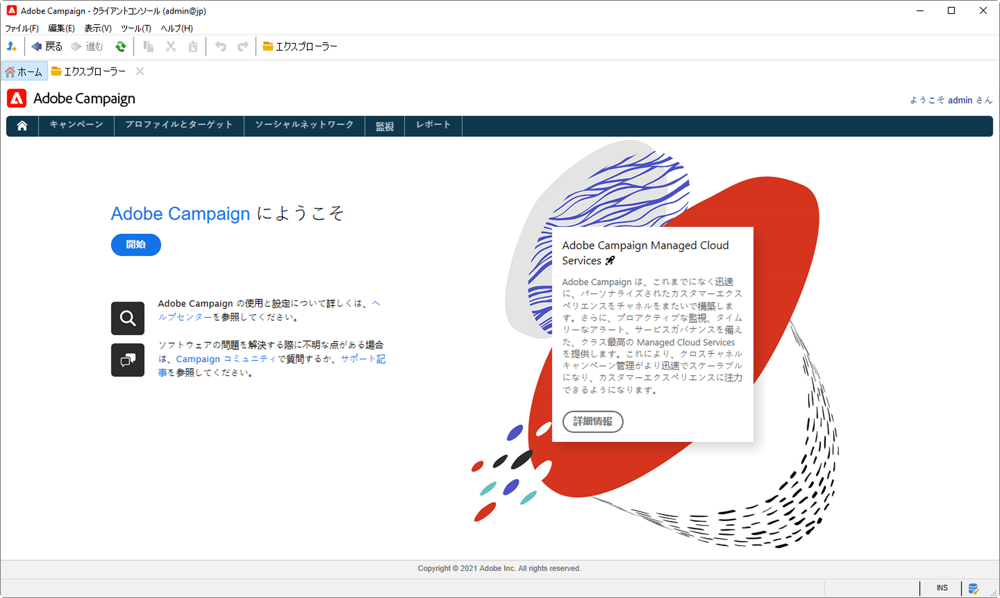
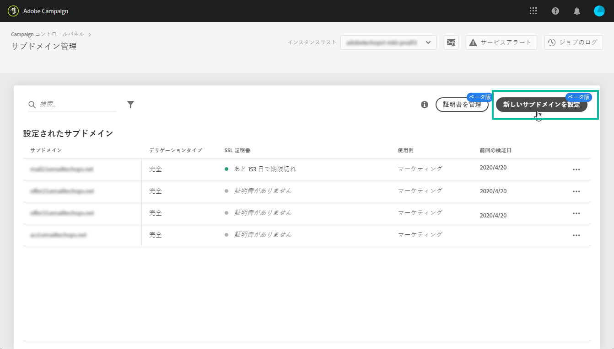

# Adobe Campaign v8 の主な機能 {#ac-gs-what-is-new}

Adobe Campaign v8 は、企業規模のクロスチャネルキャンペーン管理用にクラス最高のクラウドソリューションを必要とする、クロスチャネルマーケター向けに設計されています。 堅牢な ETL およびデータ管理機能を提供し、最適なキャンペーンの作成とキュレーションを支援します。 そのオーケストレーションエンジンは、バッチベースのジャーニーに重点を置いた、豊富なマルチタッチマーケティングプログラムを提供します。 また、拡張性の高いリアルタイムメッセージングサーバーと組み合わされているので、マーケティングチームは任意の IT システムの包括的なペイロードに基づいて、パスワードのリセット、注文の確認、電子領収書などの事前定義されたメッセージを送信できます。

Adobe Campaign v8 では、インフラストラクチャ、セキュリティ、配信品質、監視機能が大幅に強化されています。 これは、**Managed Cloud Service** として利用でき、サービスを先を見越した監視やタイムリーな警告と組み合わせたものです。 Campaign Managed Cloud Services について詳しくは、[この節](#acms-desc)を参照してください。

## 主な機能{#key-capabilities}

### Campaign web ユーザーインターフェイス{#new-web-ui}

Adobe Campaign v8では、従来のクライアントコンソールと一緒に&#x200B;**新しいweb ユーザーインターフェイス**&#x200B;を提供します。 このモダンで直感的なインターフェイスは、キャンペーンの迅速な作成とアクセシビリティの向上が必要なマーケター向けに設計されています。

**主なメリット：**

* **モダンデザイン** – あらゆるブラウザーからアクセス可能な、クリーンでレスポンシブなインターフェイス
* **簡素化されたワークフロー** – 効率的なキャンペーンの作成と管理
* **ドラッグ&amp;ドロップ機能** – 技術的な知識のないビジュアルコンテンツのデザイン
* **オンボーディングの高速化** – 新規ユーザーの学習曲線は最小限
* **統合エクスペリエンス** – 容易な移行のためにCampaign Standardと類似点を共有

Campaign v8.6以降、Campaign Web UIはAdobe Experience Cloudを通じて利用できるようになり、すべてのAdobe ソリューションにシームレスにアクセスできるようになります。

[Campaign Web ユーザーインターフェイスについて詳しく見る](https://experienceleague.adobe.com/ja/docs/campaign-web/v8/campaign-web-home){target="_blank"}

### ワークフローの一元管理{#central-wf-mgt}

セグメントの作成や配信するメッセージの準備に至るまでの、マーケティングキャンペーンのあらゆる側面でスピードと規模を改善できます。

Adobe Campaign を使用すると、キャンペーンオーケストレーション用の使いやすい単一のインターフェイスで、チャネルの同期を簡単に行えます。 したがって、電子メール、web、モバイル、ソーシャルなどのオンラインチャネルは、ダイレクトメール、コールセンター、店舗などのオフラインチャネルと一致します。 これにより、デジタルチャネルと従来のチャネルの両方で、一貫したコンテキストに沿ったエクスペリエンスを顧客に提供できます。 Adobe Campaign では、あらゆるチャネルで、顧客がたどるすべてのパスに簡単にコンテンツを配信できます。

[Campaign ワークフローの詳細](../config/workflows.md)

### パーソナライズされたメールマーケティング {#perso-email-mkt}

その後の顧客体験と一貫する、パーソナライズされた関連性の高いメールを作成します。

Adobe Campaign を使用すると、電子メールをより上手に、より巧みにパーソナライズし、より多くの利益を上げることができます。 電子メールは簡単に作成でき、配信も容易です。 Campaign v8 では、送信するすべてのメッセージの設計、パーソナライズ、テスト、調整、改善が柔軟になります。

[パーソナライゼーション機能の詳細](create-message.md)

### 顧客データ管理 {#customer-data-mgt}

顧客の全体像を確認して、企業規模のパーソナライズされたキャンペーンを素早く作成できます。

Adobe Campaign は、すべてのチャネルで収集されたデータから顧客プロファイルを作成するのに役立ちます。 このプロファイルを使用して、複数のチャネルにわたってキャンペーンを調整できます。 すべてのマーケティングチャネルを接続することで、各顧客による様々なジャーニーを、顧客が理解できる方法でカスタマイズできます。

[顧客データ管理の詳細](audiences.md)

### クラス最高のキャンペーン管理 {#best-in-campaign-mgt}

Adobe Campaign v8 は、様々なチャネルをまたいでキャンペーンを計画、開始、測定する、クラス最高の機能をマーケターに提供します。

機能には、顧客の単一のビューを提供する統合プロファイルが含まれます。 大規模なキャンペーンオーディエンス構築のためのデータ管理とセグメント化。 マルチチャネルおよびマルチウェーブキャンペーンを自動化するためのクロスチャネルワークフロー管理。 統合された電子メールにより、コストの高い ESP への依存を軽減します。 顧客の行動とキャンペーンのパフォーマンスを把握するためのレポートと分析。

[キャンペーン管理の詳細](campaigns.md)

### Adobe Experience Platform への接続 {#connection-to-aep}

Adobe Campaign v8 は、Real-Time CDP と Adobe Experience Platform のデータコネクタをサポートしているので、組織はリアルタイムの統合顧客プロファイルを活用できます。

また、Adobe Campaign v8 は、リアルタイムジャーニーオーケストレーション機能とネイティブに統合されているので、マーケターは、Adobe Campaign で同じテンプレートと配信機能を再利用して、顧客とリアルタイムでエンゲージできます。 これらの投資により、Adobe Campaign の顧客体験が最適化され、個人に合わせたリアルタイムのカスタマージャーニーをキャンペーンに追加できるなど、新しいユースケースが可能になります。

また、ジャーニー AI を使用して、予測送信時間の最適化と予測エンゲージメントスコアを設定し、開封率、クリック数、売上高を増やすこともできます。

[Campaign 統合の詳細](../connect/integration.md)

### Managed Cloud Services {#acms-desc}

Adobe Campaign v8 は Managed Cloud Services として利用でき、先を見越した監視、タイムリーな警告、サービスのガバナンスを提供します。 アドビに管理されるクラウドサービスは、低い TCO（総所有コスト）で、より機敏で安全な、拡張性の高いクロスチャネルキャンペーン管理ソリューションをマーケターに提供します。 この新しい製品は、先を見越した監視とタイムリーな警告を備えたサービスを組み合わせています。

Managed Services のアプローチにより、マーケターは、社内の IT リソースからの多大なサポートを必要とせずに、クラウドインフラストラクチャの運用規模と経済性を活用できます。 アドビのコンサルティングと実装チームは、お客様と協力してマーケティング計画、既存の慣行、データ要件、メッセージングの量を評価し、最も適切なサービス、サポート、配信品質パッケージを推奨します。 Adobe Campaign Managed Cloud Services チームは、キャンペーンのパフォーマンス、ブランドレピュテーション、顧客体験指標などを監視し、レポートできるようになります。

[!BADGE PDF]{type=Informative} [Adobe Campaign Managed Cloud Servicesのビジネス価値について詳しくは、こちらのホワイトペーパー](assets/do-not-localize/IDC-Report-BusinessValueOfAdobeCampaign.pdf){target="_blank"}をご覧ください。

新しいクラウドアーキテクチャにより、Campaign ではプロセスの効率化、コストの削減、リスクの管理およびデータセキュリティの向上が可能になります。 Campaign v8 環境には、事前設定済みの専用の仮想プライベートクラウド（VPC）が備わっています。

>[!AVAILABILITY]
>
>* Campaign v8 は、現在 Managed Cloud Service として&#x200B;**のみ**&#x200B;利用できます。オンプレミス環境またはハイブリッド環境にデプロイすることはできません。
>
>* 既存の Campaign Classic v7 環境からの自動移行はまだ利用できません。

### 速度と規模 {#speed-scale}

Adobe Campaign は、クラウド規模のデータベース技術を活用して、規模と速度を大幅に改善できるようになりました。

[Campaign v8 Enterprise](../architecture/enterprise-deployment.md) では、**Full Federated Data Access**（FFDA）の概念が導入されており、すべてのデータがリモートのクラウドデータベース上にあります。 この新しいサービスにより、Campaign v8 ではデータ管理を簡素化できます。クラウドデータベースではインデックスは必要ありません。 テーブルを作成して、データをコピーし、利用を開始するだけです。 [!DNL Snowflake] は Campaign のクラウドデータベースです。スピードと耐久性を実現し、システムアクティビティのピーク時にも過負荷が発生しません。 クラウドデータベーステクノロジーでは、パフォーマンスレベルを保証するために特別なメンテナンスを行う必要はありません。

[エンタープライズ（FFDA）デプロイメントの詳細](../architecture/enterprise-deployment.md)

### 大規模なパフォーマンス {#performance-metrics}

Campaign v8 Enterpriseは、大量のマーケティングオペレーションに優れたパフォーマンスを提供します。

* **バッチ処理** – 大規模なキャンペーン実行のために、1時間あたり最大&#x200B;**2000万回の操作**
* リアルタイム通信用の&#x200B;**トランザクションメッセージ** - **1時間あたり100万件のメッセージ**
* **オーディエンスの迅速な構築** – 何百万ものプロファイルを数時間ではなく数分でクエリおよびセグメント化できます
* **Cloud database** - Snowflake テクノロジは、ピーク時のシステムの過負荷を排除します

このパフォーマンスにより、スピードや信頼性を犠牲にすることなく、複雑なマルチタッチのキャンペーンを企業規模で実施することができます。

### 新機能と強化機能 {#new-features}

Campaign v8には、次の強力な新機能と機能強化が導入されています。

**AI アシスタント**

生成AIを活用して、コンテンツ制作を加速させる：

* 電子メール、SMS、プッシュ通知コンテンツを自動的に生成
* ブランドボイスとガイドラインに合わせたメッセージの調整
* 一貫性を確保するためのブランド調整スコアリング
* コンテンツの品質を維持しながら制作時間を短縮

**リッチ プッシュ通知**

次のような機能を活用して、魅力的なモバイル体験を創出できます。

* プッシュ通知の画像、ビデオ、カルーセル
* インタラクティブなボタンとタイマー
* IOSおよびAndroidの高度なカスタマイズ
* Storytellingのビジュアルによるエンゲージメントの向上

**アップグレードされたSMS インフラストラクチャ （v2.0）**

* 信頼性と配信率の向上
* SMPP コネクタとの互換性の向上
* 大量のSMS キャンペーンのスループットを向上
* 高度な配信モニタリングとレポート

**高度な統合**

* **Adobe Experience Manager as a Cloud Service** - シームレスなコンテンツ管理とアセットの統合
* **REST API** – 統合と開発を容易にする最新のAPI アーキテクチャ
* **Dynamic Reporting** - v8に移行するCampaign Standard ユーザー向けの高度な分析機能

### 自動アップグレードとメンテナンス {#automatic-upgrades}

Campaign v8 Managed Cloud Servicesは、手動アップグレードの負担を排除します。

* **継続配信モデル** – 最新の安定バージョンへの自動アップグレード
* **ダウンタイムなし** – 操作への影響を最小限に抑えて実行されたアップグレード
* **即時アクセス** – 新機能とセキュリティパッチがリリースされると同時に入手できます
* **IT負荷の軽減** - Adobeはすべてのインフラストラクチャのメンテナンスと更新を管理します
* **調整されたスケジュール** - Adobeは、アップグレードのタイミングを計画するためにユーザーと連携します

このアプローチにより、アップグレードの計画と実行に社内のIT リソースを必要とせずに、Campaign インスタンスが常に安全で最適化された状態で最新の機能を利用できるようになります。

## セルフサービス管理インターフェイス{#self-service-admin}

製品管理者は、**Campaign コントロールパネル**&#x200B;で各 Campaign v8 インスタンスの設定を管理し使用状況を追跡することができます。

管理者は、直感的なユーザーインターフェイスを使用して、主要なアセットの使用状況を監視し、IP アドレスの許可リストへの登録、SFTP ストレージのモニタリング、キーの管理などの高度なタスクを実行できます。 このセルフサービスインターフェイスにより管理の柔軟性が高まるほか、これを使用すると以下の利点があります。

* アドビサポートに依頼せずに自分で設定をすばやく変更できます
* 様々なタイミングで多様なビジネスニーズに応じて設定できます
* ニーズに応じて個別にアクセス設定を制御することでセキュリティを強化できます

[キャンペーンCampaign コントロールパネルの詳細](https://experienceleague.adobe.com/docs/control-panel/using/discover-control-panel/key-features.html?lang=ja){target="_blank"}

